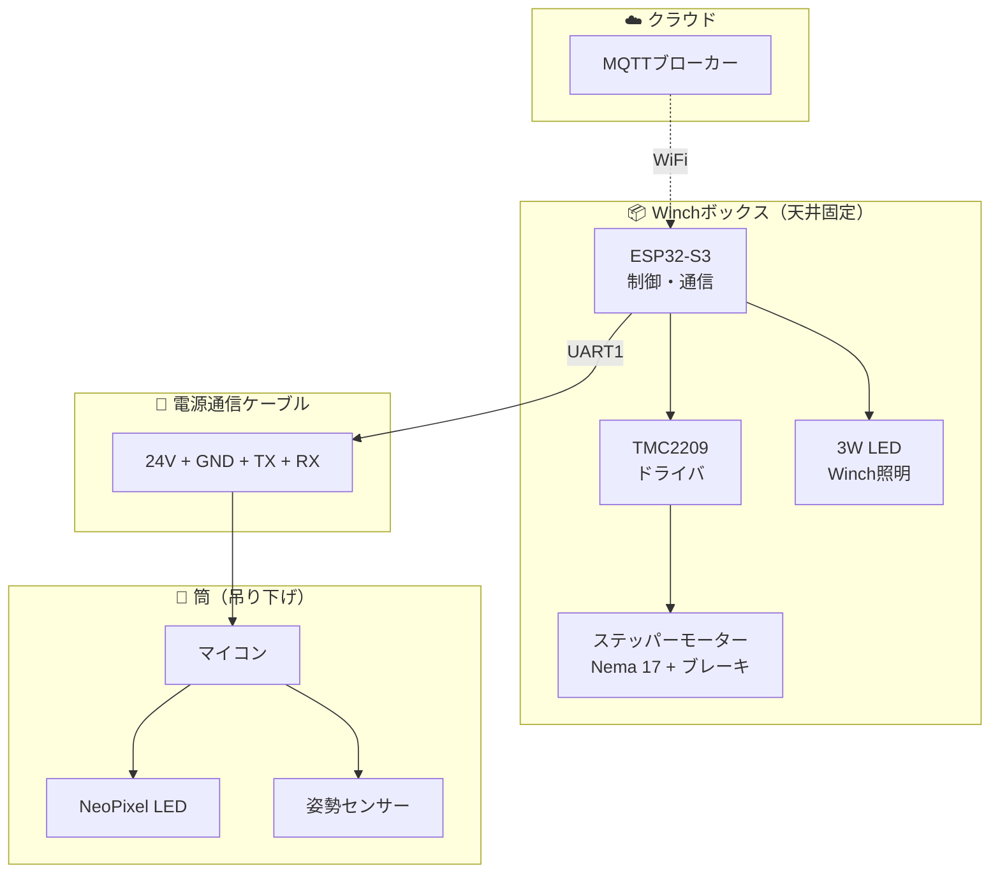

# FU-Nagoya プロジェクト進捗レポート

**プロジェクト名**: Fragmentations of Unity - Nagoya Installation
**期間**: 2025年10月
**最終更新**: 2025-10-17
**基板発注締切**: 2025-10-24

---

## 📊 プロジェクト概要

名古屋の展示空間において、天井から吊り下げられた筒型デバイスが、ウインチによって上下動しながら光と動きで空間を演出するインスタレーション作品。

### システム構成

---

## ✅ 完了した主要タスク

### 1. システムアーキテクチャ設計（V2）✅

**完了日**: 2025-10-10
**成果物**: [docs/specs/winch-circuit-design-v2.md](../projects/nagoya-tube-installation/docs/specs/winch-circuit-design-v2.md)

**主要決定事項**:
- ESP32-S3デュアルコア採用（Core 0: WiFi/MQTT、Core 1: モーター制御）
- U2独立マイコン廃止、U1に統合
- 電源通信ケーブル: 24V + GND + UART TX/RX（4線式）

---

### 2. 電磁ブレーキ回路設計✅

**完了日**: 2025-10-15
**成果物**: [docs/specs/winch-electromagnetic-brake-circuit.md](../projects/nagoya-tube-installation/docs/specs/winch-electromagnetic-brake-circuit.md)

**重要な改善**:
- 100kΩプルダウン抵抗追加（R6）
- フェイルセーフ設計: 起動時Hi-Z → 自動ブレーキON
- 安全性向上: 電源投入時・ファームウェアクラッシュ時も自動でブレーキ作動

---

### 3. ステッパーモータートレース幅問題の解決✅

**発見日**: 2025-10-17
**完了日**: 2025-10-17（8分で修正完了）
**成果物**:
- [notes/winch-stepper-trace-width-analysis.md](notes/winch-stepper-trace-width-analysis.md)
- [notes/winch-stepper-trace-width-fix-completed.md](notes/winch-stepper-trace-width-fix-completed.md)

**問題**:
- ステッパーモーター配線トレース幅: 10mil（定格電流0.5A）
- Nema 17仕様: 2.0A/相
- **400%過負荷状態** → 火災リスク

**解決**:
- トレース幅を40milに変更
- 対応電流: 約1.5A（実用的に十分）
- IPC-2221標準に準拠

**協力者**: @suzukishohei（PCB設計・修正）

---

### 4. ESP32-S3ピンアサイン確定✅

**完了日**: 2025-10-17
**成果物**:
- [docs/specs/esp32s3-pinout-assignment.md](docs/specs/esp32s3-pinout-assignment.md)
- [docs/specs/wpcbb-pinout-analysis.md](docs/specs/wpcbb-pinout-analysis.md)

**確定したGPIO配置** (13本使用):

| 機能グループ | GPIO | 詳細 |
|------------|------|------|
| **UART1（筒側通信）** | 8, 9 | Serial1、38400 baud |
| **TMC2209制御** | 10-14 | EN, MS1, MS2, STEP, DIR（連続5本） |
| **UART2（TMC2209診断）** | 17, 18 | Serial2、115200 baud |
| **LED Driver（Winch照明）** | 35, 38 | PWM輝度制御、ON/OFF |
| **電磁ブレーキ** | 2 | SOLENOID制御 |
| **システムステータス** | 48 | NeoPixel（オンボード） |

**最適化のポイント**:
- TMC2209信号を連続GPIO（10-14）に配置 → 配線簡素化
- UART1をコネクタに近接配置 → 配線距離最短
- LED Driverを右側ヘッダー中央配置 → TPS92200DDCRに近接

---

### 5. Arduino基礎講義資料作成✅

**完了日**: 2025-10-17
**成果物**: [notes/arduino-pullup-resistor-lecture.md](notes/arduino-pullup-resistor-lecture.md)

**対象者**: @suzukishohei
**内容**:
- プルアップ・プルダウン抵抗の基礎
- 電磁ブレーキ回路での適用例
- 実践的な設計手法

---

## 🔄 進行中のタスク

### 6. PCB回路図とのクロスチェック ⏩

**現在の状態**: GPIO番号確定完了、回路図確認待ち
**次のアクション**:
1. EasyEDA/KiCadで回路図を開く
2. 以下の配線が確定GPIO番号と一致するか確認:
   - TMC2209（GPIO 10-14, 17-18）→ STEPPER_H2配線
   - LED Driver（GPIO 35, 38）→ TPS92200DDCR配線
   - Brake（GPIO 2）→ Q2ブレーキ回路配線
   - TO WPCBMS（GPIO 8, 9）→ コネクタピン8/9
3. 不一致があれば回路図修正

### 7. 評価ボード設計 🔬

**完了日**: 2025-10-17（ミーティングで方針確定）
**成果物**: [docs/meetings/meeting-2025-10-17-progress-review.md](docs/meetings/meeting-2025-10-17-progress-review.md)

**設計目標**:
- LED配置の最適化（2パターンを実験的に検証）
- ケーブルヒステリシス特性の測定
- リアクションホイールとの干渉確認

**LED配置パターン**:

#### パターン1: 点状配置（V1ベース）
- 24個のLEDを分散配置
- 電力増加なし
- 光のムラが課題

#### パターン2: 中心集中配置（新提案）★
- GY-85基板裏面にNeoPixelを中心状に配置
- 中心から全方向に光を放射
- 期待される効果:
  - 光のムラ解消
  - 全体的に均一な照明
  - 「中心から光が溢れ出す」視覚効果
- 懸念点: 配線の複雑化

**決定事項**:
- 評価ボードで両パターンを試せる設計
- 実際に組み立てて視覚的に比較検証
- 結果を本番機に反映

**技術検討**:
- ケーブルヒステリシス（ねじれ蓄積）の測定
- アブソリュートエンコーダー（AS5600）による回転角度測定
- リアクションホイールによる補正効果の検証

---

## 📅 今後の予定（2025-10-17更新）

### Phase 1: 基板発注準備（2025-10-18 - 10-24）

- [ ] PCB回路図最終確認
- [ ] 部品表（BOM）最終チェック
- [ ] ガーバーファイル生成
- [ ] JLCPCB発注（**締切: 2025-10-24**）

### Phase 2: 基板到着・組み立て（2025-10-25 - 11-05）

- [ ] **10月31日**: Winch基板到着予定
- [ ] 基板組み立て
- [ ] 初期動作確認

### Phase 3: 検証ツール開発（2025-11-01 - 11-10）

- [ ] MQTTコマンド送信ツール作成
- [ ] 動作パターン選択UI開発
- [ ] データロギング機能（Raspberry Pi）
  - [ ] MQTT経由でデータ収集
  - [ ] トラブルシューティング用ログ保存
  - [ ] リモート監視機能
- [ ] ケーブルヒステリシス対策リサーチ

### Phase 4: 評価ボード検証（2025-11-06 - 11-15）

- [ ] **11月13日目標**: 評価ボード完成・試運転
- [ ] LED配置2パターンの視覚的比較
  - [ ] 点状配置の光量・ムラ測定
  - [ ] 中心集中配置の効果検証
- [ ] ケーブルヒステリシス特性測定
- [ ] リアクションホイールとの干渉確認
- [ ] 本番機への仕様フィードバック

### Phase 5: ファームウェア実装（並行作業）

- [ ] デュアルコアタスク実装（Core 0: WiFi/MQTT、Core 1: モーター制御）
- [ ] UART1実装（筒側通信、Serial1、GPIO 8/9）
- [ ] UART2実装（TMC2209診断、Serial2、GPIO 17/18）
- [ ] TMC2209制御実装（STEP/DIR/EN/MS1/MS2）
- [ ] LED Driver制御実装（PWM、GPIO 35/38）
- [ ] 電磁ブレーキ制御実装（フェイルセーフ、GPIO 2）
- [ ] I2C関連コード削除（U2廃止のため）

### Phase 6: 本番機製作（2025-11-16 - 12-31）

- [ ] 評価結果を反映した本番基板発注
- [ ] 5台製作・組み立て
- [ ] 統合テスト（WiFi/MQTT、筒側通信、モーター制御）
- [ ] **年内目標**: 動作可能な状態（フルスケールではない）

### Phase 7: 展示準備（2025-01-01 - 02-28）

- [ ] 微調整・最終テスト
- [ ] **2月中旬**: フルスケール稼働
- [ ] ビデオ撮影
- [ ] **2月26-28日**: ベルリンでイベント（菅野さん参加）

---

## 📂 ドキュメント構成

### 仕様書（docs/specs/）

| ドキュメント | 内容 |
|------------|------|
| [esp32s3-pinout-assignment.md](docs/specs/esp32s3-pinout-assignment.md) | ESP32-S3ピンアサイン確定版（実際のボード配置） |
| [wpcbb-pinout-analysis.md](docs/specs/wpcbb-pinout-analysis.md) | PCBレイアウト解析とGPIO最適配置 |

### ミーティング議事録（docs/meetings/）

| ドキュメント | 内容 |
|------------|------|
| [meeting-2025-10-17-progress-review.md](docs/meetings/meeting-2025-10-17-progress-review.md) | **進捗共有ミーティング議事録（2025-10-17）** |

### 開発ノート（notes/）

| ドキュメント | 内容 |
|------------|------|
| [arduino-pullup-resistor-lecture.md](notes/arduino-pullup-resistor-lecture.md) | Arduinoプルアップ抵抗基礎講義 |
| [tx-rx-connector-pinout-instructions-2025-10-17.md](notes/tx-rx-connector-pinout-instructions-2025-10-17.md) | TX/RXピンアウトと4極ジャック配線 |
| [winch-stepper-trace-width-analysis.md](notes/winch-stepper-trace-width-analysis.md) | ステッパートレース幅解析 |
| [winch-stepper-trace-width-fix-completed.md](notes/winch-stepper-trace-width-fix-completed.md) | トレース幅修正完了報告 |

### タスク管理（docs/tasks/）

| ドキュメント | 内容 |
|------------|------|
| [evaluation-board-design.md](docs/tasks/evaluation-board-design.md) | 評価基板設計タスク |

---

## 🎯 主要マイルストーン

| フェーズ | 期間 | ステータス |
|---------|------|----------|
| アーキテクチャ設計 | 2025-10-01 - 10-10 | ✅ 完了 |
| 回路設計・安全性改善 | 2025-10-11 - 10-17 | ✅ 完了 |
| **基板発注準備** | **2025-10-18 - 10-24** | **🔄 進行中** |
| ファームウェア実装 | 2025-10-25 - 11-05 | ⏸️ 待機中 |
| 基板到着・テスト | 2025-11-06 - 11-15 | ⏸️ 待機中 |
| 統合テスト・展示準備 | 2025-11-16 - 11-30 | ⏸️ 待機中 |

---

## 👥 貢献者

- **@kyopan**: システムアーキテクチャ設計、ピンアサイン最適化、ドキュメント作成
- **@suzukishohei**: PCB設計、トレース幅修正、回路実装

---

## 🔗 関連リソース

- **メインリポジトリ（プライベート）**: kyopan-projects/nagoya-tube-installation
- **公開リポジトリ**: [FU-Nagoya](https://github.com/kyopan/FU-Nagoya)
- **技術スタック**: ESP32-S3, TMC2209, NeoPixel, MQTT, PlatformIO

---

**優先度**: 🔴 最優先（基板発注締切: 2025-10-24）
