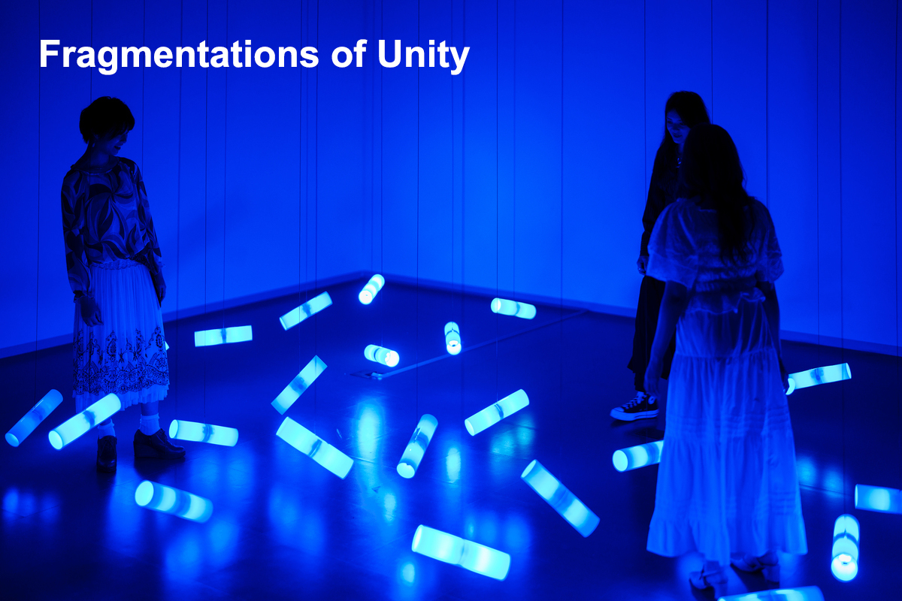

# パンフレット原稿 - Fragmentations of Unity

## タイトルバリエーション（研究テーマとして）

### パターン1：オリジナル
**Fragmentations of Unity（統一性の断片）**
～物理・仮想空間連動型ライティングロボット～

### パターン2：群知能と個性の共存
**Emergent Individuals in Swarm（群れの中の創発する個）**
～自律分散制御による非言語コミュニケーション研究～

### パターン3：インターリアリティ焦点
**Inter-Reality Through Non-Verbal Entities（非言語存在を介した現実間接続）**
～46体の自律ロボットによる共有リアリティ創出実験～

### パターン4：相互作用の本質
**Sensing and Being Sensed（感知し、感知される）**
～来場者とロボット群の相互認識システム～

### パターン5：アルゴリズムと表現
**Algorithmic Choreography（アルゴリズム的振付）**
～群行動パラメータによる予測不可能な美の創出～

### パターン6：存在論的問い
**Presence Without Language（言葉なき存在）**
～非言語コミュニケーションにおける主体性の探求～

### パターン7：フィードバックループ
**Reciprocal Transformation（相互変容）**
～物理空間と観察者の双方向的再構成～

### パターン8：集団と個の二重性
**Unity as Multiplicity（多様性としての統一）**
～分散自律系における個性パラメータの役割～

### パターン9：技術と生命の境界
**Quasi-Living Systems（準生命システム）**
～自律ロボット群による生命的振る舞いの再現実験～

### パターン10：空間の再定義
**Reconfiguring Shared Space（共有空間の再構成）**
～センシング技術による空間認識の拡張研究～

---

## 研究内容紹介バリエーション（300-350字）

### パターン1：群知能と個性パラメータの共存研究
本研究では、ESP32-S3による分散自律制御下の46台ロボットが、各々に設定された個性パラメータに基づき独自の振る舞いを示しながら、群全体としての調和を維持するメカニズムを実証する。Grid-EYE（8×8）サーマルセンサーとマイクアレイによる来場者検知データを、各ロボットがポジティブ・ネガティブフィードバックループで処理し、個体レベルの意思決定を行う。統一されたアルゴリズム基盤の上で、個性パラメータ（反応速度、閾値、重み係数）の微小な差異が群全体の創発的振る舞いにどのような影響を与えるかを定量評価する。従来の群ロボット研究では均質な個体を前提とすることが多いが、本研究は意図的に個体差を導入することで、より柔軟で頑健な群システムの設計指針を提示する。（322字）

### パターン2：非言語エージェント間相互認識の実験的探求
言語を持たない自律エージェント（ロボット）と人間の相互認識プロセスを、センシング技術と動的応答により実装する実験的研究。各ロボットはGrid-EYEで来場者の温度分布を検知し、マイクアレイで音源方向を推定することで、言語情報なしに人間の存在と意図を推論する。ESP32-S3による分散制御により、各エージェントが独立して環境を認識しつつ、群としての協調行動を実現する。重要な研究課題は、センシング情報のみから「認識されている」ことを人間が感じ取るための必要十分条件の特定である。ロボットの動きと光の応答パターンを系統的に変化させ、来場者の主観評価との相関を分析することで、非言語コミュニケーションにおける主体性の成立条件を探求する。（305字）

### パターン3：インターリアリティ基盤技術の実証実験
名古屋大学が推進するTrusted Inter-Reality基盤技術の実証を目的とした研究。物理空間のロボット群と来場者が創出する共有リアリティを、センシング技術とアクチュエーション制御で実装する。各ロボットは独自の状態遷移モデル（待機・探索・追従・回避）を持ち、Grid-EYEとマイクアレイからの入力に基づいて状態を遷移させる。重要な技術課題は、46台のロボットが独立して動作しながらも、来場者に対して統一された「世界観」を提示することである。I2C・UART・WiFiによる通信プロトコルを実装し、各ロボットが最小限の情報交換で群全体の状態を推定する分散合意アルゴリズムを開発。異なる形態の現実を安心・安全に繋ぐための技術要件を、実環境での運用を通じて検証する。（332字）

### パターン4：創発的振る舞いの定量評価手法の開発
46台の自律ロボットによる群行動から創発する予測不可能なパターンを、個性パラメータと環境入力の関数として定量評価する手法を開発する。各ロボットはGrid-EYE（8×8=64点）による温度分布データとマイク入力（4ch）から来場者位置を最尤推定し、個体固有のパラメータに基づいて応答する。群全体の振る舞いを特徴量（空間的分散度、時間的周期性、応答遅延分布）で記述し、個性パラメータの組み合わせとの相関を統計解析する。実験では、パラメータを系統的に変化させた複数回の試行を実施し、創発性（予測困難性）と再現性（制御可能性）のバランスを定量的に評価する。本手法により、芸術表現としての魅力と工学的な制御性を両立する群ロボットシステムの設計が可能となる。（326字）

### パターン5：分散自律系における個体差の機能的役割
統一されたアルゴリズム下で、個体ごとに異なるパラメータ設定が群全体の振る舞いに与える影響を実証的に検証する。ダクトレール上の位置制御（NEMA17ステッピングモーター、0.1mm精度）とNeoPixel光表現（RGB各8bit）により、各ロボットの内部状態（センシング値、意思決定閾値、行動選択確率）を可視化する。実験では、全ロボットが同一パラメータの場合と、正規分布に従う個体差を導入した場合で、群全体の応答性能（来場者検知率、追従精度、衝突回避成功率）を比較測定する。仮説は、適度な個体差が群の頑健性を向上させるというものであり、生物の群れで観察される多様性の機能的意義を工学的に再現する。分散自律系における最適な多様性レベルの設計指針を提示する。（336字）

### パターン6：低解像度センシングによる空間認識拡張
Grid-EYE（8×8=64点サーマルセンサー）とマイクアレイ（4ch）という極めて低解像度なセンシングから、来場者の存在・動き・音を統合的に推定する技術を開発する。一般的なカメラ（数百万画素）と比較して情報量は1/10000以下だが、プライバシー保護と計算負荷削減の観点で優位性がある。温度分布の時系列変化から人の移動方向を推定し、音源方向情報と統合することで、複数人の位置と動きを同時追跡する。ベイズフィルタによる状態推定とカルマンフィルタによる軌道予測を実装し、次の時刻の人の位置を確率分布として出力する。限られた情報から環境を認識し、適切な応答を生成する自律システムの設計指針を提示することで、センシング技術による空間認識拡張の新しい可能性を探る。（329字）

### パターン7：相互作用による空間の動的再構成
来場者の動きに応じてロボット群の配置と光パターンが変化することで、物理空間の認識そのものが動的に再構成される過程を研究する。46台のロボットがダクトレール上で位置を変え（移動速度0-50mm/s、可変制御）、光の色（RGB各8bit）・強度（0-100%）・点滅パターンを調整することで、空間の視覚的・心理的性質が来場者との相互作用により連続的に変容する。実験では、固定配置の場合と動的配置の場合で、来場者の空間認識（広さ感、親密性、緊張感）を主観評価および生理指標（心拍変動、視線移動）で測定する。仮説は、動的な空間再構成が来場者の没入感を高めるというものであり、インタラクティブアートにおける空間設計の新しい方法論を提示する。環境が応答することで生まれる新しい空間体験を実証する。（342字）

### パターン8：準生命システムとしての自律ロボット群
自律ロボット群に生命的な振る舞い（環境応答、個体差、群協調、適応学習）を実装し、工学的に再現する人工生命研究。各ロボットはセンシング・状態遷移・アクチュエーションの閉ループを持ち、環境変化に適応的に応答する。生物の群れで観察される特性（局所的相互作用からの大域的パターン形成、個体の単純な規則からの複雑な集団行動、外乱に対する頑健性）を、ロボット群で再現する。具体的には、各ロボットが近傍ロボットの状態を観測し（WiFi通信、最大10台）、引力・斥力モデルに基づいて行動を決定する。パラメータ（相互作用距離、力の強度）を生物データから推定し、実装する。準生命システムとしての自律ロボット群の設計原理と、その表現可能性・制御可能性の限界を探求する。生命と機械の境界を問う実験的研究。（343字）

### パターン9：計算美学に基づく動的振付の自動生成
群行動アルゴリズムと個体パラメータの組み合わせにより、予測不可能かつ美的な動きのパターンを自動生成する技術を開発する。NEMA17ステッピングモーターによる精密な位置制御（0.1mm精度、最大速度50mm/s）とNeoPixel LEDの光表現（RGB各8bit、60fps更新）を、ESP32-S3（デュアルコア240MHz）でリアルタイム制御する。振付の美的評価には、対称性・非対称性のバランス、動きの滑らかさ（加速度の連続性）、空間的配置の多様性、時間的変化の適度な複雑さを定量指標として用いる。機械学習により、これらの指標と人間の主観評価の相関を学習し、美的価値の高い振付を自動生成するアルゴリズムを構築する。計算美学とロボティクスを融合した新しい表現技術の基盤を確立する。（329字）

### パターン10：多対多インタラクションの設計手法
46台の自律ロボットと複数来場者（最大20名を想定）の間に成立する多対多インタラクションの設計手法を提案する。各ロボットがGrid-EYE（検知範囲: 水平60°×垂直60°、検知距離: 最大5m）で複数人を同時検知し、優先度（距離の逆数、滞在時間、過去の相互作用履歴）と距離に基づいて応答対象を決定する分散意思決定アルゴリズムを実装する。重要な設計課題は、全ての来場者が「無視されている」と感じないようにロボットの注意を配分することである。各ロボットは近傍ロボット（WiFi通信圏内の最大10台）と応答対象情報を交換し、群全体で来場者への注意配分を最適化する。実験では、来場者数を変化させ、各人が感じる「関与感」を主観評価で測定する。人間-ロボット群インタラクションにおける設計指針を実証的に検証する。（347字）

---

## 技術仕様

- **ロボット数**: 46台（または16台構成）
- **制御方式**: ESP32-S3による分散自律制御
- **センサー**: Grid-EYE（8×8サーマルセンサー）、マイクアレイ
- **駆動**: NEMA17電磁ブレーキ付きステッピングモーター + ダクトレール
- **照明**: NeoPixel RGB LED
- **通信**: I2C・UART・WiFi
- **電源**: DC24V（現場供給）

---

## プロジェクト情報

**会場**: Common Nexus（ComoNe） - 名古屋市芸術創造センター
**研究協力**: 名古屋大学 米澤拓郎教授（インターリアリティ研究）
**アートディレクション**: 菅野創（愛知県立芸術大学、ベルリン拠点）
**技術開発**: Kyopalab LLC（興野悠太郎）
**プロジェクトマネジメント**: 米澤拓郎

---

## 画像

**キャプション**: 青い光に包まれた空間で、46台のライティングロボットが自律的に動作し、物理空間と仮想空間を繋ぐ新しいコミュニケーション体験を創出する。

---

**作成日**: 2025-11-03
**作成者**: CIC
