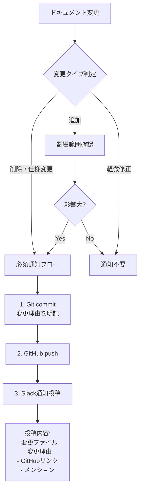
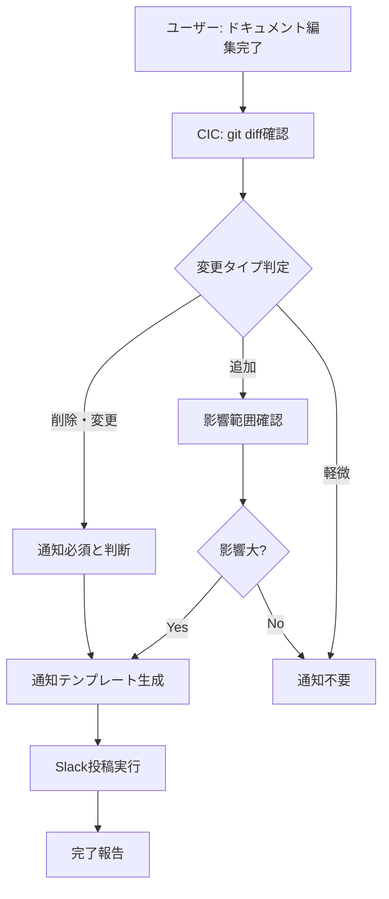

# ドキュメント変更通知ルール

**バージョン**: 1.1.0
**最終更新**: 2025-10-21
**適用対象**: すべてのプロジェクト
**更新内容**: FU-Nagoya専用スレッド方式を追加

## 目的

ドキュメント変更時に関係メンバーへ適切に通知することで、以下を防ぐ:
- 作業エビデンスの突然の消失
- 仕様変更の認識齟齬
- コミュニケーション混乱

## 通知が必要なケース

| 変更タイプ | 通知要否 | 理由 | 例 |
|-----------|---------|------|-----|
| **削除**: 仕様・要件の記述削除 | ✅ **必須** | 作業エビデンス消失 | PCBシルク印刷ルールの削除 |
| **変更**: 既存仕様の修正 | ✅ **必須** | 作業方針に影響 | ピン配置の変更 |
| **追加**: 新規セクション追加 | ⚠️ **推奨** | 影響範囲による | 新機能仕様の追加 |
| **軽微**: 誤字修正、フォーマット調整 | ❌ 不要 | 内容に影響なし | タイポ修正、Markdown整形 |

## 通知フロー



## 運用方法

### Step 1: ドキュメント編集
- ローカルで編集
- 変更内容を明確に記録

### Step 2: Git commit
```bash
git add docs/specs/example.md
git commit -m "docs: シルク印刷ルールを削除

理由: 基板設計完了により不要と判断
影響: 基板発注担当のみ（ファームウェア開発は影響なし）

🤖 Generated with [Claude Code](https://claude.com/claude-code)

Co-Authored-By: Claude <noreply@anthropic.com>"
```

### Step 3: GitHub push
```bash
git push origin main
```

### Step 4: Slack通知判定

**判断基準:**
- 削除・仕様変更 → **必須通知**
- 追加（影響大） → **推奨通知**
- 軽微修正 → 通知不要

### Step 5: Slack通知投稿

#### 🎯 プロジェクト別通知方式

| プロジェクト | 通知方式 | 理由 |
|------------|---------|------|
| **FU-Nagoya** | 📌 **専用スレッド方式** | チャンネル汚染防止、通知確実性 |
| **その他** | 💬 通常投稿またはスレッド返信 | プロジェクト特性による |

#### FU-Nagoya: 専用スレッド方式

**専用スレッド情報:**
- **チャンネル**: `#fragmented_unity` (C0806K7E9RD)
- **スレッドURL**: https://kyopalab.slack.com/archives/C0806K7E9RD/p1761018893032439
- **thread_ts**: `1761018893.032439`
- **ピン留め済み**: ✅

**投稿先:**
- ❌ チャンネルへの新規投稿（チャンネル汚染）
- ❌ 該当スレッドへの返信（開発者が困ってから見る）
- ✅ **専用スレッドへの返信**（即座に通知、履歴管理）

**テンプレート:**

```markdown
🔄 **ドキュメント更新通知**

**変更ファイル:**
[winch-u1-esp32s3-pinout.md](https://github.com/kyopan/FU-Nagoya/blob/main/docs/specs/winch-u1-esp32s3-pinout.md)

**変更内容:**
- ❌ **削除**: シルク印刷の配置ルール（Section 3.2）

**変更理由:**
基板設計完了により不要と判断

**影響範囲:**
- 基板発注担当: シルク仕様は確定版を使用
- ファームウェア開発: 影響なし

**関連メンバー:**
<@U02D0C76DJ6> <@U07V5Q2EX1V>

**GitHub Commit:**
https://github.com/kyopan/FU-Nagoya/commit/abc123

---
🤖 Generated with CIC
```

**実際の投稿例（Slack MCP使用）:**

```python
# FU-Nagoya: 専用スレッドに返信
mcp__slack__slack_reply_to_thread(
    channel_id="C0806K7E9RD",
    thread_ts="1761018893.032439",  # 専用スレッド
    text="🔄 **ドキュメント更新通知**\n\n..."
)

# その他プロジェクト: チャンネルに投稿
mcp__slack__slack_post_message(
    channel_id="C0XXXXXXX",
    text="🔄 **ドキュメント更新通知**\n\n..."
)
```

## CICの役割

### 自動サポート内容
1. **変更タイプ判定**: 削除・変更・追加を自動分類
2. **通知テンプレート生成**: 変更内容から自動作成
3. **Slack投稿実行**: Slack MCP経由で自動投稿
4. **関連メンバー特定**: `.slack-config.json`から自動取得

### CICの動作



## プロジェクト別設定

### .slack-config.json の活用

各プロジェクトの`.slack-config.json`にメンション対象と通知先を定義:

#### FU-Nagoya (nagoya-tube-installation)

```json
{
  "channels": {
    "main": "C0806K7E9RD"
  },
  "doc_change_notification": {
    "thread_ts": "1761018893.032439",
    "channel_id": "C0806K7E9RD"
  },
  "mention_groups": {
    "all": ["<@U02D0C76DJ6>", "<@U07V5Q2EX1V>"],
    "hardware": ["<@U02D0C76DJ6>"],
    "firmware": ["<@U07V5Q2EX1V>"]
  }
}
```

**使用例:**
- ハードウェア仕様変更 → `mention_groups.hardware`にメンション
- ファームウェアAPI変更 → `mention_groups.firmware`にメンション
- ドキュメント変更 → `doc_change_notification.thread_ts`のスレッドに投稿

## 運用ルール

### ユーザーの責務
- ドキュメント変更時にCICに報告
- 必要に応じて通知対象を指定

### CICの責務
- 変更タイプを自動判定
- 通知テンプレート生成
- Slack投稿実行
- 通知漏れ防止

## 例外ケース

### 通知不要なケース
- Typo修正、スペース調整
- Markdown文法修正
- リンク切れ修正
- コメント追加（内容変更なし）

### 緊急時の対応
- 重要な仕様変更が緊急の場合
- Slack投稿 + 直接メンション
- 場合によっては口頭確認

## トラブルシューティング

### Q: 通知すべきか判断に迷う場合は？
**A**: CICに相談。以下を伝える:
- 変更内容
- 影響範囲
- 関係メンバー

CICが判定して適切な対応を提案します。

### Q: 通知漏れが発生した場合は？
**A**:
1. 気づいた時点でSlack投稿
2. 「通知漏れのお詫び」を明記
3. 影響範囲を確認

### Q: 過去の変更履歴を確認したい場合は？
**A**:
```bash
git log --follow -- docs/specs/example.md
git show <commit-hash>:docs/specs/example.md
```

## 将来的な改善計画

### Phase 2: GitHub Actions自動化（Optional）
- ドキュメント変更を自動検知
- 変更内容を解析
- Slack通知を自動投稿

**現時点では手動運用で十分**と判断。通知漏れが頻発する場合に検討。

## 参考資料
- [Slack Bot人格設定](slack-bot-personality.md)
- [プロジェクト別Slackチャンネル管理](../specs/slack-channel-management-per-project.md)
- [外部共有フロー](../../CLAUDE.md#プロジェクト外部共有フロー)

---

**変更履歴:**
- v1.1.0 (2025-10-21): FU-Nagoya専用スレッド方式を追加
- v1.0.0 (2025-10-21): 初版作成
