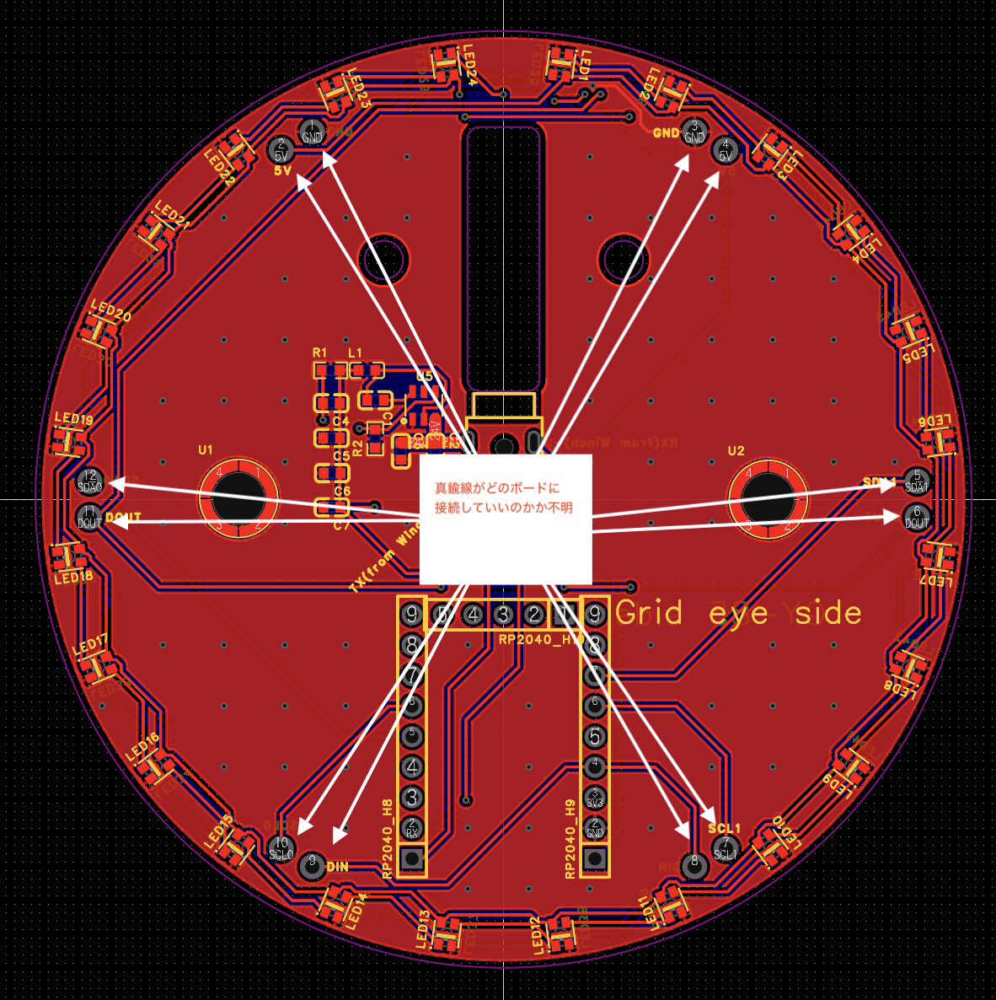

# PCB シルクスクリーン命名規則

**バージョン**: 1.1.0
**最終更新**: 2025-10-21
**適用対象**: FU-Nagoya 全基板（Grid Ring, Pitch Ring, GY85 Ring, Winch等）
**更新内容**: ブリッジ接続端子のラベル位置・向き一致ルールを追加

---

## 目的

PCBシルクスクリーン（シルク印刷）の命名規則を統一し、以下を実現する：

1. **接続の明確化**: 基板単体を見ただけで、どこに何が接続されるか理解できる
2. **誤配線の防止**: TX/RX等の信号方向を明示し、配線ミスを防ぐ
3. **保守性の向上**: 後から見ても、設計意図が分かる
4. **チーム共通認識**: 複数の基板設計者が同じ命名ルールを使用

---

## 基本原則

### 原則1: 信号方向の明示

**信号の流れを「from」で表記する**

```
TX from Winch  → ウィンチから送信される信号
RX from Winch  → ウィンチから受信される信号
```

**✅ 正しい例:**
```
TX from Winch
RX from Winch
24V from Power Supply
GND
```

**❌ 悪い例:**
```
TX (どこから？)
WINCH TX (ウィンチのTX？基板のTX？)
(from Winch) (TXなのかRXなのか不明)
```

### 原則2: 基板視点での記述

**その基板から見た信号名を記載する**

- **Secondary（筒・評価ボード）の場合:**
  - コネクタ付近: `TX from Winch`, `RX from Winch`
  - マイコンピン: クロス接続を明記

- **Primary（ウィンチ）の場合:**
  - コネクタ付近: `TX`, `RX`（自分自身の信号）

### 原則3: 階層的な命名

**接続先 + 信号種別**

```
[接続先]_[信号種別]_[詳細]

例:
WINCH_UART_TX
WINCH_UART_RX
WINCH_PWR_24V
WINCH_GND
```

### 原則4: ブリッジ接続端子のラベル位置・向き一致

**真鍮線等で基板同士をブリッジ接続する場合、接続先の基板と端子ラベルの位置・向きを一致させる**

#### 目的
- 貫通線がどのボードに接続しているか明確にする
- 組み立て時の配線ミスを防ぐ
- 視覚的に対応関係が分かるようにする

#### ルール

**✅ 正しい例（位置・向き一致）:**

```
基板A（左）          基板B（右）
┌─────────┐        ┌─────────┐
│ 3.3V    │←真鍮線→│    3.3V │
│ GND     │←真鍮線→│     GND │
│ 1       │←真鍮線→│       1 │
│ 2       │←真鍮線→│       2 │
└─────────┘        └─────────┘
```
→ 左右で同じ位置、同じ向きにラベル配置

**❌ 悪い例（位置・向き不一致）:**

```
基板A（左）          基板B（右）
┌─────────┐        ┌─────────┐
│ 3.3V    │←真鍮線→│ 2       │  ❌ 位置が合わない
│ GND     │←真鍮線→│ 1       │  ❌ 位置が合わない
│ 1       │←真鍮線→│ GND     │  ❌ 位置が合わない
│ 2       │←真鍮線→│ 3.3V    │  ❌ 位置が合わない
└─────────┘        └─────────┘
```
→ 配線ミスのリスク、視認性が悪い

#### 実例: Grid Ring 基板



**特徴:**
- 円形基板の左右で対称にラベル配置
- `3.3V`, `GND`, `1`, `2`, `3`, `4`, `5`, `9` が対応する位置に配置
- 白い矢印で対応関係を明示
- 視覚的に「どこからどこへ接続されるか」が明確

#### 設計ガイドライン

1. **ラベル位置**
   - 接続先基板と同じ相対位置に配置
   - 円形基板の場合: 対称位置に配置

2. **ラベル向き**
   - 基板を並べたときに同じ向きになるように配置
   - 読み方向を統一（例: 上から下、左から右）

3. **視覚補助**
   - 必要に応じて矢印で対応関係を明示
   - 線で接続先を示す

4. **ドキュメント化**
   - ブリッジ接続図を作成
   - 組み立て手順書に記載

---

## 命名規則詳細

### 1. UART通信（TX/RX）

#### Secondary側（筒・評価ボード）

**4極ステレオジャック付近のシルク表記:**

```
┌─────────────────────────┐
│  4極ステレオジャック     │
│  ┌─┐                    │
│  │ │ Tip    → 24V       │
│  │ │ Ring1  → TX from Winch │
│  │ │ Ring2  → RX from Winch │
│  │ │ Sleeve → GND       │
│  └─┘                    │
└─────────────────────────┘
```

**または矢印表記:**

```
TX ← (矢印でウィンチ方向を示す)
RX ← (矢印でウィンチ方向を示す)
```

**RP2040マイコンピン付近のシルク表記:**

```
RP2040
┌────────────┐
│ GPIO0 (TX) │ → Winch RX
│ GPIO1 (RX) │ → Winch TX
│ ...        │
└────────────┘
```

**クロス接続の明示:**

```
ジャック側           マイコン側
TX from Winch  →  RP2040 RX (GPIO1)
RX from Winch  →  RP2040 TX (GPIO0)
```

#### Primary側（ウィンチ）

**ウィンチ側のシルク表記:**

```
TX → （ウィンチマイコンのTXピン）
RX → （ウィンチマイコンのRXピン）
```

**シンプルに「TX」「RX」のみ記載（Primary側は自分自身の信号）**

### 2. 電源（24V, GND）

**明確な電圧表記:**

```
✅ 正しい例:
24V
GND
5V
3.3V

❌ 悪い例:
VCC （何ボルト？）
V+ （何ボルト？）
```

**電源入力の場合:**

```
24V from Power Supply
GND
```

### 3. その他の信号

#### I2C

```
SDA
SCL
```

#### SPI

```
MOSI
MISO
SCK
CS
```

#### GPIO

```
GPIO0
GPIO1
...
```

**機能が明確な場合:**

```
LED_DATA
BUTTON
SENSOR_INT
```

### 4. コネクタ全体の表記

**コネクタ種別の明示:**

```
┌──────────────────┐
│ 4P Stereo Jack   │
│ (to Winch)       │
│                  │
│ Tip:    24V      │
│ Ring1:  TX from Winch │
│ Ring2:  RX from Winch │
│ Sleeve: GND      │
└──────────────────┘
```

---

## ピン配置順序（4極ステレオジャック）

### 推奨配置（安全性重視）

```
先端 (Tip)       → 24V
リング1 (Ring1)  → TX from Winch
リング2 (Ring2)  → RX from Winch
根元 (Sleeve)    → GND
```

**理由:**

1. **抜き差し時の安全性**
   - プラグを差し込む際、先端から順に接触
   - GNDが最後に接触することで、24Vショートリスクを低減

2. **24Vの攻撃性**
   - 24Vは高電圧なので、接触不良時の火花や短絡リスクが高い
   - 最後に接触する根元（Sleeve）をGNDにすることで安全性向上

3. **通信信号の保護**
   - TX/RXは中間のリング1, 2に配置
   - GNDとのショートリスクを最小化

---

## フォント・サイズ推奨値

### 文字サイズ

| 用途 | 推奨サイズ | 最小サイズ |
|------|-----------|-----------|
| コネクタラベル | 1.2mm | 1.0mm |
| ピンラベル | 1.0mm | 0.8mm |
| 注意事項 | 0.8mm | 0.6mm |

### フォント

- **推奨**: Sans-serif（ゴシック体）
- **視認性重視**: 太字（Bold）

### 線幅

- **推奨**: 0.15mm
- **最小**: 0.10mm

---

## 配置ルール

### 1. コネクタ付近

- コネクタの直近にラベルを配置
- 矢印で信号方向を示す

### 2. マイコンピン付近

- ピン番号とGPIO名を併記
- 接続先を明記（例: `GPIO0 (TX) → Winch RX`）

### 3. 電源ピン

- 電圧値を必ず記載
- GNDは明確に表記

### 4. テストポイント

- テストポイント名を記載
- 測定目的を明記（例: `TP1 (24V Check)`）

---

## 設計チェックリスト

### Secondary側（評価ボード）PCB設計

- [ ] **4極ステレオジャックのピン配置**
  - [ ] 先端 (Tip) = 24V
  - [ ] リング1 = TX from Winch
  - [ ] リング2 = RX from Winch
  - [ ] 根元 (Sleeve) = GND

- [ ] **シルク印刷**
  - [ ] ジャック付近に「TX from Winch」「RX from Winch」と表記
  - [ ] または矢印でウィンチ方向を明示
  - [ ] フォントサイズ: 1.0mm以上
  - [ ] 線幅: 0.15mm以上

- [ ] **RP2040ピンアサイン**
  - [ ] ジャックの「TX from Winch」→ RP2040の**RX (GPIO1)**
  - [ ] ジャックの「RX from Winch」→ RP2040の**TX (GPIO0)**
  - [ ] クロス接続を確認
  - [ ] マイコンピン付近にシルク表記

- [ ] **電源表記**
  - [ ] 24V, GND を明記
  - [ ] 電圧値を記載

- [ ] **ESD保護回路**
  - [ ] TX/RXラインにESD保護回路を追加

- [ ] **ブリッジ接続端子（真鍮線等を使用する場合）**
  - [ ] 接続先基板と端子ラベルの位置が一致
  - [ ] 接続先基板と端子ラベルの向きが一致
  - [ ] 必要に応じて矢印で対応関係を明示
  - [ ] ブリッジ接続図を作成

---

## 例外ケース

### 1. スペースが限られている場合

**略記ルール:**

```
TX from Winch → TX_W
RX from Winch → RX_W
24V from Power Supply → 24V_PS
```

**ただし、基板裏面に詳細説明を追加**

### 2. 複数のUART接続がある場合

**番号付け:**

```
UART1_TX from Winch
UART1_RX from Winch

UART2_TX from Sensor
UART2_RX from Sensor
```

### 3. Primary/Secondaryが不明確な場合

**明示的な方向表記:**

```
TX (送信)
RX (受信)
```

---

## 実例

### Grid Ring 評価ボード

```
┌───────────────────────────────┐
│ Grid Ring Evaluation Board    │
│                                │
│ ┌─────────────────┐            │
│ │ 4P Stereo Jack  │            │
│ │ (to Winch)      │            │
│ │                 │            │
│ │ Tip:    24V     │            │
│ │ Ring1:  TX from Winch │     │
│ │ Ring2:  RX from Winch │     │
│ │ Sleeve: GND     │            │
│ └─────────────────┘            │
│                                │
│ ┌──────────────┐               │
│ │ RP2040       │               │
│ │ GPIO0 (TX) → Winch RX │     │
│ │ GPIO1 (RX) → Winch TX │     │
│ │ ...          │               │
│ └──────────────┘               │
└───────────────────────────────┘
```

### Pitch Ring 評価ボード

```
（Grid Ringと同様の命名規則）
```

### GY85 Ring 評価ボード

```
（Grid Ringと同様の命名規則）
```

---

## トラブルシューティング

### Q: 「TX from Winch」が長すぎてスペースに入らない

**A**: 略記ルールを使用:
```
TX_W
RX_W
```

基板裏面に詳細説明を追加:
```
TX_W = TX from Winch
RX_W = RX from Winch
```

### Q: Primary/Secondaryの判断に迷う

**A**: 以下の基準で判断:

- **Primary**: データ送信の主導権を持つ（例: ウィンチ）
- **Secondary**: データを受信・応答する（例: 筒・評価ボード）

迷った場合は、より詳細な表記を使用:
```
TX (送信)
RX (受信)
```

### Q: 既存の基板で命名規則が異なる

**A**: ドキュメントに対応表を作成:

| 既存表記 | 新規則 |
|---------|-------|
| WINCH TX | TX from Winch |
| WINCH RX | RX from Winch |
| VCC | 24V |

新規基板から新ルールを適用。

---

## 関連ドキュメント

- [TX/RXピンアサインとコネクタピン配置の指示](../../notes/tx-rx-connector-pinout-instructions-2025-10-17.md)
- [評価ボード設計タスク](../tasks/evaluation-board-design.md)
- [Winch U1 ESP32-S3 Pinout](winch-u1-esp32s3-pinout.md)
- [ドキュメント変更通知ルール](../rules/document-change-notification.md)

---

## 変更履歴

- v1.1.0 (2025-10-21): ブリッジ接続端子ルールを追加
  - 原則4: ブリッジ接続端子のラベル位置・向き一致ルールを追加
  - Grid Ring基板の実例画像を追加
  - 設計チェックリストにブリッジ接続項目を追加

- v1.0.0 (2025-10-21): 初版作成
  - 過去のドキュメント（tx-rx-connector-pinout-instructions-2025-10-17.md）を参考に体系化
  - 信号方向明示の原則を確立
  - フォント・サイズ推奨値を追加
  - 設計チェックリスト追加
