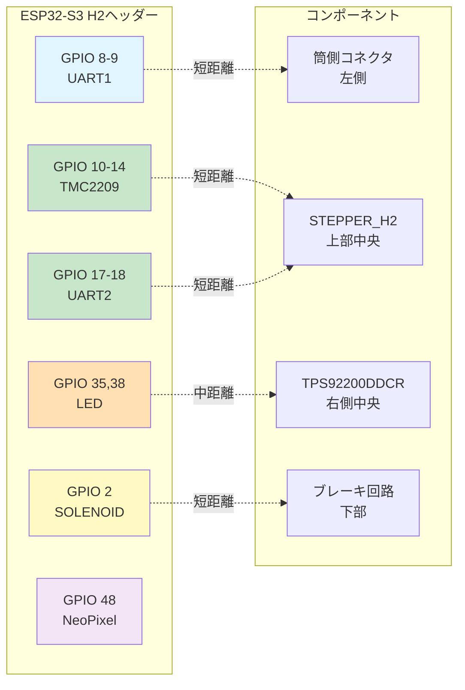

# WPCBB基板 ピンアサイン解析

**日付**: 2025-10-17
**基板**: WPCBB (Winch PCB Board)
**目的**: ESP32-S3最適ピンアサイン決定

---

## 📋 基板レイアウト分析

### H2ヘッダー（ESP32-S3-DevKitC-1）

**左側（上から下）**:
```
ピン番号 | GPIO | 備考
---------|------|------
GND      | -    |
21       | 21   |
20       | 20   | USB D+（使用注意）
19       | 19   | USB D-（使用注意）
18       | 18   |
17       | 17   |
16       | 16   |
15       | 15   |
14       | 14   |
13       | 13   |
12       | 12   |
11       | 11   |
10       | 10   |
9        | 9    |
8        | 8    |
7        | 7    |
6        | 6    |
5        | 5    |
4        | 4    |
3        | 3    | Strapping Pin
2        | 2    |
1        | 1    |
```

**右側（上から下）**:
```
ピン番号 | GPIO | 備考
---------|------|------
GND      | -    |
48       | 48   | NeoPixel（内蔵）
47       | 47   |
46       | 46   | Strapping Pin
45       | 45   | Strapping Pin
0        | 0    | Strapping Pin + Boot
35       | 35   |
36       | 36   |
37       | 37   |
38       | 38   |
39       | 39   | JTAG
40       | 40   | JTAG
41       | 41   | JTAG
42       | 42   | JTAG
43       | 43   | UART0 TX（デバッグ）
44       | 44   | UART0 RX（デバッグ）
```

---

## 🎯 コンポーネント配置の確認

### 1. STEPPER_H2コネクタ（上部中央）

**位置**: 基板上部、ピン8-1の近く
**接続先**: TMC2209信号線

**物理的に近いGPIOピン**:
- GPIO 8-15（左側上部）

### 2. STEPPERモーターコネクタ（左上）

**信号**: BLK A+, GRN A-, RED B+, BLU B-
**トレース**: 40mil（修正済み）

### 3. LED Driver周辺（右側中央）

**IC**: TPS92200DDCR (U2)
**制御信号**: LED_C, LED_PWM
**出力**: LED_A

**物理的に近いGPIOピン**:
- GPIO 35-38（右側中央）

### 4. 電磁ブレーキ回路（下部）

**IC**: Q1 (20N06), Q2 (NPN)
**制御信号**: SOLENOID
**出力**: S_DRN

**物理的に近いGPIOピン**:
- GPIO 1-4（左側下部）

### 5. 電源通信コネクタ（"Wireless module"ラベル）

**信号**: 24V, S_DRN, TX, RX（筒側通信用）
**位置**: 基板左側

**物理的に近いGPIOピン**:
- GPIO 8-10（左側上部）

---

## 📊 ESP32-S3制約の確認

### 使用禁止GPIO
- **GPIO 26-32**: SPI Flash/PSRAM内部使用
- **GPIO 33-37**: SPI Flash（オクタル）内部使用

### 注意が必要なGPIO
- **GPIO 0**: Boot button（プルアップ必須）
- **GPIO 3, 45, 46**: Strapping Pins（プルアップ/ダウン注意）
- **GPIO 19, 20**: USB D-/D+（USB使用時は不可）
- **GPIO 39-42**: JTAG（デバッグ使用時は不可）
- **GPIO 43, 44**: UART0（デバッグ用、変更非推奨）

### PWM対応GPIO
ESP32-S3は全GPIOでPWM使用可能（LEDC）

---

## 🔧 最適ピンアサイン決定

### 原則
1. **配線距離最小化**: コンポーネントに物理的に近いGPIOを使用
2. **制約回避**: Strapping Pins, USB, JTAG, UART0を避ける
3. **グルーピング**: 関連信号は連続したGPIOに配置

### ピンアサイン案

#### UART1（筒側通信）
**要件**: Serial1, 電源通信コネクタに近い
**候補**: GPIO 8-10の範囲

| 信号 | GPIO | 理由 |
|------|------|------|
| UART1_TX | **8** | 左側上部、コネクタに近い |
| UART1_RX | **9** | GPIO 8の隣、連続配置 |

#### TMC2209制御
**要件**: STEPPER_H2コネクタに近い、GPIO連続配置

| 信号 | GPIO | 理由 |
|------|------|------|
| TMC2209_EN | **10** | STEPPER_H2に近い |
| TMC2209_MS1 | **11** | GPIO 10の隣 |
| TMC2209_MS2 | **12** | GPIO 11の隣 |
| TMC2209_STEP | **13** | GPIO 12の隣 |
| TMC2209_DIR | **14** | GPIO 13の隣 |

#### UART2（TMC2209診断）
**要件**: Serial2, TMC2209制御信号に近い

| 信号 | GPIO | 理由 |
|------|------|------|
| UART2_TX | **17** | TMC2209グループに近い |
| UART2_RX | **18** | GPIO 17の隣 |

#### LED Driver（Winch照明）
**要件**: PWM対応、TPS92200DDCRに近い

| 信号 | GPIO | 理由 |
|------|------|------|
| LED_C | **38** | 右側中央、U2に近い |
| LED_PWM | **35** | GPIO 38の近く、PWM対応 |

#### 電磁ブレーキ
**要件**: ブレーキ回路に近い

| 信号 | GPIO | 理由 |
|------|------|------|
| SOLENOID | **2** | 左側下部、Q2に近い |

#### システムステータス
**確定済み**:

| 信号 | GPIO | 理由 |
|------|------|------|
| NeoPixel | **48** | オンボードLED（内蔵） |

---

## 📝 最終ピンアサイン表

| GPIO | 機能 | 接続先 | シリアル | 備考 |
|------|------|--------|---------|------|
| **48** | NeoPixel | オンボード | - | システムステータス表示 |
| **8** | UART1_TX | 筒側コネクタ | Serial1 | 電源通信ケーブル |
| **9** | UART1_RX | 筒側コネクタ | Serial1 | 電源通信ケーブル |
| **10** | TMC2209_EN | TMC2209 | - | イネーブル（LOW=有効） |
| **11** | TMC2209_MS1 | TMC2209 | - | マイクロステップ設定 |
| **12** | TMC2209_MS2 | TMC2209 | - | マイクロステップ設定 |
| **13** | TMC2209_STEP | TMC2209 | - | ステップパルス |
| **14** | TMC2209_DIR | TMC2209 | - | 方向制御 |
| **17** | UART2_TX | TMC2209 | Serial2 | 診断・設定用 |
| **18** | UART2_RX | TMC2209 | Serial2 | 診断・設定用 |
| **2** | SOLENOID | ブレーキ回路 | - | フェイルセーフ設計 |
| **35** | LED_PWM | TPS92200DDCR | PWM | Winch照明輝度 |
| **38** | LED_C | TPS92200DDCR | - | Winch照明ON/OFF |

### 使用GPIO数
**合計**: 13本 / 35本使用可能

### 未使用GPIO（拡張用）
- GPIO 1, 3-7, 15-16, 21, 36-37, 39-47

---

## ✅ 配線シンプル性の評価

### TMC2209グループ（GPIO 10-14, 17-18）
- ✅ **連続配置**: GPIO 10-14で5本連続
- ✅ **物理的近接**: 基板上部のSTEPPER_H2コネクタに近い
- ✅ **配線距離**: 最短ルートで配線可能
- ✅ **UART2**: GPIO 17-18で近傍に配置

### UART1グループ（GPIO 8-9）
- ✅ **連続配置**: GPIO 8-9で2本連続
- ✅ **物理的近接**: 電源通信コネクタ（Wireless module）に近い
- ✅ **配線距離**: 左側上部で最短

### LED Driverグループ（GPIO 35, 38）
- ✅ **物理的近接**: 右側中央のU2（TPS92200DDCR）に近い
- ⚠️ **非連続**: GPIO 35と38で間隔あり（やむを得ず）
- ✅ **配線距離**: 右側配置で最短

### ブレーキ（GPIO 2）
- ✅ **物理的近接**: 左側下部のQ2（ブレーキ回路）に近い
- ✅ **単独配置**: 1本のみなので問題なし

---

## 🎨 配線経路のビジュアル



---

## 🔗 次のアクション

### ~~1. winch-u1-esp32s3-pinout.md を更新~~ ✅ 完了（2025-10-17）
   - ✅ TBD → 確定GPIO番号に置き換え完了
   - ✅ コード例を全て更新
   - ✅ ファームウェアチェックリスト更新

### 2. ファームウェア修正（ローカルVS Codeで実施）
   - [ ] main.cpp, globals.h のGPIO定義を更新
   - [ ] I2C関連コード削除（U2廃止）
   - [ ] デュアルコアタスク実装

### 3. PCB回路図確認 ⏩ 次のステップ
   - [ ] EasyEDA/KiCadで回路図を開く
   - [ ] 実際の配線がこのピンアサインと一致するか確認
   - [ ] 不一致があれば回路図修正 or ピンアサイン変更

### 4. テスト計画（基板到着後）
   - [ ] 各GPIO動作確認
   - [ ] 通信テスト（UART1, UART2）
   - [ ] TMC2209制御テスト

---

**優先度**: 🔴 最優先（2025-10-24発注締切）
