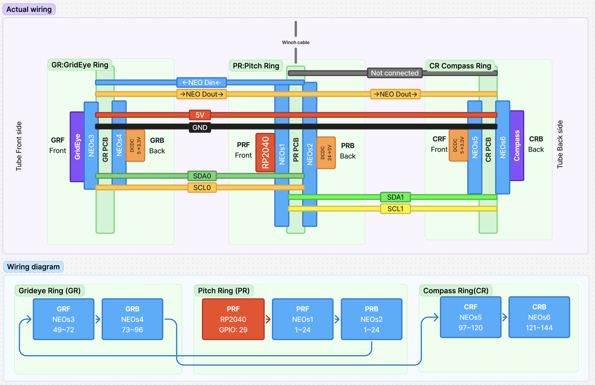
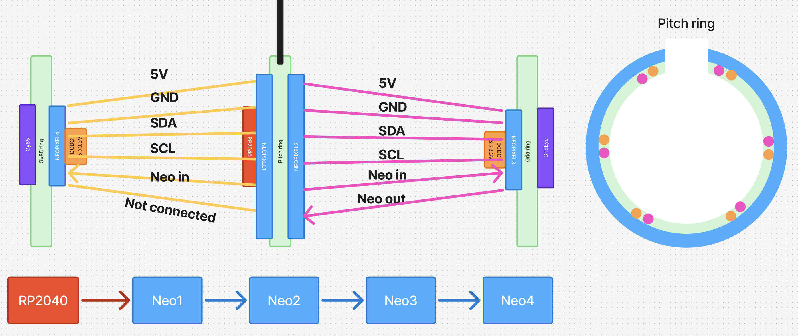
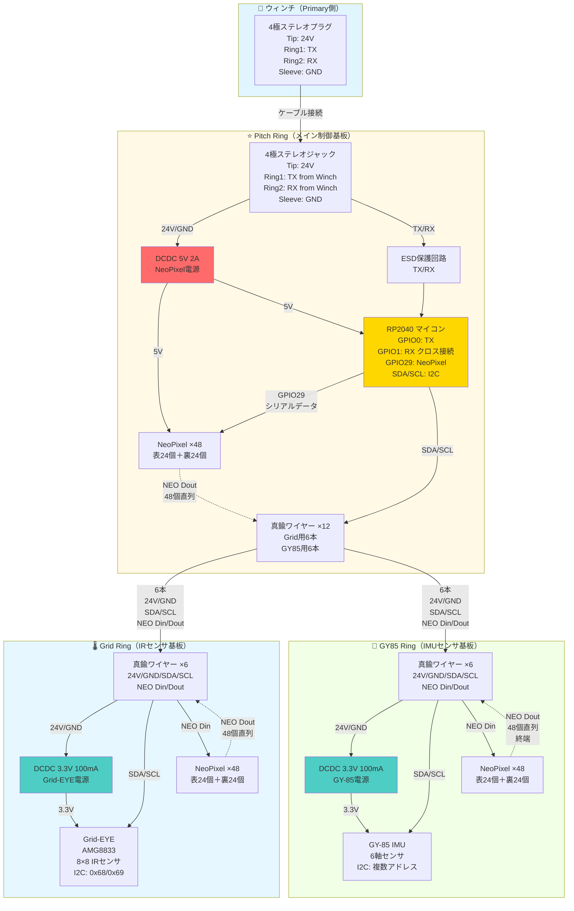

# 評価ボード設計・発注準備・確認タスク

## 📅 スケジュール

| マイルストーン | 日時 | 詳細 |
|------------|------|------|
| **発注完了** | 2025-10-24 | JLCPCB発注締切 |
| **評価ボード到着** | 2025-10-24 | 名古屋現地テスト前日着 |
| **現地テスト** | 2025-10-31 | ウィンチ5台+評価ボード5台 |
| **上條さん研修** | 2025-11-13 (Thu) | Kyopalab弟子入り開始 |

## 🎯 目的

ウィンチが現場でワークするかを検証するための**筒評価ボード**を設計・発注する。

- 筒の完成時期が見積もれていない状況で、なるべく早く検証を実行
- ウィンチとのインターフェース（電源・通信・機械的負荷）を検証
- 1ヶ月程度の耐久テストでケーブル断線リスクを評価

## 📋 プロジェクト背景

| 項目 | 内容 |
|------|------|
| **現状** | ウィンチはほぼ完成、筒はまだ時間がかかる |
| **目標台数** | ウィンチ60台（予備14台）+ 筒60台（予備14台）|
| **現地テスト** | 2025-10-31にウィンチ5台+評価ボード5台を名古屋に持ち込み |
| **サポート体制** | 上條さん（名古屋大学院進学予定）が2025-11-13からKyopalabで研修、2026年4月から筒サポート実施 |

## ✅ 検証項目

| # | 検証内容 | 詳細 | 担当 |
|---|---------|------|------|
| 1 | **電圧チェック** | ウィンチから24Vが正しく供給されているか | 鈴木さん |
| 2 | **通信チェック** | データ通信（TX/RX）が正しく動作するか | 鈴木さん |
| 3 | **光り方チェック** | 検討糸（ケント紙固定用）を巻いて影・光の干渉パターンを確認 | 鈴木さん |
| 4 | **ケーブル断線チェック** | 繰り返しウィンチを上下させ、1ヶ月間耐久テストを実施<br>**テストプログラム**: kyopanが作成（双方向通信を定期的に実行し、1ヶ月間ログ記録） | kyopan（プログラム）<br>鈴木さん（実行） |

## 🔧 ハードウェア仕様

### ⚠️ 重要な設計変更（2025-10-23 午後）

**NeoPixel真鍮線1配線を部分配線に変更**:

```
❌ 変更前（貫通配線）:
  真鍮線1: PRR.NEOs2.DOUT → GRF.NEOs3.DIN → CRF.NEOs5.DIN
  問題: GRとCRが同時点灯（個別制御不可）

✅ 変更後（部分配線）:
  真鍮線1: PRR.NEOs2.DOUT → GRF.NEOs3.DIN
  改善: PR ↔ GR のみ接続、CRには接続しない
```

**追加改善**:
- **PR配線最適化**: 真鍮線1端子をPRR.NEOs2.DOUTの最寄り位置に配置（配線コスト削減）
- **PR真鍮線1端子を2端子化**: GR接続用とCR接続用をジャンパー選択可能に
- **シルクラベル改善**: PRR/PRF/GRF/CRF等を大きく表示（視認性向上）

詳細: [評価ボード配線ディスカッション](../../notes/audio-transcriptions/evaluation-board-wiring-discussion.md#⚠️-重要な設計変更2025-10-23-午後)

#### 配線図（最新）



*図: 評価ボードの最新配線図（2025-10-23）*

**配線図の読み方**:
- **上段（Actual wiring）**: 実際の真鍮線配線とコンポーネント配置
  - 青線: NEO Din（PR → GR のみ、**CR側は "Not connected"**）
  - オレンジ線: NEO Dout（GR → PR → CR）
  - 赤線: 5V電源、黒線: GND
  - 緑・黄線: I2C通信（SDA0/SCL0, SDA1/SCL1）
- **下段（Wiring diagram）**: NeoPixelチェーン144個の論理接続
  - GRF→GRB (49-96) → PRF→PRB (1-48) → CRF→CRB (97-144)
  - RP2040 GPIO29からの信号フロー

---

### 基板構成概要

評価ボードは**3枚の独立した2層基板**で構成されます：

| 基板名 | 役割 | LED数 | センサー | DCDC | 真鍮ワイヤー |
|--------|------|-------|---------|------|-------------|
| **Grid Ring (GR)** | IRマトリクスセンサ + 照明 | 48個（表24＋裏24） | Grid-EYE (8×8 IR) | 3.3V 100mA | 6本 |
| **Pitch Ring (PR)** | メイン制御基板 + 照明 | 48個（表24＋裏24） | - | 5V 2A | 12本 |
| **Compass Ring (CR)** | IMUセンサ + 照明 | 48個（表24＋裏24） | GY-85 (6軸IMU) | 3.3V 100mA | 6本 |
| **合計** | - | **144個** | - | - | **24本** |

**構造**: Pitch Ringを中心に、Grid RingとCompass Ringが真鍮ワイヤーで接続される3層構造

**真鍮線1配線方式**: **部分配線**（PR ↔ GR のみ、CRへは非接続）

#### 3層基板構造イメージ



*図: 評価ボードの3層構造（Grid Ring、Pitch Ring、GY85 Ring）*

- **Pitch Ring中央**: RP2040マイコン、4極ステレオプラグ、12本の真鍮ワイヤー（円環状配置）
- **Grid Ring/GY85 Ring**: 各センサー＋48個のNeoPixel（表裏各24個）、6本の真鍮ワイヤーでPitch Ringに接続
- **ワイヤー配置**: Pitch Ringのピンク・オレンジドットパターンに従った円環状配置
- **LED配置の目的**: V1と同様のスポットライト効果を検証するため、全基板に表裏両面LED配置

---

### コンポーネント接続図

評価ボード全体の電気的接続を示します。



**接続図の読み方:**

| 記号 | 意味 |
|------|------|
| `-->` | 電源・信号の主要な流れ |
| `-.->` | NeoPixelシリアルデータチェーン（144個直列） |
| **太線ボックス** | 3枚の基板（Pitch/Grid/GY85 Ring） |

**重要ポイント:**

1. **電源系統**:
   - ウィンチから24V供給
   - Pitch Ringで5V降圧（NeoPixel 144個用、3A推奨）
   - Grid/GY85 Ringでそれぞれ3.3V降圧（センサー用）

2. **通信系統**:
   - **UART**: ウィンチ↔RP2040（クロス接続、ESD保護）
   - **I2C**: RP2040↔Grid-EYE/GY-85（共通バス、真鍮ワイヤー経由）
   - **NeoPixel**: 144個直列（Pitch 48個→Grid 48個→GY85 48個）

3. **真鍮ワイヤー**:
   - 構造支持と信号伝送を兼ねる
   - Pitch Ring: 12本（Grid用6本＋GY85用6本）
   - Grid/GY85 Ring: 各6本（24V/GND/SDA/SCL/NEO Din/Dout）

---

### 1️⃣ Grid Ring（IRセンサ基板）

#### 基本仕様
| 項目 | 仕様 |
|------|------|
| **PCB層数** | 2層（表・裏） |
| **センサー（表面）** | Grid-EYE (8×8 IRマトリクスセンサ、I2C接続) |
| **LED（表面）** | NeoPixel 2mm角 × 24個（円環状配置） |
| **LED（裏面）** | NeoPixel 2mm角 × 24個（円環状配置） |
| **電源回路** | DCDC 3.3V 100mA（Grid-EYE用） |
| **真鍮ワイヤー** | Φ1mm × 6本（円環状配置、Pitch Ringに接続） |

#### 真鍮ワイヤー信号（6本）
| # | 信号名 | 用途 |
|---|--------|------|
| 1 | 24V | 電源供給 |
| 2 | GND | グランド |
| 3 | SDA | I2C データ（Grid-EYE） |
| 4 | SCL | I2C クロック（Grid-EYE） |
| 5 | NEO Din | NeoPixel データ入力 |
| 6 | NEO Dout | NeoPixel データ出力（次段へ） |

---

### 2️⃣ Pitch Ring（メイン制御基板）

#### 基本仕様
| 項目 | 仕様 |
|------|------|
| **PCB層数** | 2層（表・裏） |
| **マイコン（表面）** | RP2040（WaveShare製） |
| **LED（表面）** | NeoPixel 2mm角 × 24個（円環状配置） |
| **LED（裏面）** | NeoPixel 2mm角 × 24個（円環状配置） |
| **電源回路（裏面）** | DCDC 5V 2A（メイン電源） |
| **コネクタ（表面）** | ステレオ4極ジャック（24V・GND・TX・RX、脱落防止対策） |
| **真鍮ワイヤー** | Φ1mm × 12本（円環状配置、6本ずつGrid/GY85に接続） |

#### RP2040 ピンアサイン（固定）
| ピン名 | GPIO | 用途 | 接続先 | 備考 |
|--------|------|------|--------|------|
| TX | GPIO0 | UART送信 | ジャック「RX from Winch」 | ESD保護回路必須、クロス接続 |
| RX | GPIO1 | UART受信 | ジャック「TX from Winch」 | ESD保護回路必須、クロス接続 |
| NeoPixel | GPIO29 | NeoPixel制御 | NeoPixel Din | 固定 |
| SDA | 自由 | I2C データ | Grid-EYE・GY-85共通 | プルアップ抵抗 |
| SCL | 自由 | I2C クロック | Grid-EYE・GY-85共通 | プルアップ抵抗 |

**重要**: ウィンチ（Primary）とのUART通信は**クロス接続**が必須
- ウィンチのTX → RP2040のRX (GPIO1)
- ウィンチのRX → RP2040のTX (GPIO0)

#### 真鍮ワイヤー配置（12本）
- **配置パターン**: eval_board.pngのPitch Ringに示されたピンク・オレンジドットの円環状配置に従う
- **接続先**:
  - 6本 → Grid Ring
  - 6本 → GY85 Ring
- **信号**: 各6本とも同じ信号（24V, GND, SDA, SCL, NEO Din, NEO Dout）

#### 4極ステレオジャックのピン配置（安全性重視）

| ピン位置 | 信号名 | RP2040接続 | 備考 |
|---------|--------|-----------|------|
| **先端 (Tip)** | 24V | - | 最初に接触（抜き差し時の安全性） |
| **リング1 (Ring1)** | TX from Winch | RX (GPIO1) | クロス接続 |
| **リング2 (Ring2)** | RX from Winch | TX (GPIO0) | クロス接続 |
| **根元 (Sleeve)** | GND | GND | 最後に接触（24V短絡防止） |

**設計理由:**
- 抜き差し時、先端から順に接触していく
- 24Vを先端にすることで、GNDとの短絡リスクを低減
- GNDを根元（最後に接触）にすることで、24Vの誤接触を防止

#### シルク印刷の表記

4極ステレオジャック付近のシルク印刷:

```
Tip:    24V
Ring1:  TX ← (from Winch)
Ring2:  RX ← (from Winch)
Sleeve: GND
```

または

```
TX from Winch → (to RP2040 RX)
RX from Winch → (to RP2040 TX)
```

**ポイント**: Secondary側（評価ボード）のPCBだけ見ても接続が明確になるよう表記

---

### 3️⃣ GY85 Ring（IMUセンサ基板）

#### 基本仕様
| 項目 | 仕様 |
|------|------|
| **PCB層数** | 2層（表・裏） |
| **センサー（表面）** | GY-85 (6軸IMU、I2C接続) |
| **LED（表面）** | NeoPixel 2mm角 × 24個（円環状配置） |
| **LED（裏面）** | NeoPixel 2mm角 × 24個（円環状配置） |
| **電源回路** | DCDC 3.3V 100mA（GY-85用） |
| **真鍮ワイヤー** | Φ1mm × 6本（円環状配置、Pitch Ringに接続） |

#### 真鍮ワイヤー信号（6本）
| # | 信号名 | 用途 |
|---|--------|------|
| 1 | 24V | 電源供給 |
| 2 | GND | グランド |
| 3 | SDA | I2C データ（GY-85） |
| 4 | SCL | I2C クロック（GY-85） |
| 5 | NEO Din | NeoPixel データ入力 |
| 6 | NEO Dout | NeoPixel データ出力（配線なし、端末処理） |

**注意**: GY85 RingのNEO Doutは真鍮ワイヤーに接続するが、配線はしない（端末）

---

### 共通仕様

#### NeoPixel総数
```
Grid Ring:  48個（表24 + 裏24）
Pitch Ring: 48個（表24 + 裏24）
GY85 Ring:  48個（表24 + 裏24）
───────────────────────────
合計:       144個
```

**設計意図**:
- V1と同様のスポットライト効果を検証
- 全基板で表裏両面LED配置により、光の回り込みや影の見え方を比較評価

#### 真鍮ワイヤー総数
```
Grid Ring:  6本（Pitch Ringへ）
Pitch Ring: 12本（Grid 6本 + GY85 6本）
GY85 Ring:  6本（Pitch Ringへ）
───────────────────────────
合計:       24本（構造・電源・通信を兼ねる）
```

#### 電源系統
| 電源 | 供給元 | 出力 | 用途 |
|------|--------|------|------|
| 24V入力 | ウィンチ（4極ステレオプラグ経由） | - | メイン電源 |
| 5V系 | Pitch Ring DCDC | 2A以上 | RP2040・NeoPixel（全144個） |
| 3.3V系（Grid） | Grid Ring DCDC | 100mA | Grid-EYE |
| 3.3V系（GY85） | GY85 Ring DCDC | 100mA | GY-85 IMU |

**注意**: NeoPixel 144個に対応するため、5V系DCDCは2A以上の容量が必要（3A推奨）

#### 通信系統
| 通信方式 | 用途 | 接続 |
|---------|------|------|
| **UART** | ウィンチ↔評価ボード | 4極ステレオプラグ（TX/RX） |
| **I2C** | RP2040 ↔ Grid-EYE・GY-85 | 真鍮ワイヤー経由（SDA/SCL共通バス） |
| **NeoPixel** | 144個のLED制御 | シリアルデータチェーン（144個直列） |

### 重量調整機構

| 項目 | 仕様 |
|------|------|
| **基本構造** | 表面実装用ナット × 4個（対角4点、対称配置） |
| **調整方法** | 鉄カラーで重量調整・固定 |
| **目標重量** | 実際の筒重量 × **1.2倍**（安全係数） |
| **設計裁量** | 下記2案のいずれか、または独自案 |

#### 重量調整の実装方法（2案）

| 案 | 方法 | 詳細 |
|----|------|------|
| **案1** | ナット+ネジ+カラー | ナットにネジを通し、カラーを複数個重ねて重量調整 |
| **案2** | 3Dプリントパーツ+重り | 3Dプリントパーツで構造を作り、重りを配置 |

**結論**: **どちらでもOK**。重要なのは**実際の筒重量を見積もり、それに合わせること**。

## ❌ スコープ外

以下は評価ボードには含めない：

- スリップリングの別途設計
- スラストベアリングの別途設計

## 📐 設計プロセス

### Step 1: 筒の重量見積もり

| # | タスク | 詳細 |
|---|--------|------|
| 1 | モジュールリスト作成 | 筒に搭載される/されうるモジュールを列挙 |
| 2 | 重量測定 | 各モジュールの実測重量を記録 |
| 3 | 合計重量計算 | 全モジュールの合計重量を算出 |
| 4 | 目標重量設定 | 合計重量 × **1.2倍**（安全係数） |

### Step 2: 回路設計

| # | タスク | 詳細 |
|---|--------|------|
| 1 | V1回路抽出 | [EasyEDA V1](https://pro.easyeda.com/editor#id=91112fbff8f44189b064c06750374ec7)（7枚構成）から必要回路を抽出 |
| 2 | RP2040配線 | TX=GPIO0, RX=GPIO1, NeoPixel=GPIO29（**固定**）|
| 3 | ESD保護回路 | TX/RXにESD保護回路を追加 |
| 4 | 電源回路 | 24V→5V 2A DCDC降圧回路を配置 |

### Step 3: 基板レイアウト設計

#### Grid Ring レイアウト
| # | コンポーネント | 配置要件 |
|---|--------------|---------|
| 1 | Grid-EYE (8×8 IR) | 表面中央 |
| 2 | NeoPixel 24個（表） | 表面、円環状配置 |
| 3 | NeoPixel 24個（裏） | 裏面、円環状配置 |
| 4 | DCDC 3.3V 100mA | 裏面 |
| 5 | 真鍮ワイヤーポート | Φ1mm対応、6個（円環LEDの内側に円環状配置） |
| 6 | 表面実装用ナット | 4個（対角・対称配置、重量調整用） |

#### Pitch Ring レイアウト
| # | コンポーネント | 配置要件 |
|---|--------------|---------|
| 1 | RP2040（WaveShare） | 表面中央 |
| 2 | NeoPixel 24個（表） | 表面、円環状配置 |
| 3 | NeoPixel 24個（裏） | 裏面、円環状配置 |
| 4 | DCDC 5V 2A | 裏面 |
| 5 | ステレオ4極ジャック | 表面、脱落防止対策付き |
| 6 | 真鍮ワイヤーポート | Φ1mm対応、12個（eval_board.pngのピンク・オレンジドット配置に従う） |
| 7 | 表面実装用ナット | 4個（対角・対称配置、重量調整用） |

#### GY85 Ring レイアウト
| # | コンポーネント | 配置要件 |
|---|--------------|---------|
| 1 | GY-85 (6軸IMU) | 表面中央 |
| 2 | NeoPixel 24個（表） | 表面、円環状配置 |
| 3 | NeoPixel 24個（裏） | 裏面、円環状配置 |
| 4 | DCDC 3.3V 100mA | 裏面 |
| 5 | 真鍮ワイヤーポート | Φ1mm対応、6個（円環LEDの内側に円環状配置） |
| 6 | 表面実装用ナット | 4個（対角・対称配置、重量調整用） |

### Step 4: JLCPCB発注

| 項目 | 内容 |
|------|------|
| **発注先** | JLCPCB |
| **到着目標** | **2025-10-24** |
| **基板種類** | Grid Ring, Pitch Ring, GY85 Ring（各2層基板） |
| **数量** | 各基板5枚以上（現地テスト用）+ 予備 |

## 📊 タスク分解

| # | Phase | タスク | 担当 | 期限 | Status |
|---|-------|--------|------|------|--------|
| 1 | 調査 | V1 EasyEDAファイル確認・必要回路抽出 | 鈴木さん | 10/17 | ⚪ Pending |
| 2 | 調査 | 筒の重量見積もり（モジュールリスト作成） | 鈴木さん | 10/17 | ⚪ Pending |
| 3 | 設計 | 回路図作成（EasyEDA、3層基板構造） | 鈴木さん | 10/18 | ⚪ Pending |
| 3-1 | └ | Grid Ring回路図 | 鈴木さん | 10/18 | ⚪ Pending |
| 3-2 | └ | Pitch Ring回路図 | 鈴木さん | 10/18 | ⚪ Pending |
| 3-3 | └ | GY85 Ring回路図 | 鈴木さん | 10/18 | ⚪ Pending |
| 4 | 設計 | PCBレイアウト設計（3基板） | 鈴木さん | 10/20 | ⚪ Pending |
| 4-1 | └ | Grid Ring レイアウト | 鈴木さん | 10/20 | ⚪ Pending |
| 4-1-1 | 　└ | Grid-EYE配置（表面） | 鈴木さん | 10/20 | ⚪ Pending |
| 4-1-2 | 　└ | NeoPixel 24個配置（表面） | 鈴木さん | 10/20 | ⚪ Pending |
| 4-1-2b | 　└ | NeoPixel 24個配置（裏面） | 鈴木さん | 10/20 | ⚪ Pending |
| 4-1-3 | 　└ | DCDC 3.3V 100mA配置 | 鈴木さん | 10/20 | ⚪ Pending |
| 4-1-4 | 　└ | 真鍮ワイヤーポート6個配置 | 鈴木さん | 10/20 | ⚪ Pending |
| 4-2 | └ | Pitch Ring レイアウト | 鈴木さん | 10/20 | ⚪ Pending |
| 4-2-1 | 　└ | RP2040配置・配線（表面） | 鈴木さん | 10/20 | ⚪ Pending |
| 4-2-2 | 　└ | NeoPixel 24個配置（表面） | 鈴木さん | 10/20 | ⚪ Pending |
| 4-2-3 | 　└ | NeoPixel 24個配置（裏面） | 鈴木さん | 10/20 | ⚪ Pending |
| 4-2-4 | 　└ | DCDC 5V 2A配置（裏面） | 鈴木さん | 10/20 | ⚪ Pending |
| 4-2-5 | 　└ | ステレオ4極ジャック配置 | 鈴木さん | 10/20 | ⚪ Pending |
| 4-2-6 | 　└ | 真鍮ワイヤーポート12個配置（eval_board.png参照） | 鈴木さん | 10/20 | ⚪ Pending |
| 4-3 | └ | GY85 Ring レイアウト | 鈴木さん | 10/20 | ⚪ Pending |
| 4-3-1 | 　└ | GY-85配置（表面） | 鈴木さん | 10/20 | ⚪ Pending |
| 4-3-2 | 　└ | NeoPixel 24個配置（表面） | 鈴木さん | 10/20 | ⚪ Pending |
| 4-3-2b | 　└ | NeoPixel 24個配置（裏面） | 鈴木さん | 10/20 | ⚪ Pending |
| 4-3-3 | 　└ | DCDC 3.3V 100mA配置 | 鈴木さん | 10/20 | ⚪ Pending |
| 4-3-4 | 　└ | 真鍮ワイヤーポート6個配置 | 鈴木さん | 10/20 | ⚪ Pending |
| 4-4 | └ | 重量調整用ナット配置（各基板4個ずつ） | 鈴木さん | 10/20 | ⚪ Pending |
| 5 | レビュー | 設計レビュー | kyopan/Hirano | 10/21 | ⚪ Pending |
| 6 | 発注 | Gerberファイル生成（3基板分） | 鈴木さん | 10/22 | ⚪ Pending |
| 7 | 発注 | **JLCPCB発注**（Grid/Pitch/GY85各5枚） | 鈴木さん | **10/24** | ⚪ Pending |
| 8 | 検証 | 評価ボード到着確認（3基板×5セット） | 鈴木さん | 10/24 | ⚪ Pending |
| 9 | テスト | ケーブル断線テストプログラム作成 | kyopan | 10/25 | ⚪ Pending |
| 10 | テスト | 名古屋現地テスト | kyopan/鈴木さん | 10/31 | ⚪ Pending |
| 11 | テスト | 1ヶ月耐久テスト開始 | 鈴木さん | 11/01〜 | ⚪ Pending |

## 📝 参考資料

| 資料名                     | リンク                                                                                                                                      | 用途                     |
| ----------------------- | ---------------------------------------------------------------------------------------------------------------------------------------- | ---------------------- |
| **評価ボード3層構造図**      | [eval_board.png](../../notes/eval_board.png) | 3層基板構造・真鍮ワイヤー配置パターン |
| **TX/RXピンアサイン指示** | [tx-rx-connector-pinout-instructions-2025-10-17.md](../../notes/tx-rx-connector-pinout-instructions-2025-10-17.md) | UART通信・4極ジャックピン配置・シルク印刷 |
| **V1 EasyEDAファイル**      | [https://pro.easyeda.com/editor#id=91112fbff8f44189b064c06750374ec7](https://pro.easyeda.com/editor#id=91112fbff8f44189b064c06750374ec7) | 回路設計・PCBレイアウトの参考（7枚構成） |
| **RP2040 仕様書**          | WaveShare公式                                                                                                                              | ピンアサイン確認               |
| **NeoPixel 2mm角データシート** | Adafruit公式                                                                                                                               | LED配置・電源仕様             |
| **Grid-EYE データシート** | Panasonic公式 | IRマトリクスセンサ仕様 |
| **GY-85 データシート** | 各種（L3G4200D/ADXL345/HMC5883L） | 6軸IMU仕様 |
| **ステレオ4極ジャック仕様**        | 選定後追記                                                                                                                                    | コネクタ実装仕様               |

## 🔗 関連ドキュメント

| ドキュメント | 用途 |
|------------|------|
| [README](../../README.md) | プロジェクト概要 |
| [TODO](../../TODO.md) | プロジェクト全体のTODO |
| [音声文字起こし](../../notes/task-instructions-transcription-2025-10-16.md) | タスク指示の詳細 |

## 📞 質問・レビュー連絡先

| 担当 | 対応内容 |
|------|---------|
| **kyopan** | 回路設計、ピンアサイン、V1 EasyEDAファイルの説明 |
| **Hirano** | 設計レビュー、実装アドバイス |
| **上條さん**（2025-11-13〜） | 筒サポート（研修開始後）|

---

## 📌 重要な注意事項

### V1との違い

- **V1**: 7枚構成の複雑な基板
- **評価ボード**: 3枚構成の基板（Grid Ring, Pitch Ring, GY85 Ring）
  - 各基板は2層基板（表・裏）
  - 真鍮ワイヤーで3層構造を形成
  - 必要最小限の機能で検証を実施

### 固定すべきピンアサイン（変更禁止）

```
TX        → GPIO0  (ESD保護回路付き)
RX        → GPIO1  (ESD保護回路付き)
NeoPixel  → GPIO29
```

### その他のピンは自由に設計してOK

---

## ✅ 完了条件

- [ ] JLCPCB発注完了（2025-10-24まで）
  - Grid Ring: 5枚以上
  - Pitch Ring: 5枚以上
  - GY85 Ring: 5枚以上
- [ ] 評価ボード到着（2025-10-24）
  - 3層基板×5セット（Grid/Pitch/GY85）
- [ ] 筒の目標重量（×1.2倍）を反映した重量調整機構
  - 各基板に表面実装ナット4個配置
- [ ] 全検証項目（電圧・通信・光・耐久）が実行可能な構成
  - 144個のNeoPixel動作確認（各基板48個×3枚）
  - I2C通信（Grid-EYE + GY-85）
  - UART通信（ウィンチ↔RP2040）
  - 真鍮ワイヤー24本の接続確認
  - V1スポットライト効果の再現性確認