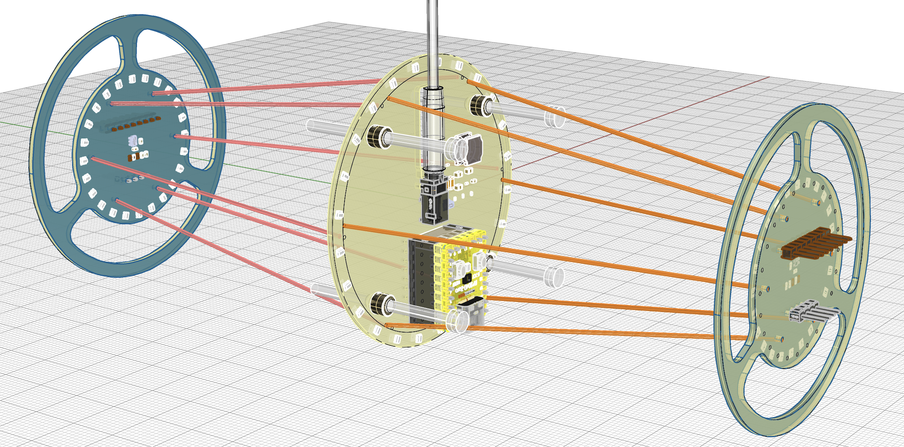
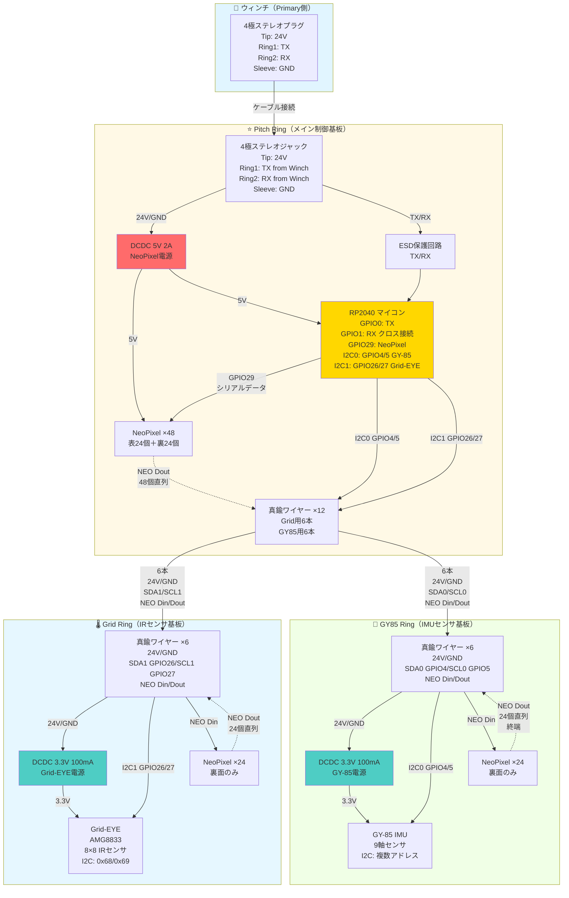

# 評価ボード設計・発注準備・確認タスク

## 📅 スケジュール

| マイルストーン | 日時 | 詳細 |
|------------|------|------|
| **発注完了** | 2025-10-24 | JLCPCB発注締切 |
| **評価ボード到着** | 2025-10-24 | 名古屋現地テスト前日着 |
| **現地テスト** | 2025-10-31 | ウィンチ5台+評価ボード5台 |
| **上條さん研修** | 2025-11-13 (Thu) | Kyopalab弟子入り開始 |

---

## 🎯 目的

ウィンチが現場でワークするかを検証するための**筒評価ボード**を設計・発注する。

- 筒の完成時期が見積もれていない状況で、なるべく早く検証を実行
- ウィンチとのインターフェース（電源・通信・機械的負荷）を検証
- 1ヶ月程度の耐久テストでケーブル断線リスクを評価

---

## 📋 プロジェクト背景

| 項目 | 内容 |
|------|------|
| **現状** | ウィンチはほぼ完成、筒はまだ時間がかかる |
| **目標台数** | ウィンチ60台（予備14台）+ 筒60台（予備14台）|
| **現地テスト** | 2025-10-31にウィンチ5台+評価ボード5台を名古屋に持ち込み |
| **サポート体制** | 上條さん（名古屋大学院進学予定）が2025-11-13からKyopalabで研修、2026年4月から筒サポート実施 |

---

## ✅ 検証項目

| # | 検証内容 | 詳細 | 担当 |
|---|---------|------|------|
| 1 | **電圧チェック** | ウィンチから24Vが正しく供給されているか | 鈴木さん |
| 2 | **通信チェック** | データ通信（TX/RX）が正しく動作するか | 鈴木さん |
| 3 | **光り方チェック** | 検討糸（ケント紙固定用）を巻いて影・光の干渉パターンを確認 | 鈴木さん |
| 4 | **ケーブル断線チェック** | 繰り返しウィンチを上下させ、1ヶ月間耐久テストを実施<br>**テストプログラム**: kyopanが作成（双方向通信を定期的に実行し、1ヶ月間ログ記録） | kyopan（プログラム）<br>鈴木さん（実行） |

---

## 🔧 ハードウェア構成概要

### 基板構成

評価ボードは**3枚の独立した2層基板**で構成されます：

| 基板名 | 役割 | LED数 | センサー | DCDC | 真鍮ワイヤー |
|--------|------|-------|---------|------|-------------|
| **Grid Ring** | IRマトリクスセンサ + 照明 | 24個 | Grid-EYE (8×8 IR) | 3.3V 100mA | 6本 |
| **Pitch Ring** | メイン制御基板 + 照明 | 48個（表裏各24） | - | 5V 2A | 12本 |
| **GY85 Ring** | IMUセンサ + 照明 | 24個 | GY-85 (9軸IMU) | 3.3V 100mA | 6本 |
| **合計** | - | **144個** | - | - | **24本** |

⚠️ **NeoPixel総数訂正**: 96個 → **144個**（各基板表裏24個×3枚）

**構造**: Pitch Ringを中心に、Grid RingとGY85 Ringが真鍮ワイヤーで接続される3層構造

---

### 3層基板構造イメージ



*図: 評価ボードの3D構造モデル*

**構造の特徴:**
- **左側**: Grid Ring（IRセンサ基板）- 青緑色のフレームに赤いケーブル配線
- **中央**: Pitch Ring（メイン制御基板）- 黄色の基板にRP2040マイコンと4極ステレオプラグを配置
- **右側**: GY85 Ring（IMUセンサ基板）- 黄緑色のフレーム
- **接続**: 真鍮ワイヤー24本（赤・オレンジで表示）が3層基板を接続
- **配線**: Pitch Ringの12本の真鍮ワイヤーが6本ずつGrid RingとGY85 Ringに分配

**設計ポイント:**
- **Pitch Ring中央**: RP2040マイコン、4極ステレオプラグ、12本の真鍮ワイヤー（円環状配置）
- **Grid Ring/GY85 Ring**: 各センサー＋24個のNeoPixel、6本の真鍮ワイヤーでPitch Ringに接続
- **ワイヤー配置**: Pitch Ringのピンク・オレンジドットパターンに従った円環状配置（この3Dモデル参照）

---

### コンポーネント接続図

評価ボード全体の電気的接続を示します。



**接続図の読み方:**

| 記号 | 意味 |
|------|------|
| `-->` | 電源・信号の主要な流れ |
| `-.->` | NeoPixelシリアルデータチェーン（144個直列） |
| **太線ボックス** | 3枚の基板（Pitch/Grid/GY85 Ring） |

**重要ポイント:**

1. **電源系統**:
   - ウィンチから24V供給
   - Pitch Ringで5V降圧（NeoPixel 144個用）
   - Grid/GY85 Ringでそれぞれ3.3V降圧（センサー用）

2. **通信系統**:
   - **UART**: ウィンチ↔RP2040（クロス接続、ESD保護）
   - **I2C0（GPIO4/5）**: RP2040↔GY-85（真鍮ワイヤー経由）
   - **I2C1（GPIO26/27）**: RP2040↔Grid-EYE（真鍮ワイヤー経由）
   - **NeoPixel**: 144個直列（Pitch 48個→Grid 24個→GY85 24個）

3. **真鍮ワイヤー**:
   - 構造支持と信号伝送を兼ねる
   - Pitch Ring: 12本（Grid用6本＋GY85用6本）
   - Grid Ring: 6本（24V/GND/SDA1/SCL1/NEO Din/Dout）
   - GY85 Ring: 6本（24V/GND/SDA0/SCL0/NEO Din/Dout）

---

## 📚 詳細仕様書

詳細な設計情報は以下のドキュメントを参照してください：

| ドキュメント | 内容 |
|------------|------|
| [**ハードウェア詳細仕様書**](specs/hardware-specifications.md) | 各基板の詳細仕様、ピン配置、センサー仕様、ワイヤ信号、部品リスト |
| [**回路設計仕様書**](specs/circuit-specifications.md) | DCDC回路詳細、ESD保護回路、NeoPixel部分点灯プラン、回路検証結果 |
| [**PCBレイアウト設計ガイド**](specs/pcb-layout-guide.md) | 各基板のレイアウト要件、コンポーネント配置、配線設計、製造仕様 |

---

## 📐 設計プロセス

### Step 1: 筒の重量見積もり

| # | タスク | 詳細 |
|---|--------|------|
| 1 | モジュールリスト作成 | 筒に搭載される/されうるモジュールを列挙 |
| 2 | 重量測定 | 各モジュールの実測重量を記録 |
| 3 | 合計重量計算 | 全モジュールの合計重量を算出 |
| 4 | 目標重量設定 | 合計重量 × **1.2倍**（安全係数） |

**優先度**: 後で調整可能な設計（重量調整機構を実装）

---

### Step 2: 回路設計

詳細は [回路設計仕様書](specs/circuit-specifications.md) を参照。

#### 設計タスク状態

| # | タスク | 詳細 | 状態 |
|---|--------|------|------|
| 1 | V1回路抽出 | V1 EasyEDAから必要回路を抽出 | ✅ 完了 |
| 2 | RP2040配線 | TX=GPIO0, RX=GPIO1, NeoPixel=GPIO29 | ✅ 確定 |
| 3 | ESD保護回路 | TX/RXにPESD5V0S1BL配置 | 🔴 TODO |
| 4 | 電源回路（5V） | TPS54202DDCR（V1流用） | ✅ 検証済み |
| 5 | 電源回路（3.3V） | SY8113IADC（C3/C4を10uFに修正） | ⚠️ 修正必要 |
| 6 | I2Cプルアップ抵抗 | マイコン内部プルアップ使用 | ✅ 不要 |
| 7 | NeoPixel部分点灯プラン | 詳細仕様策定 | 🔴 TODO |

---

### Step 3: 基板レイアウト設計

詳細は [PCBレイアウト設計ガイド](specs/pcb-layout-guide.md) を参照。

#### 共通外形仕様

| 項目 | 仕様 |
|------|------|
| **外径** | **78mm**（確定） |
| **形状** | 円形 |
| **層数** | 2層（表面・裏面） |
| **取付穴** | 対角4箇所（ナット用） |

---

### Step 4: JLCPCB発注

| 項目 | 内容 |
|------|------|
| **発注先** | JLCPCB |
| **到着目標** | **2025-10-24** |
| **基板種類** | Grid Ring, Pitch Ring, GY85 Ring（各2層基板） |
| **数量** | 各基板5枚以上（現地テスト用）+ 予備 |

---

## 📊 タスク分解

| # | Phase | タスク | 担当 | 期限 | Status |
|---|-------|--------|------|------|--------|
| 1 | 調査 | V1 EasyEDAファイル確認・必要回路抽出 | 鈴木さん | 10/17 | ⚪ Pending |
| 2 | 調査 | 筒の重量見積もり（モジュールリスト作成） | 鈴木さん | 10/17 | ⚪ Pending |
| 3 | 設計 | 回路図作成（EasyEDA、3層基板構造） | 鈴木さん | 10/18 | ⚪ Pending |
| 4 | 設計 | PCBレイアウト設計（3基板） | 鈴木さん | 10/20 | ⚪ Pending |
| 5 | レビュー | 設計レビュー | kyopan/Hirano | 10/21 | ⚪ Pending |
| 6 | 発注 | Gerberファイル生成（3基板分） | 鈴木さん | 10/22 | ⚪ Pending |
| 7 | 発注 | **JLCPCB発注**（Grid/Pitch/GY85各5枚） | 鈴木さん | **10/24** | ⚪ Pending |
| 8 | 検証 | 評価ボード到着確認（3基板×5セット） | 鈴木さん | 10/24 | ⚪ Pending |
| 9 | テスト | ケーブル断線テストプログラム作成 | kyopan | 10/25 | ⚪ Pending |
| 10 | テスト | 名古屋現地テスト | kyopan/鈴木さん | 10/31 | ⚪ Pending |
| 11 | テスト | 1ヶ月耐久テスト開始 | 鈴木さん | 11/01〜 | ⚪ Pending |

---

## 📝 参考資料

| 資料名 | リンク | 用途 |
|--------|-------|------|
| **評価ボード3D構造モデル** | [images/eval-board-3d-model.png](images/eval-board-3d-model.png) | 3層基板構造・真鍮ワイヤー配置パターン・全体構造の可視化 |
| **TX/RXピンアサイン指示** | [tx-rx-connector-pinout-instructions-2025-10-17.md](../../notes/tx-rx-connector-pinout-instructions-2025-10-17.md) | UART通信・4極ジャックピン配置・シルク印刷 |
| **V1 EasyEDAファイル** | [https://pro.easyeda.com/editor#id=91112fbff8f44189b064c06750374ec7](https://pro.easyeda.com/editor#id=91112fbff8f44189b064c06750374ec7) | 回路設計・PCBレイアウトの参考（7枚構成） |
| **RP2040 仕様書** | WaveShare公式 | ピンアサイン確認 |
| **NeoPixel データシート** | Adafruit公式 | LED配置・電源仕様 |
| **Grid-EYE データシート** | Panasonic公式 | IRマトリクスセンサ仕様 |
| **GY-85 データシート** | 各種（ADXL345/ITG3205/HMC5883L） | 9軸IMU仕様 |
| **ステレオ4極ジャック仕様** | 選定後追記 | コネクタ実装仕様 |

---

## 🔗 関連ドキュメント

| ドキュメント | 用途 |
|------------|------|
| [README](../../README.md) | プロジェクト概要 |
| [TODO](../../TODO.md) | プロジェクト全体のTODO |
| [音声文字起こし](../../notes/task-instructions-transcription-2025-10-16.md) | タスク指示の詳細 |

---

## 📞 質問・レビュー連絡先

| 担当 | 対応内容 |
|------|---------|
| **kyopan** | 回路設計、ピンアサイン、V1 EasyEDAファイルの説明 |
| **Hirano** | 設計レビュー、実装アドバイス |
| **上條さん**（2025-11-13〜） | 筒サポート（研修開始後）|

---

## 📌 重要な注意事項

### V1との違い

- **V1**: 7枚構成の複雑な基板
- **評価ボード**: 3枚構成の基板（Grid Ring, Pitch Ring, GY85 Ring）
  - 各基板は2層基板（表・裏）
  - 真鍮ワイヤーで3層構造を形成
  - 必要最小限の機能で検証を実施

### 固定すべきピンアサイン（変更禁止）

```
TX        → GPIO0  (ESD保護回路付き)
RX        → GPIO1  (ESD保護回路付き)
NeoPixel  → GPIO29
```

### その他のピンは自由に設計してOK

---

## ✅ 完了条件

- [ ] JLCPCB発注完了（2025-10-24まで）
  - Grid Ring: 5枚以上
  - Pitch Ring: 5枚以上
  - GY85 Ring: 5枚以上
- [ ] 評価ボード到着（2025-10-24）
  - 3層基板×5セット（Grid/Pitch/GY85）
- [ ] 筒の目標重量（×1.2倍）を反映した重量調整機構
  - 各基板に表面実装ナット4個配置
- [ ] 全検証項目（電圧・通信・光・耐久）が実行可能な構成
  - 144個のNeoPixel動作確認
  - I2C通信（Grid-EYE + GY-85）
  - UART通信（ウィンチ↔RP2040）
  - 真鍮ワイヤー24本の接続確認
