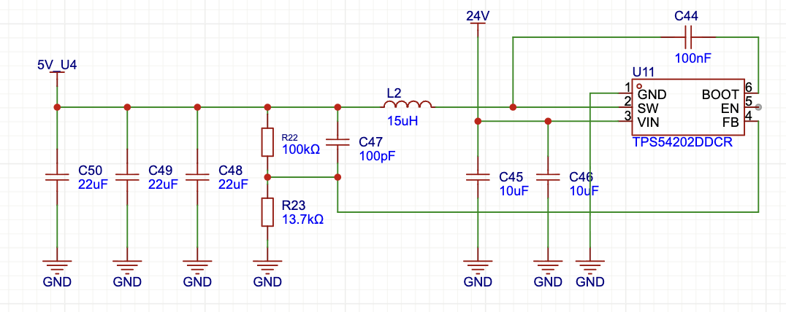
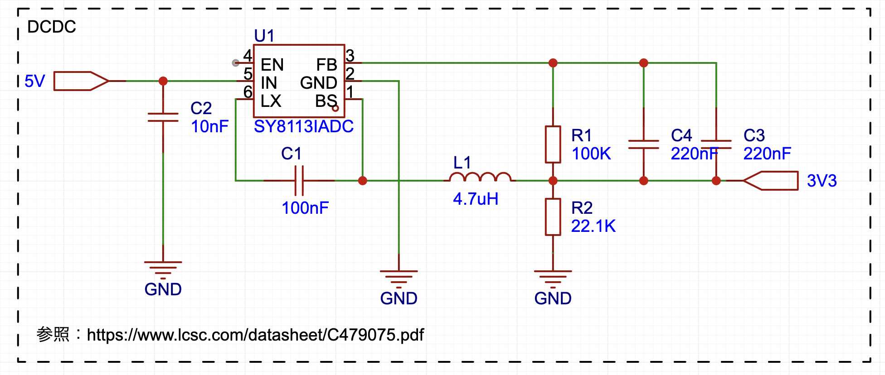

# 評価ボード - 回路設計仕様書

## 📋 概要

評価ボード3枚（Grid Ring, Pitch Ring, GY85 Ring）の電源回路・保護回路の詳細仕様。

---

## ⚡ 電源回路仕様

### 1️⃣ Pitch Ring - DCDC 24V→5V（TPS54202DDCR）



**IC**: TPS54202DDCR（Texas Instruments、2A降圧DCDC）

#### 部品表

| 部品 | 値 | パッケージ | 用途 |
|------|-----|-----------|------|
| **U11** | TPS54202DDCR | SOT-23-6 | メインDCDC IC |
| **L2** | 15uH | SMD | 出力インダクタ |
| **C44** | 100nF | 0603 | 入力バイパスコンデンサ |
| **C47** | 100pF | 0603 | フィードバック補償 |
| **C45, C46** | 10uF × 2 | 0805 | 入力平滑コンデンサ |
| **C48, C49, C50** | 22uF × 3 | 0805 | 出力平滑コンデンサ（66uF合計） |
| **R22** | 100kΩ | 0603 | 出力電圧設定（上側） |
| **R23** | 13.7kΩ | 0603 | 出力電圧設定（下側） |

#### 出力電圧計算

```
Vout = 0.6V × (1 + R22/R23)
     = 0.6V × (1 + 100kΩ/13.7kΩ)
     = 0.6V × 8.3
     = 4.98V ≈ 5V
```

#### 検証結果

**✅ 回路は正しい**

- V1から流用、実績あり
- NeoPixel 144個は**部分点灯運用**で問題なし
- 出力コンデンサ: 66uF（22uF × 3）で十分

---

### 2️⃣ Grid/GY Ring - DCDC 5V→3.3V（SY8113IADC）



**IC**: SY8113IADC（Silergy、3A降圧DCDC）
**データシート**: [C479075.pdf](https://www.lcsc.com/datasheet/C479075.pdf)

#### 部品表

| 部品 | 値 | パッケージ | 用途 |
|------|-----|-----------|------|
| **U1** | SY8113IADC | SOT-23-6 | メインDCDC IC |
| **L1** | 4.7uH | SMD | 出力インダクタ |
| **C2** | 10nF | 0603 | 入力バイパスコンデンサ |
| **C1** | 100nF | 0603 | フィードバック安定化 |
| **C3, C4** | **10uF × 2** | **0805** | **出力平滑コンデンサ** ⚠️ |
| **R1** | 100kΩ | 0603 | 出力電圧設定（上側） |
| **R2** | 22.1kΩ | 0603 | 出力電圧設定（下側） |

#### ⚠️ 修正指示

```diff
- C3, C4 = 220nF（元の設計）
+ C3, C4 = 10uF（セラミックコンデンサ、X7R、16V以上）
```

**理由**:
- データシート推奨値: 最低10uF
- 電源安定化のため必須
- センサー用途でも安定性向上

#### 出力電圧計算

```
Vout = 0.6V × (1 + R1/R2)
     = 0.6V × (1 + 100kΩ/22.1kΩ)
     = 0.6V × 5.53
     = 3.32V ≈ 3.3V
```

#### 検証結果

**⚠️ 修正後、回路は正しい**

- C3/C4を10uFに変更すれば問題なし
- センサー用途（Grid-EYE/GY-85）に十分な性能

---

## 🛡️ ESD保護回路（必須）

### 対象

TX/RX（UART通信）

### 推奨素子

**PESD5V0S1BL**（NXP Semiconductors）

| 項目 | 仕様 |
|------|------|
| パッケージ | SOD-323 |
| 保護電圧 | 5V |
| 用途 | 静電気・サージ保護 |
| データシート | [PESD5V0S1BL.pdf](https://www.nxp.com/docs/en/data-sheet/PESD5V0S1BL.pdf) |

### 配置

```
TX信号線 ──┬── RP2040 GPIO0
           │
         [PESD5V0S1BL]
           │
          GND

RX信号線 ──┬── RP2040 GPIO1
           │
         [PESD5V0S1BL]
           │
          GND
```

### 目的

- 静電気放電（ESD）対策
- サージ電圧保護
- ウィンチ接続時の保護

---

## 💡 NeoPixel部分点灯プラン（TODO）

### 背景

| 項目 | 値 |
|------|-----|
| **NeoPixel総数** | **144個**（各基板表裏24個×3枚） |
| **5V DCDC** | TPS54202DDCR（2A定格） |
| **全点灯時電流** | 144個 × 60mA = **8.64A**（理論値） |

### 運用方針

**部分点灯**でDCDC容量（2A）内に収める

### 電流計算

```
DCDC容量: 2A = 2000mA
同時点灯可能LED数: 2000mA ÷ 60mA = 33個

推奨上限: 2000mA × 0.8（安全率）÷ 60mA = 26個
```

### 別途詳細仕様が必要

- [ ] 同時点灯LED数の上限（推奨: 26個以下）
- [ ] 輝度制限の有無（PWM設定: 0-255）
- [ ] 点灯パターン（スポットライト効果の実装方法）
- [ ] ファームウェア側の電流制限ロジック

### 担当

- **kyopan**: プログラム仕様策定
- **鈴木さん**: テスト実行

---

## 📋 回路設計タスク状態

| # | タスク | 詳細 | 状態 |
|---|--------|------|------|
| 1 | V1回路抽出 | V1 EasyEDAから必要回路を抽出 | ✅ 完了 |
| 2 | RP2040配線 | TX=GPIO0, RX=GPIO1, NeoPixel=GPIO29 | ✅ 確定 |
| 3 | ESD保護回路 | TX/RXにPESD5V0S1BL配置 | 🔴 TODO |
| 4 | 電源回路（5V） | TPS54202DDCR（V1流用） | ✅ 検証済み |
| 5 | 電源回路（3.3V） | SY8113IADC（C3/C4を10uFに修正） | ⚠️ 修正必要 |
| 6 | I2Cプルアップ抵抗 | マイコン内部プルアップ使用 | ✅ 不要 |
| 7 | NeoPixel部分点灯プラン | 詳細仕様策定 | 🔴 TODO |

---

## 🔗 関連ドキュメント

| ドキュメント | 用途 |
|------------|------|
| [evaluation-board-design.md](../evaluation-board-design.md) | メインタスク管理 |
| [hardware-specifications.md](hardware-specifications.md) | ハードウェア詳細仕様 |
| [pcb-layout-guide.md](pcb-layout-guide.md) | PCBレイアウト設計ガイド |
