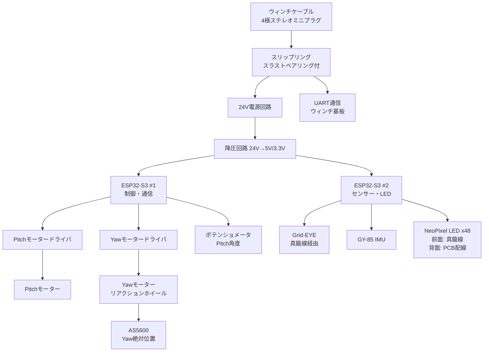

# Tube Body V2 実装計画書

## 📋 文書情報

| 項目 | 内容 |
|------|------|
| **バージョン** | V2.0（Draft） |
| **作成日** | 2025-11-03 |
| **作成者** | kyopan |
| **最終更新** | 2025-11-03 |
| **ステータス** | Draft |
| **展示日** | 2025-12-20 |

## 🎯 目的

FU@ComoNeプロジェクトにおける筒ロボット本体（Tube Body）V2の実装仕様を定義する。

## 📊 プロジェクト概要

| 項目 | 内容 |
|------|------|
| **台数** | 46台（本番） + 予備台数 TBD |
| **展示場所** | Common Nexus（ComoNe）天井 |
| **展示日** | 2025-12-20 |
| **制御対象** | 筒ロボット（姿勢制御：Pitch ±60°、Yaw 360°） |
| **通信** | ウィンチ基板との双方向通信（24V電源 + データ） |
| **責任分担** | ウィンチ実装：鈴木さん / 筒本体実装：kyopan |

## 🔄 V1からV2への主要変更点

### 構造面の改善
| 項目 | V1 | V2 | 改善理由 |
|------|----|----|----------|
| **構造方式** | 3Dプリント + PCB断片 | PCB基板構造 | 組み立て容易化、コスト削減 |
| **基板構成** | 分散配置 | 3枚基板統合 | 配線簡素化、信頼性向上 |
| **組み立て** | 複雑な工程 | 評価ボードベース | 製造効率化 |

### 電子部品の変更
| 項目 | V1 | V2 | 改善理由 |
|------|----|----|----------|
| **MCU** | RP2040 x2 | ESP32-S3 x2 | 処理能力向上、Wi-Fi対応 |
| **回転検出** | GY85コンパス | AS5600磁気エンコーダ | 精度向上（低精度問題解決） |
| **傾き検出** | GY85加速度計 | ポテンショメータ | 安定性向上 |

### 接続方式の変更
| 項目 | V1 | V2 | 改善理由 |
|------|----|----|----------|
| **ウィンチ接続** | TBD | 4極ステレオミニプラグ（オス） | 標準化、脱着容易 |
| **筒側受け口** | TBD | ステレオミニプラグレセプタクル（メス） | スリップリング統合 |
| **前面データ伝送** | PCB配線 | 真鍮線 | LED・GridEye信号伝送 |

## 🔧 ハードウェア要件

### 1. 電源仕様

| 項目 | 仕様 | 備考 |
|------|------|------|
| **入力電源** | DC24V（ウィンチケーブル経由） | 4極ステレオミニプラグ |
| **電源受け取り** | スリップリング内蔵レセプタクル | 連続回転対応 |
| **降圧回路** | 24V → 5V/3.3V | ESP32-S3、センサー用 |
| **電源保護** | 逆接続保護、過電流保護 | 必須 |

### 2. マイコン仕様

| 項目 | 仕様 | 備考 |
|------|------|------|
| **型番** | ESP32-S3 x2 | デュアルコア、Wi-Fi/BLE対応 |
| **役割分担** | 1: Pitch/Yaw制御 + 通信<br/>2: センサー処理 + LED制御 | 負荷分散 |
| **通信** | UART（ウィンチ基板）<br/>I2C（内部センサー）<br/>SPI（オプション） | 多重通信対応 |
| **電源電圧** | 3.3V（ロジック）、5V（モーター駆動） | レギュレータ必須 |

### 3. センサー仕様

#### AS5600 磁気エンコーダ（Yaw回転検出）

| 項目 | 仕様 | 備考 |
|------|------|------|
| **型番** | AS5600 | 12-bit絶対位置エンコーダ |
| **通信** | I2C | 0.087°分解能 |
| **取り付け** | マグネットアレイ対向配置 | GY85コンパス置き換え |
| **精度** | ±0.5° | V1のGY85より大幅向上 |
| **用途** | リアクションホイール絶対位置把握 | ねじれ補正 |

#### ポテンショメータ（Pitch傾き検出）

| 項目 | 仕様 | 備考 |
|------|------|------|
| **型番** | TBD（回転型ポテンショメータ） | ±60°範囲 |
| **出力** | アナログ電圧 | ESP32-S3 ADC読み取り |
| **取り付け** | Pitch軸直結 | 機械的連動 |
| **精度** | TBD | GY85加速度計より安定 |
| **用途** | 傾き角度フィードバック | モーター制御 |

#### Grid-EYE（サーマルセンサー）

| 項目 | 仕様 | 備考 |
|------|------|------|
| **型番** | AMG8833 | 8×8熱画像アレイ |
| **通信** | I2C | 前面配置 |
| **取り付け** | GY-85基板裏面 | 真鍮線で信号伝送 |
| **用途** | 人感検知、温度分布取得 | インタラクション用 |

#### GY-85 IMUセンサー

| 項目 | 仕様 | 備考 |
|------|------|------|
| **役割** | 加速度・ジャイロ（参考値） | V2ではポテンショメータが主 |
| **通信** | I2C | |
| **用途** | 補助的なモーション検知 | V1との互換性維持 |

### 4. モーター仕様

#### Pitchモーター（傾き制御）

| 項目 | 仕様 | 備考 |
|------|------|------|
| **モータータイプ** | BLDCモーター | エンコーダ付き |
| **制御範囲** | ±60° | |
| **トルク** | TBD Nm | 筒重量に応じて |
| **ドライバ** | TBD | PWM制御 |
| **フィードバック** | ポテンショメータ | 絶対位置 |

#### Yawモーター（回転制御 - リアクションホイール）

| 項目 | 仕様 | 備考 |
|------|------|------|
| **モータータイプ** | BLDCモーター | 高速回転対応 |
| **制御範囲** | 360°連続 | |
| **トルク** | TBD Nm | ケーブルねじれ補正用 |
| **ドライバ** | TBD | PWM制御 |
| **フィードバック** | AS5600磁気エンコーダ | 絶対位置 |

### 5. LED仕様

| 項目 | 仕様 | 備考 |
|------|------|------|
| **LED種別** | NeoPixel（WS2812B互換） | シリアル制御 |
| **数量** | 24個 × 2（前面/背面） | 合計48個 |
| **配置** | 前面: GY-85裏面中心配置検討<br/>背面: 既存配置 | 評価ボードで検証 |
| **電源** | 5V | 電力計算必須 |
| **制御** | ESP32-S3（GPIO） | PWM制御 |
| **データ伝送** | 前面: 真鍮線<br/>背面: PCB配線 | |

### 6. スリップリング

| 項目 | 仕様 | 備考 |
|------|------|------|
| **型番** | TBD | ステレオミニプラグレセプタクル内蔵型 |
| **信号数** | 4極（GND, 24V, TX, RX） | |
| **定格電流** | TBD A | 24V電源供給 |
| **回転範囲** | 360°連続 | |
| **ベアリング** | スラストベアリング | 負荷軽減 |
| **取り付け** | 筒上部 | ウィンチケーブル受け口 |

### 7. 構造・筐体

| 項目 | 仕様 | 備考 |
|------|------|------|
| **基本構造** | PCB基板構造 | 3Dプリント廃止 |
| **基板構成** | 3枚基板 | 評価ボードベース |
| **主要基板** | Pitch Ring（PR）のみ本番用に修正 | 他2枚は評価ボードそのまま |
| **直径** | 76mm | V1と同一 |
| **長さ** | 300mm | V1と同一 |
| **重量** | TBD g | 軽量化目標 |
| **材質** | FR-4基板、真鍮線 | |

## 📐 回路構成

### ブロック図



### 3枚基板構成

```
┌─────────────────────────┐
│  評価ボード（そのまま）    │  ← 上部
│  - スリップリング受け口   │
│  - ESP32-S3 #1          │
│  - 電源回路              │
└─────────────────────────┘
          ↓
┌─────────────────────────┐
│  Pitch Ring（PR）        │  ← 中央（本番用に修正）
│  - Pitchモーター制御     │
│  - ポテンショメータ       │
│  - ESP32-S3 #2          │
└─────────────────────────┘
          ↓
┌─────────────────────────┐
│  評価ボード（そのまま）    │  ← 下部
│  - Yawモーター制御       │
│  - AS5600エンコーダ      │
│  - NeoPixel LED背面      │
└─────────────────────────┘
```

### 主要回路

#### 1. 電源回路
- **入力**: DC24V（ステレオミニプラグ経由）
- **スリップリング**: 連続回転対応、スラストベアリング付
- **降圧**: 24V → 5V（モーター、LED用）
- **降圧**: 24V → 3.3V（MCU、センサー用）
- **保護**: 逆接続保護ダイオード、過電流保護ヒューズ

#### 2. ESP32-S3 #1（制御・通信）
- **役割**: Pitch/Yaw制御、ウィンチ基板通信
- **GPIO割り当て**:
  - UART（TX/RX）: ウィンチ基板通信
  - PWM: Pitch/Yawモータードライバ制御
  - ADC: ポテンショメータ読み取り
  - I2C: AS5600エンコーダ読み取り

#### 3. ESP32-S3 #2（センサー・LED）
- **役割**: センサーデータ処理、LED制御
- **GPIO割り当て**:
  - I2C: Grid-EYE、GY-85
  - GPIO: NeoPixel LED制御（前面/背面）
  - 真鍮線経由: Grid-EYE、前面LED信号

#### 4. モーター制御回路
- **Pitchドライバ**: PWM制御、電流制限
- **Yawドライバ**: PWM制御、電流制限
- **フィードバック**: ポテンショメータ（Pitch）、AS5600（Yaw）

#### 5. センサー入力回路
- **AS5600**: I2C通信、マグネット対向配置
- **ポテンショメータ**: アナログ入力、ノイズフィルタ
- **Grid-EYE**: I2C通信、真鍮線経由
- **GY-85**: I2C通信、参考値用

#### 6. LED制御回路
- **NeoPixel制御**: シリアルPWM
- **前面LED**: 真鍮線経由、GY-85裏面配置検討
- **背面LED**: PCB配線
- **電源**: 5V、電流制限

#### 7. 通信回路
- **UART**: ウィンチ基板 ↔ ESP32-S3 #1
- **I2C（内部）**: ESP32-S3 ↔ センサー群
- **真鍮線**: 前面LED、Grid-EYE信号

## 🔌 コネクタ仕様

### 1. ウィンチ接続（4極ステレオミニプラグ）

| ピン | 信号 | 方向 | 備考 |
|------|------|------|------|
| Tip | TX | ウィンチ → 筒 | データ受信 |
| Ring1 | RX | 筒 → ウィンチ | データ送信 |
| Ring2 | 24V | 電源供給 | |
| Sleeve | GND | 共通グランド | |

### 2. スリップリング内蔵レセプタクル

| 項目 | 仕様 | 備考 |
|------|------|------|
| **形式** | ステレオミニプラグレセプタクル（メス） | 4極 |
| **回転** | 360°連続 | スリップリング機構 |
| **ベアリング** | スラストベアリング | 負荷軽減 |
| **定格** | 24V、TBD A | |

### 3. 内部基板間接続

| 接続 | 方式 | 備考 |
|------|------|------|
| 評価ボード ↔ Pitch Ring | コネクタ or ピンヘッダ | 電源・通信 |
| Pitch Ring ↔ 評価ボード | コネクタ or ピンヘッダ | 電源・通信 |
| 前面LED・Grid-EYE | 真鍮線 | データ伝送 |

## 📏 物理仕様

| 項目 | 仕様 | 備考 |
|------|------|------|
| **直径** | 76mm | V1と同一 |
| **長さ** | 300mm | V1と同一 |
| **重量** | TBD g | 軽量化目標 |
| **基板サイズ** | 直径75mm程度（3枚） | 筐体内に収納 |
| **取付方法** | ウィンチケーブル懸架 | |
| **防水性** | なし（屋内使用） | |
| **動作温度** | 0℃〜40℃ | 会場環境 |

## 🧪 テスト項目

### 1. 電源テスト
- [ ] 24V入力動作確認
- [ ] 5V/3.3V降圧動作確認
- [ ] スリップリング連続回転時の電源安定性
- [ ] 過電流保護動作確認
- [ ] 逆接続保護動作確認

### 2. モーター制御テスト
- [ ] Pitchモーター駆動確認（±60°範囲）
- [ ] Yawモーター駆動確認（360°連続）
- [ ] ポテンショメータフィードバック精度
- [ ] AS5600エンコーダ精度（Yaw絶対位置）
- [ ] リアクションホイールねじれ補正動作

### 3. センサーテスト
- [ ] AS5600磁気エンコーダ動作確認
- [ ] ポテンショメータ精度測定
- [ ] Grid-EYE動作確認（真鍮線経由）
- [ ] GY-85 IMU動作確認
- [ ] 真鍮線信号伝送品質テスト

### 4. LED制御テスト
- [ ] 前面LED動作確認（真鍮線経由）
- [ ] 背面LED動作確認
- [ ] NeoPixel全点灯テスト
- [ ] LED中心配置 vs 点状配置 視覚比較

### 5. 通信テスト
- [ ] ウィンチ基板との通信確認
- [ ] データ送受信エラーレート測定
- [ ] スリップリング回転時の通信安定性
- [ ] UART通信ノイズ耐性テスト

### 6. 統合テスト
- [ ] 全機能同時動作テスト
- [ ] 連続昇降テスト（1時間）
- [ ] スリップリング連続回転テスト（1時間）
- [ ] 温度上昇測定
- [ ] 評価ボード → 本番基板移行テスト

### 7. 展示リハーサル
- [ ] 本番環境での動作確認（11/13試運転）
- [ ] 46台同時制御テスト
- [ ] 群制御アルゴリズムテスト
- [ ] 人感反応テスト（Grid-EYE）

## 📝 V1からの改良点

### 完了事項
- [x] GY85コンパス精度問題 → AS5600磁気エンコーダに変更
- [x] 3Dプリント + PCB断片構造 → PCB基板構造に変更
- [x] RP2040 → ESP32-S3に変更（処理能力・Wi-Fi対応）
- [x] GY85加速度計 → ポテンショメータに変更（安定性向上）

### 検討事項
- [ ] LED配置最適化（中心集中 vs 点状配置）
- [ ] 真鍮線の信頼性検証
- [ ] スリップリング + スラストベアリングの機械設計
- [ ] 3枚基板の接続方式
- [ ] Pitch Ring（PR）基板の詳細設計
- [ ] 電力計算（LED 48個、モーター2個、MCU 2個）
- [ ] 重量最適化
- [ ] ケーブルねじれヒステリシス対策

### リスク
- [ ] スリップリング信頼性 → 耐久テストで評価
- [ ] 真鍮線信号品質 → ノイズ対策必須
- [ ] LED電力不足 → 電力計算・電源容量確認
- [ ] AS5600マグネット配置精度 → 機械設計精度必要
- [ ] ポテンショメータ寿命 → 連続動作テスト必要
- [ ] 評価ボード → 本番基板移行時の不具合 → 段階的検証

## 📅 開発スケジュール

### Phase 1: 評価ボード検証（〜11/13）
- **目標**: 評価ボードで基本機能確認
- **内容**:
  - AS5600エンコーダ動作確認
  - ポテンショメータ精度測定
  - LED配置比較（中心 vs 点状）
  - 真鍮線信号伝送テスト
  - スリップリング + スラストベアリング機械試作

### Phase 2: 本番基板設計（11/14〜11/30）
- **目標**: Pitch Ring（PR）基板設計完了
- **内容**:
  - Pitch Ring基板回路設計
  - PCB設計（EasyEDA等）
  - BOM（部品表）作成
  - 基板発注

### Phase 3: 本番基板製作・検証（12/1〜12/15）
- **目標**: 本番基板5台製作・動作確認
- **内容**:
  - 基板組み立て
  - ファームウェア書き込み
  - 単体動作テスト
  - 統合テスト

### Phase 4: 展示準備（12/16〜12/19）
- **目標**: 46台製作・現地設置
- **内容**:
  - 残り41台製作
  - 現地設置・配線
  - 群制御テスト
  - 最終調整

### Phase 5: 本番展示（12/20）
- **目標**: 安定稼働
- **内容**:
  - 展示運用
  - リアルタイムモニタリング
  - トラブルシューティング

## 🔗 関連ドキュメント

- [tube-body-v2-structure-understanding.md](tube-body-v2-structure-understanding.md) - 構造理解確認ドキュメント
- [PR-board-design-specification.md](PR-board-design-specification.md) - PR基板詳細設計仕様
- [PR-board-WBS.md](PR-board-WBS.md) - PR基板設計WBS
- [HR-mechanical-dimensions.md](HR-mechanical-dimensions.md) - HR基板機械寸法ワークシート
- [evaluation-PR-verification-plan.md](evaluation-PR-verification-plan.md) - 評価PR検証計画
- [../specs/winch-circuit-design-v2.md](../specs/winch-circuit-design-v2.md) - ウィンチ基板仕様（鈴木担当）
- [../meetings/meeting-2025-10-17-progress-review.md](../meetings/meeting-2025-10-17-progress-review.md) - 進捗会議議事録
- [../米澤拓郎 + 菅野創+Kyopalab チーム 企画書.pdf](../米澤拓郎 + 菅野創+Kyopalab チーム 企画書.pdf) - V1設計資料

## 📅 更新履歴

| 日付 | バージョン | 変更内容 | 担当 |
|------|-----------|---------|------|
| 2025-11-03 | V2.0 Draft | 初版作成（V2仕様に基づく） | kyopan |

---

## ✅ レビュー承認

| 役割 | 氏名 | 日付 | 署名 |
|------|------|------|------|
| 設計 | kyopan | | |
| レビュー | 鈴木さん | | |
| レビュー | 菅野さん | | |
| 承認 | | | |
