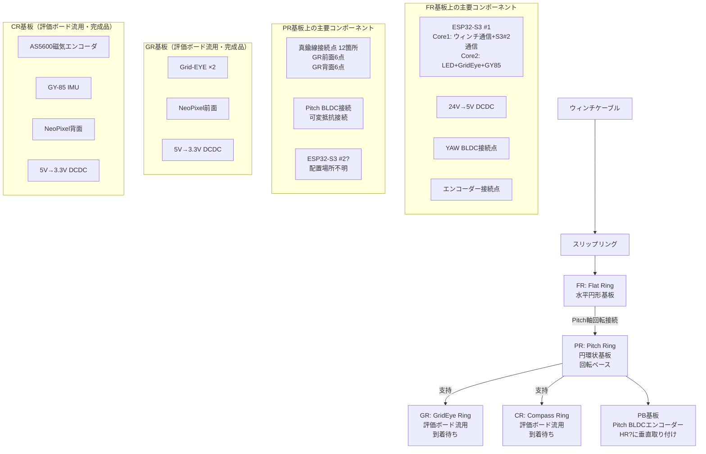

# Tube Body V2 構造理解（確認用）

**作成日**: 2025-11-03
**目的**: kyopanの説明に基づく構造理解の確認

---

## 基板構成（上から下）



---

## 現在の理解

### 1. FR (Flat Ring) - 水平円形基板
**役割**: 最上部、スリップリング受け口、主制御

**搭載予定:**
- スリップリング接続レセプタクル（4極ステレオミニプラグ）
- ESP32-S3 #1（デュアルコア）
  - Core 1: ウィンチ通信 + ESP32-S3 #2との通信
  - Core 2: LED制御 + GridEye制御 + GY85制御（使わない可能性）
- 24V→5V DCDC コンバータ
- YAW BLDC接続点
- エンコーダー接続点

**状態**: V2で新規設計が必要（評価ボードには無かった要素あり）

---

### 2. PR (Pitch Ring) - 円環状基板（回転ベース）
**役割**: Pitch軸で±60°回転、GR・CRを支持

**搭載予定:**
- 真鍮線接続点 12箇所
  - GR前面6点（用途: ?）
  - GR背面6点（用途: ?）
- FR-PR間接続:
  - Pitch BLDC
  - 可変抵抗（Pitch角度検出用？）
- ESP32-S3 #2の搭載場所？（不明）

**状態**: **V2で新規設計が必要**（本タスクの対象）

**評価ボードPR**:
- スリップリング無し
- モーター無し
- HR無し
- 用途: 通信テスト・LED点灯テスト・ウィンチ耐久性テスト

---

### 3. PB基板 - Pitch BLDCエンコーダー専用
**役割**: Pitch BLDCのエンコーダー専用基板

**搭載予定:**
- Pitch BLDCエンコーダー（種類不明）

**取り付け**: HR?に垂直取り付け

**状態**: 設計必要性不明

---

### 4. GR (GridEye Ring) - 評価ボード流用
**役割**: センサー・LED（前面）

**搭載済み:**
- Grid-EYE ×2（配置不明）
- NeoPixel（前面）
- 5V→3.3V DCDC

**状態**: 完成品、到着待ち

---

### 5. CR (Compass Ring) - 評価ボード流用
**役割**: エンコーダー・IMU・LED（背面）

**搭載済み:**
- AS5600磁気エンコーダ
- GY-85 IMU
- NeoPixel（背面）
- 5V→3.3V DCDC

**状態**: 完成品、到着待ち

---

## ESP32-S3 役割分担

### ESP32-S3 #1（FR基板搭載）
| コア | 役割 |
|------|------|
| Core 1 | ウィンチ基板との通信<br/>ESP32-S3 #2との通信 |
| Core 2 | LED制御（NeoPixel全体?）<br/>GridEye制御<br/>GY85制御（使わない可能性） |

### ESP32-S3 #2（搭載場所不明）
| コア | 役割 |
|------|------|
| Core 1 | Pitchモーター制御<br/>Pitchエンコーダー制御 |
| Core 2 | YAWモーター制御<br/>YAWエンコーダー制御<br/>ミニプラグエンコーダー制御 |

---

## 電源系統

```
24V入力（ウィンチケーブル経由）
  ↓
スリップリング
  ↓
FR基板: 24V → 5V DCDC
  ↓
  ├→ ESP32-S3 #1（3.3V内部レギュレータ）
  ├→ ESP32-S3 #2（3.3V内部レギュレータ）※搭載場所不明
  ├→ モーター駆動（5V系?）
  └→ GR・CR基板へ5V供給
        ↓
      GR・CR基板: 5V → 3.3V DCDC
        ↓
        └→ センサー類（Grid-EYE, AS5600, GY-85）
```

---

## 不明点・確認事項

### 🤔 質問1: ESP32-S3 #2の搭載場所
- **FR基板**に2個並べて搭載？
- それとも**PR基板**に搭載？
- PRに搭載の場合、Pitch回転時のFR-PR間通信方法は？

### 🤔 質問2: 真鍮線12点の信号内容
- **GR前面6点**: 何の信号？
  - NeoPixel信号（何本?）
  - Grid-EYE I2C（SDA/SCL/GND/VCC = 4本?）
  - 合計6本の内訳は？
- **GR背面6点**: 何の信号？
  - NeoPixel信号のみ？

### 🤔 質問3: Pitch軸の回転機構
- Pitch BLDC + 可変抵抗で、PRがFRに対して±60°回転する認識で正しい？
- 可変抵抗は**Pitch角度フィードバック用**？

### 🤔 質問4: YAW BLDCの物理的配置
- YAW BLDCは**どこ**に配置？
- CRを回転させる？
- それともCR内部のリアクションホイール？

### 🤔 質問5: エンコーダーの詳細
- **YAW BLDCエンコーダー**: AS5600磁気エンコーダ（CR基板上）？
- **Pitch BLDCエンコーダー**: PB基板上、何のエンコーダー？
- **ミニプラグエンコーダー**: これは何？スリップリング回転検出？

### 🤔 質問6: HRとは？
- 「PB基板をHRに垂直に取り付け」のHRとは何の略？
- Horizontal Ring? 別の基板？ それともPR/FR/GR/CRのいずれか？

### 🤔 質問7: 11/13試運転と12/20本番の違い
- **11/13試運転**: 評価ボードPRを使用？
- **12/20本番**: 本番PRを使用？
- 評価ボードPRと本番PRの設計差分は？

---

## PR基板（本番用）設計スコープ（暫定）

### 必要な設計要素
1. **回転機構**
   - Pitch軸中心の円環構造
   - FR-PR間: Pitch BLDC接続
   - FR-PR間: 可変抵抗接続
   - ±60°回転範囲確保

2. **真鍮線接続点 12箇所**
   - GR前面6点の配線設計
   - GR背面6点の配線設計
   - 信号品質確保（ノイズ対策）

3. **電気的接続**
   - FR → PR: 5V電源供給
   - FR → PR: 通信線（ESP32-S3 #2がPRにある場合）
   - PR → GR/CR: 5V電源供給
   - PR → GR/CR: 信号線（真鍮線経由）

4. **機械的構造**
   - GR・CRを支持する構造
   - PB基板取り付け箇所（HR?への垂直取り付け）

5. **部品搭載**
   - ESP32-S3 #2（搭載場所確定後）
   - その他必要なコネクタ・配線

---

## 次のステップ

上記不明点を明確にした後、以下を実施：

1. **PR基板詳細仕様確定**
   - 回路図作成範囲の明確化
   - 機械設計との境界定義

2. **WBS作成**
   - 設計タスク分解
   - スケジュール策定
   - 依存関係整理

3. **BOM作成**
   - 必要部品リスト
   - 調達先・納期確認

---

**作成者**: CIC
**レビュー待ち**: kyopan
