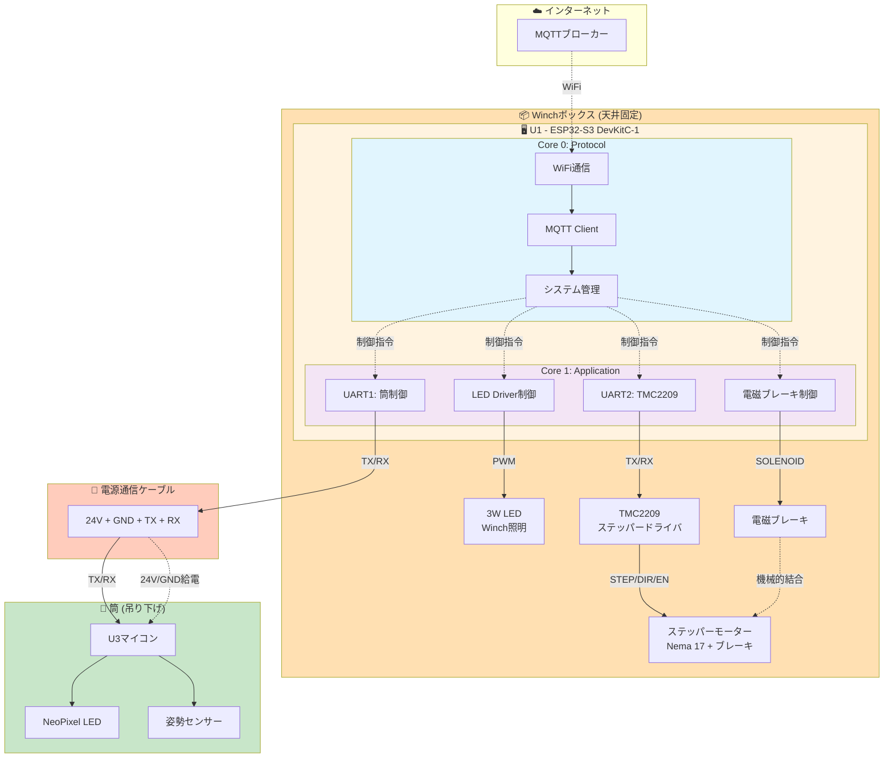

# Winch U1 ESP32-S3 ピンアサイン仕様 V2

**プロジェクト**: FU@ComoNe (Fragmentations of Unity @ Common Nexus)
**ボード**: ESP32-S3-DevKitC-1
**アーキテクチャ**: デュアルコア（V2）
**GPIO確定日**: 2025-10-17
**最終更新**: 2025-10-17

---

## 📋 V2アーキテクチャ概要

### V1からの主要変更点

**V1（旧）**:
- U1（ESP32-S3）: WiFi/MQTT制御
- U2（独立マイコン）: モーター制御
- U3（独立マイコン）: LED/姿勢制御

**V2（新）**:
- **U1（ESP32-S3デュアルコア）のみ**:
  - Core 0: WiFi/MQTT通信
  - Core 1: モーター制御（TMC2209）、LED制御
- U2は廃止
- U3は吊り筒側で独立制御

### システム構成



---

## 🔌 ピンアサイン一覧

### 確定済みピン

| GPIO | 機能 | 接続先 | 制約 | 備考 |
|------|------|--------|------|------|
| **48** | NeoPixel RGB LED | オンボード | - | システムステータス表示 |
| **8** | UART1 TX | TO WPCBMS (筒側) | Serial1 | 電源通信ケーブル経由、左側上部 |
| **9** | UART1 RX | TO WPCBMS (筒側) | Serial1 | 電源通信ケーブル経由、左側上部 |
| **17** | UART2 TX | TMC2209 | Serial2 | TMC2209制御用、STEPPER_H2近く |
| **18** | UART2 RX | TMC2209 | Serial2 | TMC2209診断用、STEPPER_H2近く |
| **10** | TMC2209_EN | TMC2209 | GPIO | ステッパー有効化、連続配置 |
| **11** | TMC2209_MS1 | TMC2209 | GPIO | マイクロステップ設定、連続配置 |
| **12** | TMC2209_MS2 | TMC2209 | GPIO | マイクロステップ設定、連続配置 |
| **13** | TMC2209_STEP | TMC2209 | GPIO | ステップパルス、連続配置 |
| **14** | TMC2209_DIR | TMC2209 | GPIO | 回転方向、連続配置 |
| **38** | LED_C | TPS92200DDCR | GPIO | LED制御信号（Winch照明）、右側 |
| **35** | LED_PWM | TPS92200DDCR | PWM | LED輝度PWM（Winch 3W LED）、右側 |
| **2** | SOLENOID | 電磁ブレーキ回路 | GPIO | ブレーキ制御、左側下部 |

---

## 📡 通信仕様

### UART1通信（U1 → U3 筒側）

**物理層**:
- **ポート**: Serial1
- **TX**: GPIO 8
- **RX**: GPIO 9
- **ボーレート**: 38400 baud
- **データビット**: 8
- **パリティ**: なし
- **ストップビット**: 1
- **伝送路**: TO WPCBMS経由、電源通信ケーブル（24V, GND, TX, RX）

**筒側構成**:
- U3マイコン（筒内部）
- NeoPixel LED（U3制御）
- 姿勢センサー（IMU, U3読み取り）

**コマンドフォーマット** (V1互換):
```
統合データパケット:
DATA,F,<f_r>,<f_g>,<f_b>,R,<r_r>,<r_g>,<r_b>,P,<pitch>,<yaw>,B,<brightness>,H,<enc_h>\n

Sparkコマンド:
SPARK,<秒数>\n

クリアコマンド:
C\n
```

**注意**: U3は筒内でNeoPixelを直接制御し、UART経由でコマンドを受信する。

---

### UART2通信（U1 → TMC2209）

**物理層**:
- **ポート**: Serial2
- **TX**: GPIO 17
- **RX**: GPIO 18
- **ボーレート**: 115200 baud（TMC2209標準）
- **データビット**: 8
- **パリティ**: なし
- **ストップビット**: 1

**用途**:
- TMC2209の詳細設定（電流制限、StealthChop/SpreadCycle切替）
- 診断情報読み取り（温度、ストール検出）
- レジスタ読み書き

**コマンド例**（TMCUARTプロトコル）:
```cpp
// 電流設定（RMS電流）
TMC2209.tmc_writeRegister(TMC2209_IHOLD_IRUN, 0x00051010);

// StealthChop有効化
TMC2209.tmc_writeRegister(TMC2209_GCONF, 0x00000004);

// ストール検出閾値設定
TMC2209.tmc_writeRegister(TMC2209_SGTHRS, 100);
```

---

## 🎛️ ステッパーモーター制御（TMC2209）

### ピンアサイン（確定）

| 信号名 | GPIO | 機能 | 配置理由 |
|--------|------|------|---------|
| **TMC2209_EN** | GPIO 10 | イネーブル（LOW=有効） | 連続配置開始、STEPPER_H2近接 |
| **TMC2209_MS1** | GPIO 11 | マイクロステップ設定 | 連続配置、配線簡素化 |
| **TMC2209_MS2** | GPIO 12 | マイクロステップ設定 | 連続配置、配線簡素化 |
| **TMC2209_STEP** | GPIO 13 | ステップパルス | 連続配置、配線簡素化 |
| **TMC2209_DIR** | GPIO 14 | 方向制御（HIGH=CW） | 連続配置、配線簡素化 |
| **UART2_TX** | GPIO 17 | TMC2209 UART送信（Serial2） | STEPPER_H2近接 |
| **UART2_RX** | GPIO 18 | TMC2209 UART受信（Serial2） | STEPPER_H2近接 |

### ステッパー仕様

| 項目 | 仕様 |
|------|------|
| **型番** | Nema 17 - 17HS24-2004D-B070 |
| **定格電流** | 2.0A/相 |
| **電圧** | 24V |
| **トルク** | 0.72Nm (101.96oz.in) |
| **特徴** | 電磁ブレーキ付き |

### マイクロステップ設定

| MS1 | MS2 | ステップ分解能 |
|-----|-----|--------------|
| LOW | LOW | 1/8 |
| HIGH | LOW | 1/16 |
| LOW | HIGH | 1/32 |
| HIGH | HIGH | 1/64 |

### 制御コード例

```cpp
// GPIO定義
#define TMC2209_EN 10
#define TMC2209_MS1 11
#define TMC2209_MS2 12
#define TMC2209_STEP 13
#define TMC2209_DIR 14

// Core 1: モーター制御タスク
void motorControlTask(void* parameter) {
  pinMode(TMC2209_EN, OUTPUT);
  pinMode(TMC2209_STEP, OUTPUT);
  pinMode(TMC2209_DIR, OUTPUT);
  pinMode(TMC2209_MS1, OUTPUT);
  pinMode(TMC2209_MS2, OUTPUT);

  // 1/16マイクロステップ設定
  digitalWrite(TMC2209_MS1, HIGH);
  digitalWrite(TMC2209_MS2, LOW);

  // モーター有効化
  digitalWrite(TMC2209_EN, LOW);

  while(1) {
    // ステップパルス生成
    digitalWrite(TMC2209_STEP, HIGH);
    delayMicroseconds(100);
    digitalWrite(TMC2209_STEP, LOW);
    delayMicroseconds(100);
  }
}
```

---

## 💡 LED Driver制御（3W LED用）

### ピンアサイン（確定）

| 信号名 | GPIO | 機能 | 配置理由 |
|--------|------|------|---------|
| **LED_C** | GPIO 38 | LED制御信号 | TPS92200DDCR近接、右側配置 |
| **LED_PWM** | GPIO 35 | LED輝度PWM | TPS92200DDCR近接、PWM対応 |

### LED仕様

| 項目 | 仕様 |
|------|------|
| **タイプ** | 既製品3W LED |
| **ドライバIC** | TPS92200DDCR |
| **電源** | 24V |
| **出力** | LED_A |
| **制御** | LED_C（ON/OFF）、LED_PWM（輝度） |

### 制御コード例

```cpp
// GPIO定義
#define LED_C 38
#define LED_PWM 35

// LED PWM設定
const int LED_PWM_CHANNEL = 0;
const int LED_PWM_FREQ = 5000;  // 5kHz
const int LED_PWM_RESOLUTION = 8;  // 8bit (0-255)

void setupLEDDriver() {
  pinMode(LED_C, OUTPUT);
  ledcSetup(LED_PWM_CHANNEL, LED_PWM_FREQ, LED_PWM_RESOLUTION);
  ledcAttachPin(LED_PWM, LED_PWM_CHANNEL);
}

void setLEDBrightness(uint8_t brightness) {
  digitalWrite(LED_C, HIGH);  // LED有効化
  ledcWrite(LED_PWM_CHANNEL, brightness);  // 0-255
}
```

---

## 🛑 電磁ブレーキ制御

### ピンアサイン（確定）

| 信号名 | GPIO | 機能 | 配置理由 |
|--------|------|------|---------|
| **SOLENOID** | GPIO 2 | ブレーキ制御 | Q2ブレーキ回路近接、左側下部 |

### 回路構成

```
SOLENOID ─── R8 (10kΩ) ─── Q2 Base
                             |
                        R6 (100kΩ) プルダウン
                             |
                            GND

Q2 Collector → Q1 Gate
Q1 (20N06 MOSFET) → S_DRN → 電磁ブレーキ
```

### 動作仕様

| SOLENOID状態 | Q2状態 | Q1状態 | ブレーキ状態 |
|-------------|--------|--------|------------|
| Hi-Z（起動時） | OFF | ON | **ブレーキON（安全）** |
| LOW | OFF | ON | **ブレーキON** |
| HIGH | ON | OFF | **ブレーキOFF** |

### 制御コード例

```cpp
// GPIO定義
#define SOLENOID 2

void setupBrake() {
  pinMode(SOLENOID, OUTPUT);
  digitalWrite(SOLENOID, LOW);  // 起動時ブレーキON（安全）
}

void releaseBrake() {
  digitalWrite(SOLENOID, HIGH);
  delay(50);  // 機械的遅延
}

void applyBrake() {
  digitalWrite(SOLENOID, LOW);
  delay(10);
}

void moveMotor(int steps) {
  releaseBrake();  // ブレーキ解除
  delay(100);

  // モーター制御
  for(int i = 0; i < steps; i++) {
    digitalWrite(TMC2209_STEP, HIGH);
    delayMicroseconds(100);
    digitalWrite(TMC2209_STEP, LOW);
    delayMicroseconds(100);
  }

  applyBrake();  // ブレーキ再適用
}
```

---

## ⚙️ デュアルコアタスク設計

### Core 0: Protocol Task

**役割**: WiFi/MQTT通信、システム管理

```cpp
void setup() {
  // Core 0で実行
  Serial.begin(115200);

  // WiFi/MQTT初期化
  setupWiFi();
  setupMQTT();

  // Core 1タスク起動
  xTaskCreatePinnedToCore(
    motorControlTask,   // タスク関数
    "MotorControl",     // タスク名
    10000,              // スタックサイズ
    NULL,               // パラメータ
    1,                  // 優先度
    NULL,               // タスクハンドル
    1                   // Core 1に固定
  );
}

void loop() {
  // Core 0: MQTT処理
  mqttClient.loop();
  handleMQTTCommands();
  delay(10);
}
```

### Core 1: Application Task

**役割**: モーター制御、LED制御、ブレーキ制御

```cpp
void motorControlTask(void* parameter) {
  // Core 1で実行
  setupMotor();
  setupLEDDriver();
  setupBrake();

  while(1) {
    // モーター制御
    if(targetPositionChanged) {
      moveToPosition(targetPosition);
    }

    // LED制御
    if(ledBrightnessChanged) {
      setLEDBrightness(ledBrightness);
    }

    delay(1);
  }
}
```

---

## 🔧 ファームウェア修正チェックリスト

### main.cpp

- [x] GPIO定義を更新（2025-10-17確定）
  ```cpp
  // UART1（筒側通信）
  #define UART1_TX_PIN 8
  #define UART1_RX_PIN 9

  // UART2（TMC2209通信）
  #define UART2_TX_PIN 17
  #define UART2_RX_PIN 18

  // TMC2209制御
  #define TMC2209_EN 10
  #define TMC2209_MS1 11
  #define TMC2209_MS2 12
  #define TMC2209_STEP 13
  #define TMC2209_DIR 14

  // LED Driver（Winch照明用）
  #define LED_C 38
  #define LED_PWM 35

  // 電磁ブレーキ
  #define SOLENOID 2

  // NeoPixel（システムステータス）
  #define ONBOARD_LED_PIN 48
  ```

- [ ] I2C関連コードを削除（U2廃止のため）
- [ ] デュアルコアタスク実装
  - Core 0: WiFi/MQTT
  - Core 1: TMC2209/LED/ブレーキ制御
- [ ] UART1実装（筒側通信、Serial1）
- [ ] UART2実装（TMC2209通信、Serial2）
- [ ] TMC2209制御実装（STEP/DIR/EN + UART）
- [ ] LED Driver制御実装（Winch 3W LED照明）
- [ ] 電磁ブレーキ制御実装（フェイルセーフ）

### platformio.ini

- [ ] ボード設定確認
  ```ini
  board = esp32-s3-devkitc-1
  ```

- [ ] ビルドフラグ
  ```ini
  build_flags =
    -DARDUINO_USB_MODE=1
    -DARDUINO_USB_CDC_ON_BOOT=1
    -DCORE_DEBUG_LEVEL=3
  ```

---

## 🧪 テスト計画

### 1. UART通信テスト（U1 → U3 筒側）

| # | テスト内容 | コマンド | 期待結果 |
|---|-----------|---------|---------|
| 1 | 統合パケット送信 | DATA,F,255,0,0,... | U3でLED点灯 |
| 2 | Sparkコマンド | SPARK,10\n | U3でSparkモード開始 |
| 3 | クリアコマンド | C\n | U3でクリア動作 |

### 2. TMC2209制御テスト

| # | テスト内容 | 期待結果 |
|---|-----------|---------|
| 1 | モーター有効化 | EN=LOWでモーター通電 |
| 2 | ステップパルス | STEP信号でモーター回転 |
| 3 | 方向制御 | DIR=HIGH/LOWで正逆回転 |
| 4 | マイクロステップ | MS1/MS2で分解能変更 |

### 3. LED Driver制御テスト

| # | テスト内容 | 期待結果 |
|---|-----------|---------|
| 1 | LED ON/OFF | LED_C=HIGHで点灯 |
| 2 | PWM輝度制御 | LED_PWM=0-255で明るさ変化 |

### 4. ブレーキ制御テスト

| # | テスト内容 | 期待結果 |
|---|-----------|---------|
| 1 | 電源投入時 | ブレーキON（安全確認） |
| 2 | ブレーキ解除 | SOLENOID=HIGHで解除 |
| 3 | ブレーキ適用 | SOLENOID=LOWで作動 |
| 4 | モーター動作 | ブレーキ解除→回転→ブレーキ適用 |

---

## 📊 GPIO使用可能数の確認

### ESP32-S3 GPIO制約

| 分類 | GPIO番号 | 備考 |
|------|---------|------|
| **使用可能** | 0-21, 35-48 | 合計35本 |
| **内部使用（禁止）** | 26-32 | SPI Flash/PSRAM |
| **Strapping Pins** | 0, 3, 45, 46 | プルアップ/ダウン注意 |
| **USB** | 19, 20 | USB使用時は不可 |
| **JTAG** | 39-42 | デバッグ使用時は不可 |
| **UART0** | 43, 44 | デバッグ用、変更非推奨 |

### 現在の使用状況

**確定済み（2025-10-17）**: 13本
- GPIO 2: SOLENOID（ブレーキ）
- GPIO 8: UART1 TX（筒側通信）
- GPIO 9: UART1 RX（筒側通信）
- GPIO 10: TMC2209_EN
- GPIO 11: TMC2209_MS1
- GPIO 12: TMC2209_MS2
- GPIO 13: TMC2209_STEP
- GPIO 14: TMC2209_DIR
- GPIO 17: UART2_TX（TMC2209）
- GPIO 18: UART2_RX（TMC2209）
- GPIO 35: LED_PWM（Winch照明）
- GPIO 38: LED_C（Winch照明）
- GPIO 48: NeoPixel（システムステータス）

**予備**: 22本 / 35本使用可能（将来拡張に十分な余裕）

---

## 📝 PCB回路図確認項目

### TO WPCBMS コネクタ

| ピン | 信号 | 接続先 | 確認 |
|------|------|--------|------|
| 1-3 | 24V | 電源供給 | ✅ |
| 4-6 | GND | GND | ✅ |
| 7 | NC | - | ⚠️ 未確認 |
| 8 | TX | ESP32-S3 GPIO8 | ✅ 確定 |
| 9 | RX | ESP32-S3 GPIO9 | ✅ 確定 |
| 10 | SW | - | ⚠️ 用途確認 |

### TMC2209周辺

- [x] EN, MS1, MS2, STEP, DIR: GPIO 10-14（連続配置、2025-10-17確定）
- [x] UART2 TX/RX: GPIO 17/18（診断用、2025-10-17確定）
- [ ] PCB上の配線が確定GPIO番号と一致するか回路図で確認

### LED Driver周辺

- [x] LED_C: GPIO 38, LED_PWM: GPIO 35（2025-10-17確定）
- [ ] PCB上のTPS92200DDCR配線が確定GPIO番号と一致するか回路図で確認

### 電磁ブレーキ回路

- [x] SOLENOID: GPIO 2（2025-10-17確定）
- [x] R6 (100kΩ) プルダウン実装確認済み（fail-safe設計）

---

## ✅ 次のアクション

### ~~Phase 1: GPIO Pin Assignment~~ ✅ 完了（2025-10-17）

- ✅ PCBレイアウト解析完了
- ✅ GPIO番号確定（全13本）
- ✅ ドキュメント更新完了

**成果物**: [wpcbb-pinout-analysis.md](wpcbb-pinout-analysis.md)

### Phase 2: PCB回路図とのクロスチェック ⏩ 次のステップ

1. **EasyEDA/KiCadで回路図を開く**
2. **配線がGPIO番号と一致するか確認**:
   - [ ] TMC2209（GPIO 10-14, 17-18）→ STEPPER_H2配線
   - [ ] LED Driver（GPIO 35, 38）→ TPS92200DDCR配線
   - [ ] Brake（GPIO 2）→ Q2ブレーキ回路配線
   - [ ] TO WPCBMS（GPIO 8, 9）→ コネクタピン8/9
3. **不一致があれば回路図修正**

### Phase 3: ファームウェア実装

1. **デュアルコアタスク実装**
2. **TMC2209制御実装**（GPIO定義済み）
3. **LED Driver制御実装**（GPIO定義済み）
4. **電磁ブレーキ制御実装**（GPIO定義済み）
5. **I2C関連コード削除**（U2廃止）

### Phase 4: テスト & 基板発注

1. **ビルド&書き込み**
2. **各機能の動作確認**
3. **基板発注**（締切: 2025-10-24）

---

## 🔗 関連ドキュメント

| ドキュメント | 用途 |
|------------|------|
| [wpcbb-pinout-analysis.md](wpcbb-pinout-analysis.md) | PCBレイアウト解析とGPIO最適配置（2025-10-17） |
| [winch-esp32s3-functional-requirements.md](winch-esp32s3-functional-requirements.md) | 機能要件整理 |
| [winch-circuit-design-v2.md](winch-circuit-design-v2.md) | Winch V2回路設計仕様 |
| [winch-electromagnetic-brake-circuit.md](winch-electromagnetic-brake-circuit.md) | 電磁ブレーキ回路仕様 |
| [winch-stepper-trace-width-analysis.md](../../notes/winch-stepper-trace-width-analysis.md) | ステッパートレース幅解析 |
| [ESP32-S3 Datasheet](https://www.espressif.com/sites/default/files/documentation/esp32-s3_datasheet_en.pdf) | 公式データシート |

---

**優先度**: 🔴 最優先（2025-10-24発注締切）
