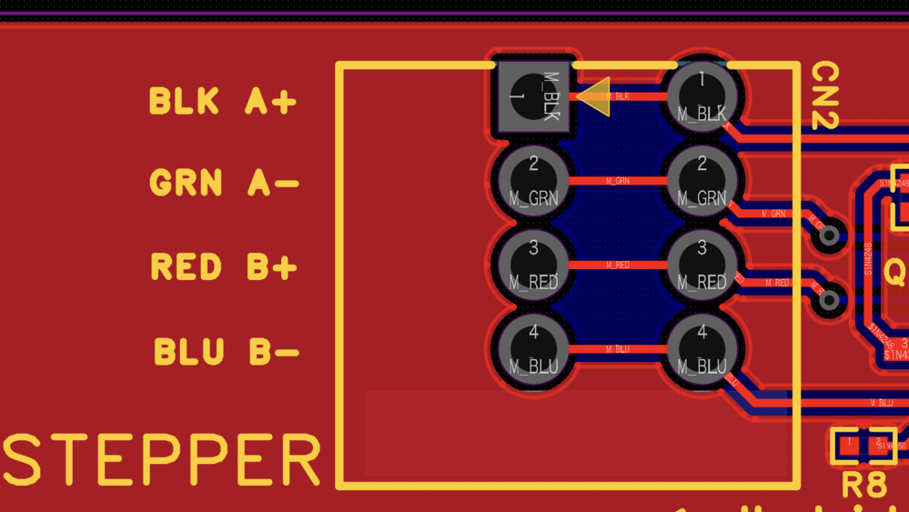

# Winch ステッパーモーター PCBトレース幅 解析レポート

**日付**: 2025-10-17
**担当**: kyopan
**対象基板**: Winch U2 モーター制御基板

## 📋 概要

WPCBBのボードデザインを確認した結果、ステッパーモーター電源ラインのトレース幅が定格電流に対して不足している可能性が判明しました。

## 🔍 現状分析

### PCB画像確認



- **ステッパーコネクタ**: 4相バイポーラ接続
  - BLK A+ (黒)
  - GRN A- (緑)
  - RED B+ (赤)
  - BLU B- (青)
- **現在のトレース幅**: **10 mil (0.254 mm)**

### モーター仕様

| 項目 | 仕様 |
|------|------|
| **型番** | **Nema 17 - 17HS24-2004D-B070** |
| **定格電流** | **2.0A/相** |
| **電圧** | 24V |
| **トルク** | 0.72Nm (101.96oz.in) |
| **消費電力** | 3.7W |
| **特徴** | 電磁ブレーキ付き |

**重要**: モデル番号の "2004" は **2.0A/相** を意味します。

## ⚠️ 問題点

### IPC-2221標準による許容電流

**現在の10 mil トレース（1oz銅箔）**:
- **許容電流**: 約 **0.5A** (温度上昇10°C)
- **モーター定格**: **2.0A/相**
- **過負荷率**: **400%** (4倍オーバー)

### リスク

1. **過熱**: トレースが過熱し、基板焼損の可能性
2. **電圧降下**: 抵抗値が高く、モータートルク低下
3. **信頼性**: 長時間運転で劣化・断線リスク
4. **安全性**: 24V電源との組み合わせで発火リスク

## 📊 推奨仕様

### オプション1: 1oz銅箔（標準的なPCB）

| 条件 | トレース幅 | 温度上昇 | 安全率 |
|------|-----------|---------|--------|
| **推奨** | **50 mil (1.27 mm)** | 10°C | 余裕あり |
| **最小** | **35 mil (0.89 mm)** | 20°C | ギリギリ許容 |

### オプション2: 2oz銅箔（高電流対応）

| 条件 | トレース幅 | 温度上昇 | 安全率 |
|------|-----------|---------|--------|
| **推奨** | **25 mil (0.635 mm)** | 10°C | 余裕あり |
| **最小** | **18 mil (0.457 mm)** | 20°C | ギリギリ許容 |

## 🎯 推奨アクション

### 設計変更（優先度: High）

**対象トレース**:
- BLK A+ (黒)
- GRN A- (緑)
- RED B+ (赤)
- BLU B- (青)

**変更内容**:
```
1oz銅箔の場合: 10 mil → 50 mil (推奨) または 35 mil (最小)
2oz銅箔の場合: 10 mil → 25 mil (推奨) または 18 mil (最小)
```

### 計算式（参考）

**IPC-2221内部導体式**:
```
I = k × ΔT^0.44 × A^0.725

I: 電流 (A)
ΔT: 温度上昇 (°C)
A: 断面積 (mil²) = 幅(mil) × 厚さ(mil)
k: 係数 (外層: 0.048, 内層: 0.024)
```

**1oz銅箔 = 1.4 mil厚**:
- 10 mil幅 → 断面積 14 mil² → 許容電流 0.5A (10°C上昇)
- 50 mil幅 → 断面積 70 mil² → 許容電流 2.1A (10°C上昇)

## 📷 参考画像

### PCB画像（トレース幅10mil）


### 電磁ブレーキ回路（修正済み）

- [電磁ブレーキ回路仕様](../docs/specs/winch-electromagnetic-brake-circuit.md)
- [安全性修正完了レポート](winch-brake-safety-fix-completed.md)

## 🔗 関連ドキュメント

- [Winch Circuit Design V2](../docs/specs/winch-circuit-design-v2.md)
- [ESP32S3 Pinout Specification](../docs/specs/winch-u1-esp32s3-pinout.md)
- [U1 Firmware Overview](../firmware/Winch/U1/U1_FIRMWARE_OVERVIEW.md)

## 📝 結論

**現在の10milトレースは定格電流2.0Aに対して著しく不足しています。**

1oz銅箔を使用する場合、最低でも **35 mil** (理想は **50 mil**) への変更を強く推奨します。

---

**次のアクション**: WPCBBにてトレース幅修正後、再度レビュー
