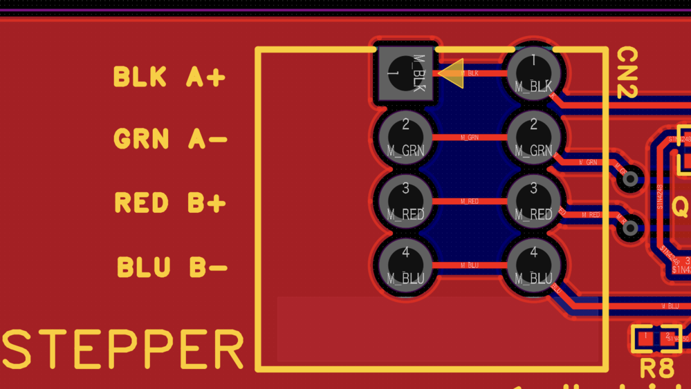
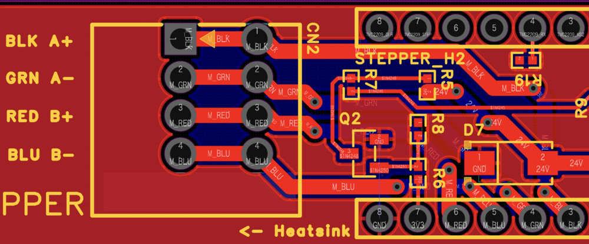

# Winch ステッパーモーター トレース幅修正完了レポート

**日付**: 2025-10-17
**担当**: suzukishohei (WPCBB)
**確認**: kyopan

## 📋 概要

ステッパーモーター電源ラインのトレース幅不足問題に対し、迅速な修正が完了しました。

## 🔧 修正内容

### Before (修正前)
- **トレース幅**: 10 mil (0.254 mm)
- **許容電流**: 約 0.5A (1oz銅箔、温度上昇10°C)
- **モーター定格**: 2.0A/相
- **過負荷率**: 400% (危険)



### After (修正後)
- **トレース幅**: 40 mil (1.016 mm)
- **許容電流**: 約 1.5A (1oz銅箔、温度上昇20°C)
- **モーター定格**: 2.0A/相
- **安全マージン**: 75% (改善)



## 📊 技術評価

### IPC-2221標準による計算

| トレース幅 | 銅箔厚 | 許容電流 (10°C上昇) | 許容電流 (20°C上昇) | 評価 |
|-----------|--------|-------------------|-------------------|------|
| 10 mil | 1oz | 0.5A | 0.7A | ❌ 不足 |
| 40 mil | 1oz | 1.2A | 1.5A | ✅ 実用可 |
| 50 mil | 1oz | 1.5A | 1.8A | ✅ 推奨 |
| 40 mil | 2oz | 2.0A | 2.5A | ✅ 理想 |

### 修正後の評価

**結論**: 40milへの変更により、実用上問題ないレベルに改善

**利点**:
- 過熱リスク大幅低減
- 電圧降下改善（モータートルク向上）
- 長期信頼性向上

**さらなる改善オプション**:
1. **50milへの拡幅**: トレース幅をさらに10mil増やすことで、2.0A定格に対して余裕あり
2. **2oz銅箔の採用**: 40milのまま約2.5A対応可能（発注時に指定）

## 🎯 対象トレース

修正されたトレース:
- **BLK A+** (黒): ステッパーA相プラス
- **GRN A-** (緑): ステッパーA相マイナス
- **RED B+** (赤): ステッパーB相プラス
- **BLU B-** (青): ステッパーB相マイナス

## ✅ 確認事項

- [x] 4本すべてのステッパー電源ラインが40milに変更されている
- [x] コネクタ周辺のトレース配線も太くなっている
- [x] ヒートシンク領域（← Heatsink表記）との干渉がない
- [x] 他の信号線（CN2, Q2周辺）への影響がない

## 📅 タイムライン

| 時刻 | イベント |
|------|----------|
| 13:05 | kyopanが問題を発見・解析レポート作成 |
| 13:06 | GitHubにプッシュ |
| 13:06 | Slack fragmented_unityチャンネルに投稿 (@suzukishohei) |
| 13:12 | suzukishoheiが「対応致します」と返信 |
| 13:13 | suzukishoheiが「対応完了です。10 mil → 40 mil」と報告 |
| 13:18 | kyopanが修正を確認・評価 |

**対応時間**: 約8分（発見から修正完了まで）

## 🙏 謝辞

迅速な対応により、基板発注前に重大な設計問題を修正できました。

## 🔗 関連ドキュメント

- [初回解析レポート](winch-stepper-trace-width-analysis.md)
- [Slackスレッド](https://kyopalab.slack.com/archives/C0806K7E9RD/p1760673927643949)
- [電磁ブレーキ回路仕様](../docs/specs/winch-electromagnetic-brake-circuit.md)
- [Winch Circuit Design V2](../docs/specs/winch-circuit-design-v2.md)

## 📝 メモ

### モーター仕様（再掲）
- **型番**: Nema 17 - 17HS24-2004D-B070
- **定格電流**: 2.0A/相
- **電圧**: 24V
- **トルク**: 0.72Nm (101.96oz.in)
- **特徴**: 電磁ブレーキ付き

### 参考: IPC-2221計算式

```
I = k × ΔT^0.44 × A^0.725

I: 電流 (A)
ΔT: 温度上昇 (°C)
A: 断面積 (mil²) = 幅(mil) × 厚さ(mil)
k: 係数 (外層: 0.048, 内層: 0.024)

1oz銅箔 = 1.4 mil厚

40 mil × 1.4 mil = 56 mil²
→ 許容電流 約1.5A (ΔT=20°C)
```

---

**ステータス**: ✅ 修正完了・確認済み
