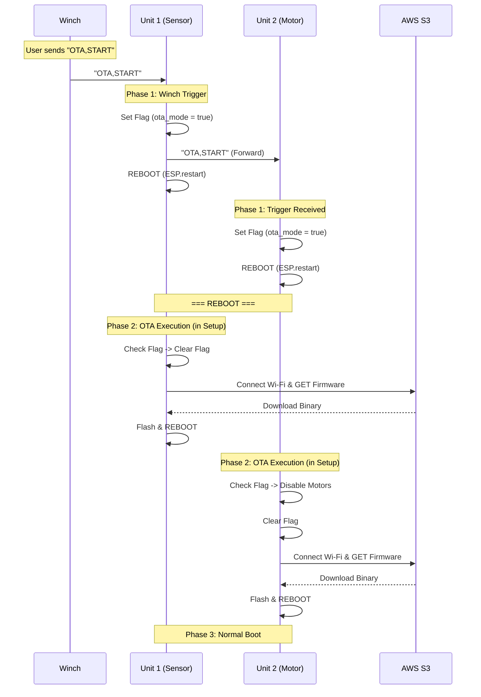

# OTA Update Process (Safe Boot Mechanism)

このドキュメントでは、Unit 1 (Sensor Hub) および Unit 2 (Motor Control) で採用されているOTA (Over-The-Air) アップデートのシーケンスについて記述する。

## 概要

システムの安定性と安全性を確保するため、**「Safe Boot OTA」** 方式を採用している。
更新コマンドを受信すると、デバイスは即座にOTAを実行するのではなく、一度「OTAモード」フラグを不揮発性メモリ (NVS) に保存して再起動する。
これにより、モーター制御やセンサー通信などの高負荷プロセスが停止したクリーンな状態 (`setup()` 冒頭) で、安全にファームウェアの書き換えを行う。

## シーケンス図

## 詳細プロセス解説

### Phase 1: トリガーと伝播 (Trigger & Propagate)
Winchからのコマンドチェーンは以下の通り処理される。

1.  **Unit 1**:
    *   `processWinchCommand` 内で `OTA,START` を受信。
    *   `preferences` (NVS) に `ota_mode: true` を書き込む。
    *   Unit 2へ `OTA,START` をUART転送する。
    *   **即座に再起動** (`ESP.restart()`) する。
2.  **Unit 2**:
    *   `loop` 内で Unit 1 からの `OTA,START` を受信。
    *   同様にNVSに `ota_mode: true` を書き込む。
    *   **即座に再起動** (`ESP.restart()`) する。

### Phase 2: クリーン環境での実行 (Safe Execution)
再起動直後、デバイスは以下の手順で更新を行う。この処理は `setup()` の最初（周辺機器の初期化前）に行われるため、メモリが最も空いており、割り込みなどの競合がない安全な状態である。

1.  **フラグチェック**: `setup()` 冒頭でNVSの `ota_mode` を確認。TrueならOTAモードへ移行。
2.  **安全策 (Unit 2のみ)**: `execOTA()` 関数内で、明示的に `motorYaw.disable()`, `motorPitch.disable()` を呼び出し、モーターへの通電を物理的に遮断する。
3.  **Wi-Fi接続**: 所定のSSID/Pass (FU / spark!!!!!) に接続。
4.  **ダウンロード**: 指定されたS3バケットから `firmware_product.bin` を取得。
    *   Unit 1 Source: `s3://comone-fragmented-unity-fw/tube_v2_unit1/tube_v2_unit1_product.bin`
    *   Unit 2 Source: `s3://comone-fragmented-unity-fw/tube_v2_unit2/tube_v2_unit2_product.bin`
5.  **書き込み**: ストリーム形式でFlashメモリへ書き込み。完了後、NVSのフラグは既にFalseに戻されているため、**再起動** して通常モードへ戻る。

### Phase 3: 通常起動
更新が成功していれば、新しいファームウェアで通常通りの `setup()` (センサー初期化、モーターキャリブレーション等) が走り、稼働を開始する。
