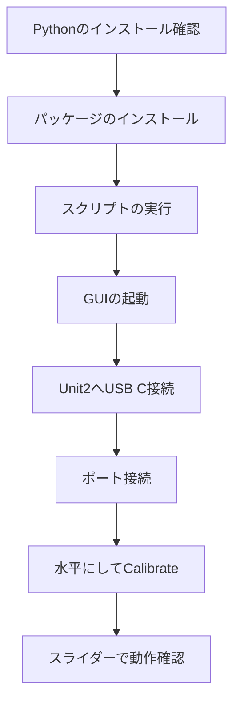

# Tube Pitch Motor Diagnostics 起動ガイド

## 目的
筒v2のUnit2のマイコンにUSB Cを接続し、水平キャリブレーションを行い、EEPROMに保存するプログラム。

本ツール（`pitch_diag.py`）を利用するための初期設定と起動方法について説明します。

## 1. パッケージの導入

本ツールはPythonを利用しています。以下のコマンドをターミナル（またはコマンドプロンプト）で実行し、必要なパッケージをインストールしてください。

```bash
pip install PyQt6 pyserial
```
※環境によっては `pip3 install PyQt6 pyserial` と入力してください。

## 2. 起動方法

ターミナルで `pitch_diag.py` があるディレクトリに移動し、以下のコマンドを実行します。

```bash
python pitch_diag.py
```
※環境によっては `python3 pitch_diag.py` と入力してください。

## 3. キャリブレーションの実行方法

GUI起動後、以下の手順でキャリブレーションを行います。

1. GUIを起動する
2. 筒v2のUnit2にUSB Cを挿して片方をPCに接続する（USB CケーブルがLEDリングや真鍮棒に引っかからないように工夫する）
3. 自動認識されるはずだが、されない場合は左上のメニューから`/cu/usbmodem.xxx`を選んでConnectボタンを押す
4. 筒を水平に保ち、青いボタン **Calibrate (Horizon)** を押す
5. キャリブレーション完了
6. 確認のためPitch Controlスライダー左右に動かすとPitchモーターが回転する

※Winchケーブルが繋がっていなくてもUSB電源のみで動作する

## 4. 導入・実行フロー図


