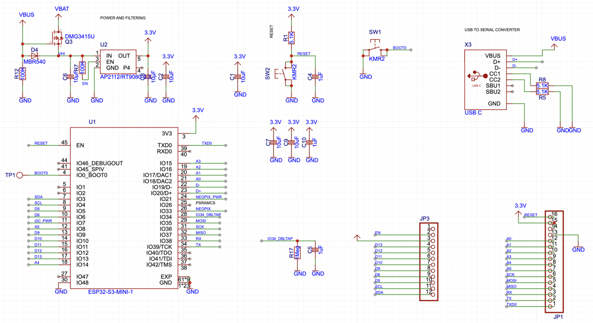

# ESP32-S3 仕様書

**作成日**: 2025-11-09
**ステータス**: ✅ 確定

---

## 回路図



**回路構成:**
- **電源系統**: USB VBUS → 3.3Vレギュレータ → ESP32-S3
- **USB接続**: GPIO19 (D-), GPIO20 (D+) 直接接続
- **プログラミング**: ENボタン（リセット）+ BOOTボタン（GPIO0）
- **デカップリングコンデンサ**: 10µF + 0.1µF（電源安定化）
- **外部接続**: JP3ピンヘッダ（GPIO展開）

---

## 基本仕様

| 項目 | 仕様 |
|------|------|
| **メーカー** | ESPRESSIF |
| **型番** | ESP32-S3-MINI-1-N8 |
| **LCSC Part#** | C2913206 |
| **パッケージ** | SMD (15.4 × 20.5 × 2.4mm) |
| **ピン数** | 65 pads |
| **CPU** | Xtensa® dual-core 32-bit LX7 (最大240MHz) |
| **アンテナ** | チップアンテナ内蔵 |
| **Flashメモリ** | 8MB (Quad SPI) |
| **PSRAM** | なし |
| **動作電圧** | 3.0-3.6V (推奨3.3V) |
| **消費電流** | 最大 240mA (WiFi TX 20dBm時) |
| **動作温度** | -40°C ~ +85°C |
| **無線規格** | WiFi 802.11b/g/n + Bluetooth 5 (LE) |

---

## 使用台数

- **HD (Horozon Disc)**: 2基
  - ESP32-S3 #1: WiFi/UART + センサー統合
  - ESP32-S3 #2: YAWモーター + Pitchサーボ制御
- **Winch**: 1基
  - ESP32-S3 U1: WiFi/MQTT制御

**合計**: 3基

---

## コア割当

### ESP32-S3 #1 (HD)

| Core | 役割 |
|------|------|
| **Core 0** | WiFi通信 / UART通信 (Winch ↔ HD) |
| **Core 1** | センサー統合 (GridEye, GY-85, AS5600) |

### ESP32-S3 #2 (HD)

| Core | 役割 |
|------|------|
| **Core 0** | YAWモーター FOC制御 |
| **Core 1** | Pitchサーボ PWM制御 |

### ESP32-S3 U1 (Winch)

| Core | 役割 |
|------|------|
| **Core 0** | WiFi/MQTT通信 |
| **Core 1** | UART通信 / プーリー制御 |

---

## ピン配置

### 電源ピン

| ピン名 | 機能 | 接続先 |
|--------|------|--------|
| **GND** | グラウンド | GNDプレーン |
| **3V3** | 電源入力 (3.3V) | レギュレータ出力 |
| **VDD** | 内部電源 | 3.3V (3V3と共通) |

### 制御ピン

| ピン名 | 機能 | 接続先 | 備考 |
|--------|------|--------|------|
| **EN** | チップイネーブル | 10kΩプルアップ + リセットボタン | アクティブHigh |

### ブートモード設定（Strapping Pins）

| GPIO | 機能 | ブート時レベル | 備考 |
|------|------|---------------|------|
| **GPIO0** | BOOT | High (10kΩプルアップ) | Low時: ダウンロードモード |
| **GPIO45** | VDD_SPI | High (内部) | Flash電圧選択 |
| **GPIO46** | ROM Messages | High (内部) | UARTログ制御 |

**重要事項:**
- GPIO0はブート時にHighである必要があります（通常動作）
- ダウンロードモード（書き込みモード）にする場合は、GPIO0をLowにしてリセット
- GPIO45, 46は通常、内部プルアップで問題なし

## GPIO割当

**ステータス**: 未定（次フェーズで決定）

**必要GPIO数:**

| 機能 | GPIO数 |
|------|--------|
| I2C0 (SDA/SCL) | 2 |
| I2C1 (SDA/SCL) | 2 |
| UART (TX/RX) | 2 |
| PWM (サーボ) | 1 |
| NeoPixel Data | 1 |
| **合計** | 8 |

**使用可能GPIO:**
- GPIO1-GPIO21 (21本)
- GPIO33-GPIO48 (16本、ただし一部Strapping用途)
- **合計:** 約30本以上の汎用GPIO利用可能

**⚠️ 使用制限があるGPIO:**

| GPIO | 制約理由 | 対応 |
|------|----------|------|
| **GPIO0** | BOOT選択（Strapping Pin） | 10kΩプルアップ必須、Lowでダウンロードモード |
| **GPIO3** | JTAG信号 | JTAGデバッグ使用時は避ける |
| **GPIO19, 20** | USB D-/D+ | USB通信使用時は避ける |
| **GPIO26-32** | SPI Flash/PSRAM専用 | **使用不可**（内部接続済み） |
| **GPIO43, 44** | UART0（デフォルトログ出力） | 使用可能だが起動時にログノイズあり |
| **GPIO45, 46** | 内部制御（Strapping） | 外部で触らない |

**推奨GPIO割当（修正版）:**

### ESP32-S3 #1 (WiFi/UART + センサー統合)

| 機能 | GPIO | 備考 |
|------|------|------|
| I2C0 SDA | GPIO8 | GridEye用 |
| I2C0 SCL | GPIO9 | GridEye用 |
| I2C1 SDA | GPIO4 | GY-85用 |
| I2C1 SCL | GPIO5 | GY-85用 |
| UART TX | GPIO17 | Winch ↔ HD（クリーン通信） |
| UART RX | GPIO18 | Winch ↔ HD（クリーン通信） |
| NeoPixel | GPIO48 | RGB LED制御 |
| Debug TX | GPIO43 | デバッグログ出力（予約） |
| Debug RX | GPIO44 | デバッグログ入力（予約） |

### ESP32-S3 #2 (YAWモーター + Pitchサーボ制御)

| 機能 | GPIO | 備考 |
|------|------|------|
| I2C SDA | GPIO33 | AS5600 × 2（エンコーダー） |
| I2C SCL | GPIO34 | AS5600 × 2（エンコーダー） |
| PWM (サーボ) | GPIO10 | Pitchサーボ制御 |
| FOC PWM_U | GPIO11 | YAWモーターU相 |
| FOC PWM_V | GPIO12 | YAWモーターV相 |
| FOC PWM_W | GPIO13 | YAWモーターW相 |
| FOC Hall_A | GPIO35 | ホールセンサーA |
| FOC Hall_B | GPIO36 | ホールセンサーB |
| FOC Hall_C | GPIO37 | ホールセンサーC |

**決定事項:**
- [x] UART TX/RX をクリーンなGPIO17/18に変更
- [x] GPIO43/44をデバッグ専用として予約
- [x] ESP32-S3 #2のGPIO割当案を追加
- [ ] ピン配置図作成
- [ ] PCBレイアウトでのノイズ対策確認

---

## 通信インターフェース

### I2C

| バス | 用途 | 接続先 |
|------|------|--------|
| **I2C0** | GridEye通信 | AMG8833 (GR) |
| **I2C1** | 9軸センサー通信 | GY-85 (CR) |
| **I2C (ESP32-S3 #2)** | エンコーダー読取 | AS5600 × 2 |

**設定:**
- クロック周波数: 100kHz
- プルアップ: ESP32-S3内部プルアップ使用
- バス長: 最大15cm程度

### UART

| 項目 | 仕様 |
|------|------|
| **ボーレート** | 38400 baud |
| **データビット** | 8bit |
| **パリティ** | あり |
| **ストップビット** | 1bit |
| **フロー制御** | なし |
| **エラー検出** | CRC/パリティ |
| **バッファ** | 未定 |

**プロトコル:**
```
Winch → HD: "DATA,F,r,g,b,R,r,g,b,P,pitch,yaw,B,brightness,H,enc_horizontal\n"
HD → Winch: センサーデータフィードバック（形式未定）
```

### SPI

- **使用なし**（NeoPixelは専用シリアル信号）

---

## 電源仕様

| 項目 | 仕様 |
|------|------|
| **供給電圧** | 3.3V (DCDC 5V→3.3V変換) |
| **電圧範囲** | 3.0V ~ 3.6V |
| **最大消費電流** | 240mA (WiFi TX 20dBm時) |
| **平均消費電流** | 80-120mA (WiFi動作時) |
| **スリープ電流** | 未使用 |

### 電源回路要件

**必須コンデンサ:**
- **VDD**: 10µF + 0.1µF (できるだけモジュール近くに配置)
- **3V3**: 10µF + 0.1µF (できるだけモジュール近くに配置)
- **バルクコンデンサ**: 100µF (電源入力部)

**レギュレータ仕様:**
- 出力: 3.3V
- 最大電流: 500mA以上（余裕を持たせる）
- 入力: 5V (USB/外部電源)
- 推奨IC: AMS1117-3.3 または同等品

**電源投入シーケンス:**
1. 3.3V安定後、最低10ms待機
2. EN (CHIP_PU) をHighに設定
3. リセット完了まで待機

---

## WiFi仕様

| 項目 | 仕様 |
|------|------|
| **規格** | 802.11 b/g/n |
| **周波数** | 2.4GHz |
| **アンテナ** | チップアンテナ |
| **TX出力** | 最大 20dBm |
| **用途** | MQTT通信 / コマンド受信 |

---

## 開発環境

| 項目 | 仕様 |
|------|------|
| **開発環境** | PlatformIO + Arduino Framework |
| **プログラミング言語** | C/C++ |
| **デバッグ** | JTAG / USB Serial |
| **OTA対応** | 対応予定 |

---

## PCBレイアウト推奨事項

### 配置

1. **電源デカップリングコンデンサ:**
   - 0.1µFはESP32-S3-MINIの直下に配置（Via経由で接続）
   - 10µFはモジュールから5mm以内に配置
   - GNDは最短経路でGNDプレーンへ接続

2. **アンテナクリアランス:**
   - モジュールのアンテナ部分（約4mm×4mm）の下にGNDプレーンを配置しない
   - アンテナ周辺15mm以内に銅箔・部品を配置しない
   - 基板端から5mm以上離す

3. **熱設計:**
   - モジュール下のGNDプレーンを熱放散に利用
   - サーマルビアでGNDプレーンと接続（推奨）

### 配線

1. **電源配線:**
   - 3.3V配線は太く（最低0.5mm幅）
   - レギュレータ → デカップリングコンデンサ → ESP32-S3の順で最短距離

2. **高速信号:**
   - USB D+/D- は差動配線（インピーダンス整合 90Ω）
   - SPI Flash信号は短く（モジュール内蔵のため問題なし）

3. **低速信号:**
   - I2C, UART は通常配線でOK
   - 長距離配線の場合は22Ωシリーズ抵抗を検討

### GND設計

- **4層基板推奨構成:**
  - Layer 1: 信号層（TOP）
  - Layer 2: GNDプレーン
  - Layer 3: 電源プレーン（3.3V）
  - Layer 4: 信号層（BOTTOM）

- **2層基板の場合:**
  - TOP: 信号層
  - BOTTOM: GNDプレーン（できるだけベタGND）
  - 電源配線は太く確保

### プログラミング接続

**必須ピン:**
- TX (GPIO43)
- RX (GPIO44)
- GND
- 3.3V
- EN (リセット用)
- GPIO0 (BOOT用)

**コネクタ推奨:**
- 6ピン 2.54mmピンヘッダ（標準的なUSB-Serialアダプタ用）
- または 8ピン TagConnect (TC2050) (省スペース設計の場合)

---

## USB接続とプログラミング

### ESP32-S3の内蔵USB機能

**重要:** ESP32-S3は**USB Serial/JTAGコントローラーを内蔵**しており、外部USB-Serial ICなしで直接PCと接続可能です。

**内蔵USB機能:**
- USB Serial/JTAG Controller
- GPIO19 (USB D-), GPIO20 (USB D+) で直接USB接続
- 自動ダウンロードモード対応
- デバッグ機能（JTAG）も同時利用可能

**利点:**
- 外部USB-Serial IC（CH340G等）不要
- 部品コスト削減
- 基板面積削減
- より高速な通信（最大12Mbps USB Full Speed）

### 必要な回路構成

**最小構成（USB直接接続）:**
```
PC USB Type-C
  ↓
ESP32-S3
  ├─ GPIO19 (D-) → USB Data Minus
  ├─ GPIO20 (D+) → USB Data Plus
  ├─ GND → USB GND
  └─ EN: 10kΩプルアップ
```

**推奨構成（保護回路付き）:**
```
PC USB Type-C
  ↓
USB保護回路（ESD, 過電流）
  ↓
ESP32-S3
  ├─ GPIO19 (D-) → USB Data Minus（27Ω直列抵抗推奨）
  ├─ GPIO20 (D+) → USB Data Plus（27Ω直列抵抗推奨）
  ├─ GND → USB GND
  ├─ VBUS → 5V入力（レギュレータへ）
  ├─ EN: 10kΩプルアップ + リセットボタン
  └─ GPIO0: 10kΩプルアップ + BOOTボタン（GNDへ）
```

### USB回路部品表

| 部品 | 型番/値 | 数量 | 用途 |
|------|--------|------|------|
| USB Type-C コネクタ | 16ピン | 1 | PC接続 |
| 直列抵抗 | 27Ω | 2 | D+/D- 保護 |
| ESD保護IC | USBLC6-2SC6 | 1 | 静電気保護（推奨） |
| プルアップ抵抗 | 10kΩ | 2 | EN, GPIO0 |
| リセットボタン | タクトスイッチ | 1 | EN制御 |
| BOOTボタン | タクトスイッチ | 1 | GPIO0制御 |

### USB差動配線の注意点

1. **インピーダンス整合**
   - 差動インピーダンス: 90Ω ±10%
   - D+/D- は等長配線（±5mm以内）
   - できるだけ短く（推奨: 50mm以内）

2. **GNDプレーン**
   - USB信号の下にベタGND配置
   - GNDは連続したプレーンを維持

3. **配線ルール**
   - D+/D- は並行配線
   - 他の信号線から0.5mm以上離す
   - Via使用は最小限に

### 書き込み手順

#### USB経由（推奨）
```bash
# esptool.pyで自動書き込み（USB Serial/JTAG使用）
esptool.py --chip esp32s3 --port /dev/ttyACM0 --baud 921600 \
  write_flash -z 0x0 firmware.bin
```

**ポート名:**
- Linux: `/dev/ttyACM0`
- macOS: `/dev/cu.usbmodem*`
- Windows: `COM*`

#### 手動ダウンロードモード突入
1. BOOTボタンを押しながらRESETボタンを押す
2. RESETボタンを離す
3. BOOTボタンを離す
4. ダウンロードモード突入（自動認識）

#### PlatformIO設定例
```ini
[env:esp32-s3-mini]
platform = espressif32
board = esp32-s3-devkitc-1
framework = arduino
upload_port = /dev/ttyACM0
upload_speed = 921600
monitor_port = /dev/ttyACM0
monitor_speed = 115200
```

### GPIO19/20の使用制限

**重要:** GPIO19/20をUSB接続で使用する場合、これらのピンは**アプリケーションで使用できません**。

**対策:**
- USB接続時: GPIO19/20は使用不可
- UART経由書き込み時: GPIO19/20を汎用GPIOとして利用可能
- 製品化時: USB不要ならGPIO19/20を解放可能

**プロジェクトでの影響:**
- ESP32-S3 #1, #2ともにGPIO19/20は未割当のため問題なし
- USB接続を使用する場合、GPIO19/20を避けた割当になっている

### 参考資料（USB接続）
- [ESP32-S3 USB Serial/JTAG Controller](https://docs.espressif.com/projects/esp-idf/en/latest/esp32s3/api-guides/usb-serial-jtag-console.html)
- [ESP32-S3を使った書き込み回路の簡素化](https://zenn.dev/usagi1975/articles/2025-03-02-000_esp32_c3_flash)

---

## 参考資料

- [ESP32-S3-MINI-1 Datasheet](https://www.espressif.com/sites/default/files/documentation/esp32-s3-mini-1_mini-1u_datasheet_en.pdf)
- [ESP32-S3 Technical Reference Manual](https://www.espressif.com/sites/default/files/documentation/esp32-s3_technical_reference_manual_en.pdf)
- [ESP32-S3 Hardware Design Guidelines](https://www.espressif.com/sites/default/files/documentation/esp32-s3_hardware_design_guidelines_en.pdf)
- [LCSC Product Page - C2913206](https://www.lcsc.com/product-detail/WiFi-Modules_ESPRESSIF-ESP32-S3-MINI-1-N8_C2913206.html)

---

## 変更履歴

| 日付 | 変更内容 | 担当 |
|------|---------|------|
| 2025-11-09 | 初版作成 | CIC |
| 2025-11-11 | LCSC Part#追加、電源仕様詳細化、ピン配置追加、PCBレイアウト推奨事項追加 | CIC |
| 2025-11-11 | GPIO制約情報追加、UART TX/RX変更（GPIO17/18）、ESP32-S3 #2 GPIO割当追加、外部書き込み装置仕様追加 | CIC |
| 2025-11-11 | 方式2（ESP32-C3）の内容更新、USB Serial/JTAG活用による簡素化、方式比較表追加、参考記事追加 | CIC |
