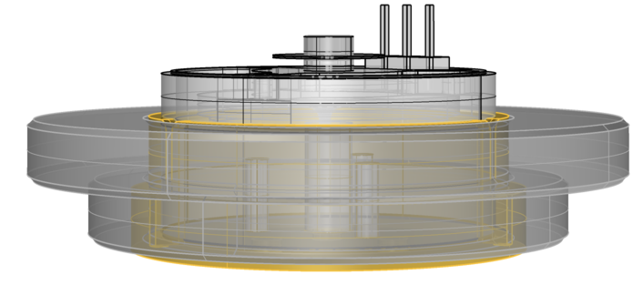

# リアクションホイール - 2段構成

**コンポーネント種別**: 機構部品（慣性輪）
**用途**: YAWモーター慣性モーメント増加
**製品**: MISUMI S45C平座金（2段構成）
**作成日**: 2025-11-09
**更新日**: 2025-11-11

---

## 組立図



**構成:**
- **上段**: WSSB50-30-5（φ50mm × 5mm厚）
- **下段**: WSSB40-30-5（φ40mm × 5mm厚）
- **取付**: BLDCモーター軸に2段重ねで固定

---

## 概要

YAWモーターに取り付けるリアクションホイール（慣性輪）。
**2段構成（φ50 + φ40）**により、慣性モーメントを最適化し、姿勢制御の応答性と安定性を向上。

---

## 製品仕様

### 上段ホイール: WSSB50-30-5

| 項目       | 仕様           |
| -------- | ------------ |
| **型番**   | WSSB50-30-5  |
| **製造元**  | MISUMI       |
| **製品分類** | 平座金          |
| **材質**   | S45C相当（炭素鋼）  |
| **外径**   | φ50mm        |
| **内径**   | φ30mm        |
| **板厚**   | 5mm          |
| **表面処理** | 四三酸化鉄皮膜（黒染め） |

**製品ページ**: https://jp.misumi-ec.com/vona2/detail/110302677010/?ProductCode=WSSB50-30-5

### 下段ホイール: WSSB40-30-5

| 項目       | 仕様           |
| -------- | ------------ |
| **型番**   | WSSB40-30-5  |
| **製造元**  | MISUMI       |
| **製品分類** | 平座金          |
| **材質**   | S45C相当（炭素鋼）  |
| **外径**   | φ40mm        |
| **内径**   | φ30mm        |
| **板厚**   | 5mm          |
| **表面処理** | 四三酸化鉄皮膜（黒染め） |

**製品ページ**: https://jp.misumi-ec.com/vona2/detail/110302677010/?ProductCode=WSSB40-30-5

---

## 物理特性

### 質量・慣性モーメント

#### 上段ホイール (WSSB50-30-5)

**質量計算:**
```
体積 = π × (R² - r²) × t
     = π × (25² - 15²) × 5
     = π × (625 - 225) × 5
     = π × 400 × 5
     = 6,283 mm³
     ≈ 6.28 cm³

質量 = 体積 × 密度
     = 6.28 cm³ × 7.85 g/cm³ (S45C密度)
     ≈ 49.3 g
     ≈ 0.049 kg
```

**慣性モーメント（円環）:**
```
I₁ = (1/2) × m × (R² + r²)
   = (1/2) × 0.049 kg × (0.025² + 0.015²)
   = 0.0245 × (0.000625 + 0.000225)
   = 0.0245 × 0.00085
   = 0.00002083 kg·m²
   = 2.08 × 10⁻⁵ kg·m²
```

#### 下段ホイール (WSSB40-30-5)

**質量計算:**
```
体積 = π × (R² - r²) × t
     = π × (20² - 15²) × 5
     = π × (400 - 225) × 5
     = π × 175 × 5
     = 2,749 mm³
     ≈ 2.75 cm³

質量 = 体積 × 密度
     = 2.75 cm³ × 7.85 g/cm³ (S45C密度)
     ≈ 21.6 g
     ≈ 0.022 kg
```

**慣性モーメント（円環）:**
```
I₂ = (1/2) × m × (R² + r²)
   = (1/2) × 0.022 kg × (0.020² + 0.015²)
   = 0.011 × (0.0004 + 0.000225)
   = 0.011 × 0.000625
   = 0.00000688 kg·m²
   = 6.88 × 10⁻⁶ kg·m²
```

#### 2段構成合計

**合計質量:**
```
m_total = m₁ + m₂
        = 49.3 g + 21.6 g
        ≈ 70.9 g
        ≈ 0.071 kg
```

**合計慣性モーメント:**
```
I_total = I₁ + I₂
        = 2.08 × 10⁻⁵ + 6.88 × 10⁻⁶
        = 2.77 × 10⁻⁵ kg·m²
```

### 材料特性（S45C）

| 項目 | 値 |
|------|-----|
| 密度 | 7.85 g/cm³ |
| 引張強度 | 690 MPa |
| 耐食性 | 低（炭素鋼、表面処理推奨） |
| 磁性 | 有（強磁性体） |
| 熱膨張係数 | 11.7 × 10⁻⁶ /K |

---

## 取付仕様

### モーター軸統合

**取付方法（2段構成）:**
```
YAWモーター軸
    ↓
[下段ホイール WSSB40-30-5] ← 軸に直接固定
    ↓
[上段ホイール WSSB50-30-5] ← 下段に重ねて固定
    ↓
[AS5600磁石ホルダー]
    ↓
[AS5600エンコーダー（I2C読取）]
```

**固定方法（確定）:**

**M2×4mmネジ固定 + 3Dプリントモーターカバー**
- **ネジ仕様**: M2×4mm × 3本（120°間隔配置）
- **固定構造**:
  ```
  [3Dプリントモーターカバー]
       ↓（M2×4mmネジ × 3本）
  [上段ホイール WSSB50-30-5]
  [下段ホイール WSSB40-30-5]
       ↓（モーター軸に直接固定）
  [YAWモーター軸]
  ```
- **利点**:
  - 分解・再組立が容易
  - 接着剤不要（メンテナンス性向上）
  - 3Dプリントで柔軟な設計変更可能
  - 120°配置で均等な固定力

**決定事項:**
- [x] 2段構成確定（WSSB50-30-5 + WSSB40-30-5）
- [x] 固定方法確定（M2×4mmネジ3本 + 3Dプリントカバー）
- [ ] 3Dプリントモーターカバー設計
- [ ] AS5600磁石ホルダーとの統合設計
- [ ] ネジ穴位置（120°間隔）の確認

---

## 設計上の考慮点

### 利点

1. **慣性モーメント増加**
   - 回転の安定性向上
   - 姿勢制御の精度向上

2. **コスト効率**
   - MISUMIの汎用部品（低コスト）
   - 加工不要（そのまま使用可能）

3. **材料適性**
   - S45Cの高強度（690 MPa引張強度）
   - 加工性に優れる
   - コスト効率が良い

### 制約・課題

1. **質量増加**
   - ホイール合計: 約71g（2段構成）
   - 筒全体の重量バランスへの影響

2. **モーター負荷**
   - 慣性モーメント増加 → 起動トルク増大
   - YAW BLDCモーターの定格確認必要

3. **バランス調整**
   - 2段ホイール重心のずれ → 振動発生
   - 高速回転時の動的バランス要確認
   - 上段・下段の同軸精度が重要

4. **材質特性による制約**
   - S45Cは強磁性体 → AS5600磁気エンコーダーへの影響
   - 耐食性が低い → 表面処理または防錆対策必要
   - 長期使用時の錆発生リスク

---

## 性能試算

### YAW回転性能への影響

**慣性モーメント比較:**
```
リアクションホイールなし:
  I₀ ≈ モーター軸 + AS5600磁石のみ
     ≈ 1 × 10⁻⁵ kg·m² (推定)

リアクションホイールあり（2段構成）:
  I₁ = I₀ + I_wheel
     ≈ 1 × 10⁻⁵ + 2.77 × 10⁻⁵
     ≈ 3.77 × 10⁻⁵ kg·m²
     = I₀ × 3.77倍
```

**回転加速度への影響:**
```
角加速度 α = τ / I

同一トルクτの場合:
  α₁ / α₀ = I₀ / I₁
          = 1 / 3.77
          ≈ 0.27

→ 回転加速度は約1/4に低下
→ より滑らかな回転、オーバーシュート抑制
```

**最大角速度への影響:**
```
最大角速度 ω_max = √(2 × P_max / I)

同一モーター出力P_maxの場合:
  ω₁ / ω₀ = √(I₀ / I₁)
          = √(1 / 3.77)
          ≈ 0.52

→ 最大角速度は約52%に低下
→ Sparkモード（最高速回転）への影響あり
```

---

## 設計パラメータ調整

### モーター選定への影響

**必要トルク増加:**
```
起動トルク τ = I × α

慣性3.77倍 → 起動トルク3.77倍必要
→ YAW BLDCモーター定格トルク要確認
```

**推奨対策:**
1. モーター定格トルクの確認（現行BLDCで対応可能か？）
2. SimpleFOC PIDパラメータ調整（慣性増加対応）
3. 加速度プロファイル調整（急加速抑制）

### 制御アルゴリズム調整

**PIDパラメータ:**
```cpp
// 慣性増加に伴うPID調整
float Kp = Kp_base / 3.77;  // 比例ゲイン低減
float Ki = Ki_base;         // 積分ゲインは維持
float Kd = Kd_base * 3.77;  // 微分ゲイン増加
```

**速度プロファイル:**
```cpp
// 加速度制限（急加速防止）
float max_acceleration = 10.0; // rad/s²（要調整）
float ramp_rate = 0.1;         // 加速率（要調整）
```

---

## 実装チェックリスト

### 設計フェーズ
- [ ] YAW BLDCモーター定格トルク確認
- [ ] モーター軸径確認（φ30mm想定）
- [ ] AS5600磁石ホルダーとの統合設計
- [ ] 固定方法選定（セットスクリュー or 圧入 or 接着）

### 試作フェーズ
- [ ] WSSB50-30-5購入（MISUMI）
- [ ] WSSB40-30-5購入（MISUMI）
- [ ] 2段構成の取付テスト
- [ ] 動的バランス測定（振動確認）
- [ ] SimpleFOC PIDパラメータ調整

### 検証フェーズ
- [ ] 起動トルク測定
- [ ] 最大角速度測定
- [ ] 姿勢制御応答性テスト
- [ ] Sparkモード動作確認

---

## 関連ドキュメント

- [tube-v2-circuit-design.md](../tube-v2-circuit-design.md) - システム全体構成
- [BLDC-YAW-Motor.md](./BLDC-YAW-Motor.md) - YAWモーター仕様
- [AS5600.md](./AS5600.md) - エンコーダー仕様

---

## 変更履歴

| 日付 | 変更内容 | 担当 |
|------|---------|------|
| 2025-11-09 | 初版作成（WSSB50-30-10仕様書） | CIC |
| 2025-11-11 | 2段構成に変更（WSSB50-30-5 + WSSB40-30-5） | CIC |
| 2025-11-11 | 物理特性再計算（質量72g、慣性2.82×10⁻⁵ kg·m²） | CIC |
| 2025-11-11 | 性能試算更新（慣性比3.82倍、角速度51%） | CIC |
| 2025-11-11 | 材質修正（SUS304 → S45C相当）、物理特性再計算（質量71g、慣性2.77×10⁻⁵ kg·m²） | CIC |
| 2025-11-11 | 性能試算更新（慣性比3.77倍、角速度52%）、材質特性による制約追加 | CIC |