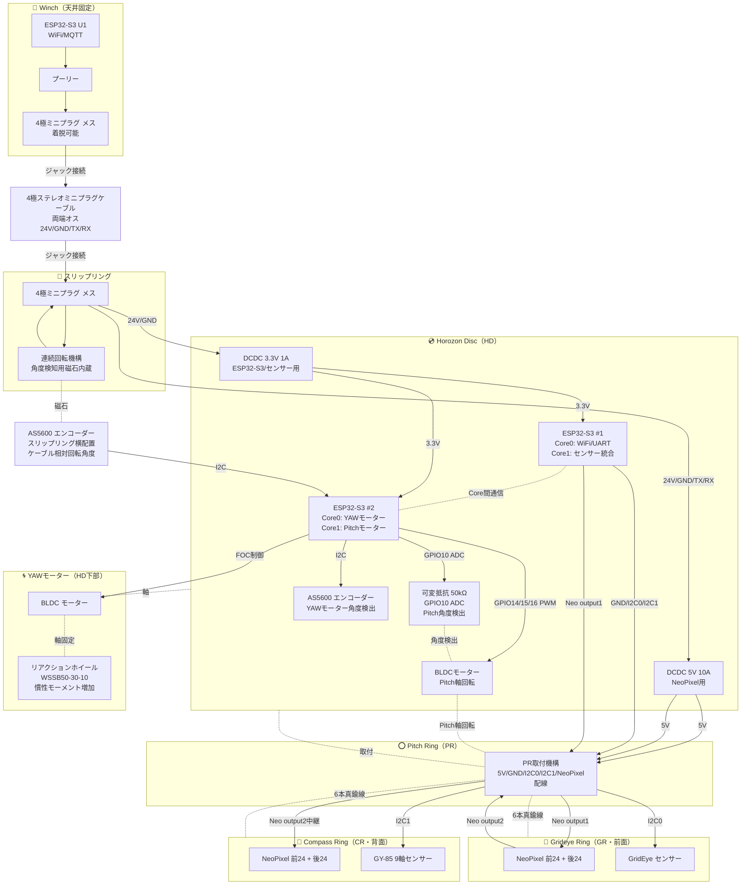

# Tube V2 回路設計仕様書

**プロジェクト**: Fragmentations of Unity - Nagoya Installation
**対象**: 吊り下げ筒本体 V2（HD統合制御方式）
**作成日**: 2025-11-09
**ステータス**: 🔄 設計中

---

## 概要

V2では、HD（Horozon Disc）に2基のESP32-S3を搭載し、GR/CRリングと通信しながら全体を制御する。
スリップリングを介してWinchと接続し、YAWモーターで自由回転、Pitchサーボで姿勢制御を実現。

---

## V1からの主要変更点

| 項目 | V1 | V2 |
|------|----|----|
| **マイコン** | RP2040-Zero × 2 | ESP32-S3 × 2 (4コア) |
| **LED総数** | 48個 (24+24) | 96個 (48+48) |
| **センサー統合** | 各基板独立 | HD集中管理 |
| **通信方式** | U3→U4 UART連鎖 | HD→PR I2C×2系統 + NeoPixel |
| **Pitch制御** | BLDC | BLDCモーター + 可変抵抗 50kΩ |
| **YAW制御** | BLDC（背面） | BLDC（HD下部） |
| **新規機能** | - | スリップリング角度検出 |

---

## システム構成

### コンポーネント仕様書

各コンポーネントの詳細仕様は以下を参照:

| コンポーネント | 仕様書 |
|---------------|--------|
| **マイコン** | [ESP32-S3](../Component/ESP32-S3.md) |
| **エンコーダー** | [AS5600](../Component/AS5600.md) |
| **センサー** | [GridEye AMG8833](../Component/GridEye-AMG8833.md) / [GY-85](../Component/GY-85.md) |
| **LED** | [NeoPixel WS2812B](../Component/NeoPixel-WS2812B.md) / [NeoPixel信号仕様](../Component/NeoPixel-Signal.md) |
| **電源** | [DCDC変換器](../Component/DCDC-Converter.md) |
| **モーター** | [BLDC Pitchモーター](../Component/BLDC-Pitch-Motor.md) / [BLDC YAWモーター](../Component/BLDC-YAW-Motor.md) / [リアクションホイール WSSB50-30-10](../Component/Reaction-Wheel-WSSB50-30-10.md) |
| **角度センサー** | [可変抵抗 RK0971210](../Component/Variable-Resistor-RK0971210.md) |
| **機構** | [スリップリング](../Component/SlipRing.md) / [プーリー](../Component/Pulley.md) / [PR取付機構](../Component/PR-Mount.md) / [真鍮線](../Component/BrassWire.md) |
| **ケーブル** | [4極ケーブル](../Component/Cable-4pole.md) |
| **基板** | [HD Board](../Component/HD-Board.md) / [GR/CR Board](../Component/GR-CR-Board.md) |
| **通信** | [I2Cインターフェース](../Component/I2C-Interface.md) / [UARTプロトコル](../Component/UART-Protocol.md) |

### システム構成図



---

## 設計方針

### 設計目標
- ESP32-S3 デュアルコア×2基で4コアフル活用
- HD集中制御によるセンサー統合
- スリップリング対応でケーブルねじれ検出
- Pitch BLDC化による精密制御（可変抵抗フィードバック）
- YAWモーター自由回転による方向制御

### 設計制約
- 電源: 24V入力（Winchから供給）
- 通信: スリップリング経由UART（TX/RX、38400 baud）
- LED: NeoPixel WS2812B × 96個（GR 48個 + CR 48個）
- センサー: GridEye + GY-85 + AS5600×2

---

## ハードウェア構成

### 1. Horozon Disc (HD)

**マイコン: ESP32-S3 × 2**

#### オプション1: 2基ESP32-S3構成（提案）

| ESP32-S3 | Core | 担当処理 | 主要タスク |
|----------|------|---------|-----------|
| **#1** | Core 0 | WiFi/MQTT/UART | Winch通信、GR/CR通信 |
| **#1** | Core 1 | センサー統合 | GridEye + GY-85データ収集・処理 |
| **#2** | Core 0 | YAWモーター制御 | BLDC FOC制御、AS-Y読取 |
| **#2** | Core 1 | Pitchモーター制御 | BLDC FOC制御、可変抵抗ADC読取、AS-S読取 |

**メリット:**
- 各タスクを完全分離、リアルタイム性向上
- 負荷分散でCPU余裕確保
- 片方クラッシュしても他方継続可能

**デメリット:**
- 基板面積増加、コスト増
- ESP32-S3間通信オーバーヘッド

#### オプション2: 1基ESP32-S3構成（簡素化案）

| Core | 担当処理 | 主要タスク |
|------|---------|-----------|
| Core 0 | WiFi/MQTT/UART + センサー統合 | Winch通信、GR/CR通信、GridEye/GY-85処理 |
| Core 1 | モーター制御 | YAWモーター FOC、Pitch BLDC FOC、可変抵抗ADC、AS5600×2読取 |

**メリット:**
- 基板簡素化、コスト削減
- 配線削減

**デメリット:**
- CPU負荷高、リアルタイム性低下の可能性
- センサー処理とWiFi処理が競合

**決定**: （未定 - 負荷試算待ち）

---

**電源回路:**
- 入力: 24V DC（スリップリング経由）
- 出力: 5V 2A DCDC
- レギュレータ候補:
  - LM2596 (3A, 〜92%)
  - MP1584 (3A, 〜96%)
  - XL4015 (5A, 〜94%)

**決定**: （未定）

**消費電力試算:**
- ESP32-S3 × 2: 500mA（WiFi送信時）
- Pitch BLDCモーター: 500mA（動作時、電圧制限1.5V）
- YAW BLDCモーター: 1A（最大）
- NeoPixel LED: 1.5A（96個、全点灯時）
- **合計**: 約3.5A（安全マージン考慮で5V 10A DCDC使用）

---

**センサー接続:**

| センサー | インターフェース | 用途 |
|---------|----------------|------|
| AS5600 (AS-S) | I2C | スリップリング角度検出 |
| AS5600 (AS-Y) | I2C | YAWモーターエンコーダー |
| 可変抵抗 50kΩ | ADC (GPIO10) | Pitchモーター角度検出（0-300°、12bit分解能） |

---

**通信プロトコル:**

**HD → PR配線 (5線):**
```
1. 5V電源
2. GND
3. I2C0 (SDA/SCL) - GridEye接続用
4. I2C1 (SDA/SCL) - GY-85接続用
5. NeoPixel Data - GR/CR LED制御用（シリアル信号）
```

**センサー接続:**
```
GridEye (GR) → I2C0 → HD (ESP32-S3 #1)
GY-85 (CR)   → I2C1 → HD (ESP32-S3 #1)
```

**LED制御:**
```
HD → NeoPixel Data → GR LED (48個) → CR LED (48個)
```

**HD ↔ Winch (UART 38400 baud、既存プロトコル維持):**
```
Winch → HD: "DATA,F,r,g,b,R,r,g,b,P,pitch,yaw,B,brightness,H,enc_horizontal\n"
HD → Winch: センサーデータフィードバック（形式未定）
```

---

### 2. Pitch Ring (PR) と Pitchモーター

**構成:**
- BLDCモーター: HD基板上に実装（V1 Tube U3と同型）
- 可変抵抗 50kΩ: Pitch角度フィードバック用
- PR取付機構: モーター軸経由でGR/CRを固定

**BLDCモーター: Pitch制御用（HD搭載）**

| 項目 | 仕様 |
|------|------|
| 制御信号 | 3相PWM (GPIO14/15/16) |
| 極対数 | 7 |
| 相抵抗 | 6.5Ω |
| KV値 | 330 |
| 制御ライブラリ | SimpleFOC v2.3.4 |
| 制御モード | 速度制御 + 位置フィードバック |
| 電圧制限 | 1.5V |
| 速度制限 | 1.3 rad/s |
| **配置** | **HD基板上** |

**可変抵抗: RK0971210-F15-C0-B503**

| 項目 | 仕様 |
|------|------|
| 抵抗値 | 50kΩ (±20%) |
| 回転角度 | 300° (電気角) |
| 出力電圧 | 0-3.3V |
| GPIO | GPIO10 (ESP32-S3 ADC) |
| 分解能 | 12-bit (0-4095) |
| 用途 | Pitch角度フィードバック |

**制御方式:**
- SimpleFOC速度制御モード
- 可変抵抗ADC読取で現在角度取得（0-300°）
- 位置フィードバック: 目標角度と現在角度の差分から目標速度を計算
- PIDパラメータ: P=0.1, I=0.3, D=0.01（V1最適値を継承）
- 位置制御ゲイン: 2.5
- 最大速度制限: 1.2 rad/s
- デッドバンド: ±0.015 rad（約0.86°）

**キャリブレーション:**
- ユーザーが手動で0°と300°位置に設定
- ADC最小値・最大値を記録
- 実測ADC範囲を300°にマッピング

**機構:**
- モーター本体: HD基板に固定
- モーター軸: PR取付機構を介してGR/CR Ringを固定
- Pitch軸回転: モーター回転でGR/CRが傾く
- 可変抵抗: モーター軸に連動して回転

**決定事項:**
- [x] モーター制御方式: SimpleFOC速度制御 + 位置フィードバック
- [x] 角度センサー: 可変抵抗 50kΩ (RK0971210)
- [x] GPIO割当: PWM (GPIO14/15/16), ADC (GPIO10)
- [ ] モーター軸と可変抵抗の機械的連結方法
- [ ] HD基板上のモーター実装位置

---

### 3. Grideye Ring (GR) / Compass Ring (CR)

**仕様:**
- NeoPixel: 前面24個 + 背面24個 = 48個/基板
- センサー: GR = GridEye、CR = GY-85
- **制御マイコン: なし（センサーとLEDのみ）**

**接続方式:**
- **GridEye (GR)**: I2C0系統で直接HD (ESP32-S3 #1) に接続
- **GY-85 (CR)**: I2C1系統で直接HD (ESP32-S3 #1) に接続
- **NeoPixel (GR/CR)**: シリアルデータ線で直接HD制御
- **電源**: 5V/GND はPR経由でHDから供給

**配線構成:**
```
HD → PR取付機構 → GR/CR
  ↓
5V/GND/I2C0/I2C1/NeoPixel Data (5線)
```

**決定事項:**
- [ ] PRからGR/CRへの配線方法（コネクタ or 直付け）
- [ ] I2C0/I2C1のプルアップ抵抗配置（HD側 or PR側）
- [ ] NeoPixel データ線のシグナルインテグリティ対策

---

### 4. スリップリング

**仕様:**
- 4極ミニプラグ対応（24V / GND / TX / RX）
- 連続回転可能
- **角度検知用磁石内蔵**: スリップリング回転機構内に磁石を配置

**AS5600 (AS-S) 配置:**
- **位置**: スリップリングの横（外側）に配置
- **磁石**: スリップリング回転機構内に内蔵
- インターフェース: I2C
- 分解能: 12-bit (0-4095)
- 用途: ケーブル相対回転角度検出（0-360°）
- **測定対象**: Winchから吊り下がるケーブルの回転角度（スリップリング磁石の回転を検知）

**制御ロジック:**
```cpp
// ケーブルねじれ検出
if (abs(cable_rotation_angle) > 180°) {
  // YAWモーター逆回転でケーブル巻き戻し
  apply_yaw_correction();
}
```

**決定事項:**
- [ ] スリップリング製品選定（型番）
- [x] AS5600配置: スリップリング横（外側）
- [x] 磁石配置: スリップリング回転機構内に内蔵
- [ ] AS5600取付構造設計（スリップリング横の固定方法）
- [ ] ケーブル巻き戻し閾値（何度でアラート？）

---

### 5. YAWモーター

**仕様:**
- 型番: （V1と同じBLDC想定）
- 制御: SimpleFOC + AS5600エンコーダー (AS-Y)
- 最大速度: 80 rad/s（V1 U4と同等）

**制御モード:**
1. **角度制御モード**: 目標YAW角度に追従
2. **ケーブル補正モード**: AS-S角度に基づき自動補正
3. **Sparkモード**: 最高速回転演出

**決定事項:**
- [ ] YAWモーター取付構造（HD下部固定方法）
- [ ] AS5600 (AS-Y) 磁石配置
- [ ] ケーブル補正PIDパラメータ

---

## 未決定事項

### 高優先度
- [ ] ESP32-S3の台数（1基 or 2基）
- [ ] GR/CR基板マイコン選定（RP2040継続 or ESP32-C3）
- [ ] HD↔GR/CR通信方式（UART or I2C or SPI）
- [ ] DCDC選定（LM2596 / MP1584 / XL4015）
- [ ] 電源供給方法（GR/CRへの配線）

### 中優先度
- [ ] スリップリング製品選定
- [ ] AS5600 (AS-S) 磁石取付方法
- [ ] Pitchサーボ電源供給方法
- [ ] YAWモーター取付構造
- [ ] ケーブル巻き戻し閾値設定

### 低優先度
- [ ] HD基板サイズ・形状
- [ ] 筒内実装レイアウト
- [ ] ファームウェアアーキテクチャ詳細
- [ ] 量産時の組み立て手順

---

## 次のアクション

1. **ESP32-S3台数決定**: 負荷試算・コスト比較
2. **GR/CR基板仕様確定**: マイコン・通信方式選定
3. **電源設計**: DCDC選定・消費電流詳細試算
4. **スリップリング選定**: 製品リサーチ・AS5600統合方法

---

## 関連ドキュメント

- [PROGRESS.md](../../PROGRESS.md) - プロジェクト全体進捗
- [V1 U3ファームウェア](../../products/firmware/v1/Tube_v1/FU_TUBE_RP2040_U3/)
- [V1 U4ファームウェア](../../products/firmware/v1/Tube_v1/FU_TUBE_RP2040_U4/)

---

## 変更履歴

| 日付 | 変更内容 | 担当 |
|------|---------|------|
| 2025-11-09 | V2構成初版作成（HD統合制御方式） | kyopan |
| 2025-11-09 | AS5600 (AS-S) 配置修正（スリップリング上部・ケーブルメス側） | kyopan |
| 2025-11-09 | RCサーボ DS-M005 配置修正（HD基板上に実装） | kyopan |
| 2025-11-09 | Winch-スリップリング間に4極ステレオミニプラグケーブル（両端オス）追加 | kyopan |
| 2025-11-09 | AS5600 (AS-S) 配置再修正（スリップリング横、磁石はスリップリング内蔵） | kyopan/CIC |
| 2025-11-09 | PR固定方法を「6本真鍮線（はんだ固定）」に変更、真鍮線仕様書追加 | kyopan/CIC |
| 2025-11-09 | リアクションホイール WSSB50-30-10 追加（YAWモーター慣性増加用） | kyopan/CIC |
| 2025-11-09 | 電源系統修正: DCDC 5V 10A (NeoPixel用) + DCDC 3.3V 1A (ESP32-S3/センサー用) 2系統化 | kyopan/CIC |
| 2025-11-09 | NeoPixel配線修正: output1 (HD→PR→GR) / output2 (GR→PR→CR) デイジーチェーン構成 | kyopan/CIC |
| 2025-11-13 | Pitch制御をRCサーボからBLDCモーター+可変抵抗50kΩに変更 | kyopan/CIC |
| 2025-11-13 | GPIO割当追加: GPIO10 (可変抵抗ADC), GPIO14/15/16 (BLDC PWM) | kyopan/CIC |
